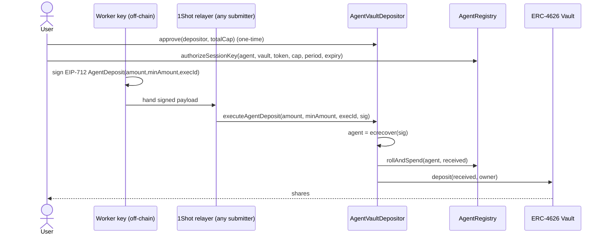

# Roadmap v2 — Phase 1: Trust Foundation Implementation Plan

> **For agentic workers:** REQUIRED SUB-SKILL: Use superpowers:subagent-driven-development (recommended) or superpowers:executing-plans to implement this plan task-by-task. Steps use checkbox (`- [ ]`) syntax for tracking.

**Goal:** Replace the over-parameterized, accounting-only depositor with a two-contract design where agent scope lives in a dedicated `AgentRegistry` and `executeAgentDeposit` moves real ERC20 with balance-delta accounting, period caps, execId idempotency, and pause.

**Architecture:** `AgentRegistry` is the single source of truth for per-agent bounds (vault, token, period cap, expiry). `AgentVaultDepositor` holds no scope — each deposit carries an **EIP-712 signature by the worker key**; the depositor `ecrecover`s the signer and reads its scope from the registry. Authorization is the signature, **not `msg.sender`** — so the 1Shot relayer (or any submitter) can broadcast the call gas-abstracted. It pulls funds from the owner via `transferFrom` (Jalur B), verifies the received delta, spends against the period cap, and deposits ERC-4626 shares straight to the owner. The worker key can never widen its own scope or redirect funds; the execId burns each signed authorization once (replay-safe).

> **Why EIP-712 and not `msg.sender`:** the gasless claim (1Shot Permissionless Relayer) requires that the submitter ≠ the authorizer. If scope were keyed by `msg.sender`, every relayed call would resolve to the relayer's (unscoped) address → `ScopeInactive` → all deposits revert. Recovering the signer decouples *who submits* from *who is authorized*. (Alternatives considered: worker pays its own gas — kills gasless; ERC-2771 forwarder — needs 1Shot 2771 support **[VERIFY]**.)

**Tech Stack:** Solidity `^0.8.24`, Foundry (runs in **WSL only**), OpenZeppelin Contracts ≥5.x (`ReentrancyGuard`, `Pausable`, `SafeERC20`, `IERC4626`, `IERC20`, `EIP712`, `ECDSA`).

> **WSL command form** (from CLAUDE.md — never run `forge` in PowerShell):
> `wsl -e bash -c "cd /mnt/c/SharredData/project/competition/vibing-farmer && <forge cmd>"`

---

## File Structure

- Create: `contracts/AgentRegistry.sol` — scope storage + authorize/revoke + `rollAndSpend` (one responsibility: agent bounds).
- Rewrite: `contracts/AgentVaultDepositor.sol` — execution only; depends on registry; real ERC20 movement.
- Upgrade: `contracts/MockVault.sol` — real ERC-4626 token custody (`transferFrom` on deposit) so tests exercise real flows.
- Create: `test/AgentRegistry.t.sol` — negative + period unit tests.
- Rewrite: `test/AgentVaultDepositor.t.sol` — malicious-worker matrix + balance-delta + execId.
- Create: `test/mocks/MockERC20.sol` — 6-decimal USDC-like token + a fee-on-transfer variant for edge tests.
- Modify: `script/Deploy.s.sol` — deploy registry, depositor, wire `setDepositor`, write `deployments/base-sepolia.json`.
- Modify: `README.md`, `docs/technical-blockchain-usage.md` — correct the false 7715 claim.

> **Note on frontend:** the new `executeAgentDeposit(amount, minAmount, execId, bytes sig)` signature breaks `frontend/src/relay.js` (`encodeExecuteAgentDeposit`) and `frontend/src/wallet.js`. The frontend must now (1) have the worker key sign the EIP-712 `AgentDeposit` digest (`dep.hashDeposit(...)` or the equivalent viem `signTypedData` with domain `{name:"VibingFarmer",version:"1",chainId,verifyingContract}`), and (2) hand the signed payload to the 1Shot relayer. Re-wiring is **Phase 5, Task 2** (signature added to `encodeExecuteAgentDeposit`). Phase 1 is contracts + docs only; keep Phase 1 commits contract-scoped.

---

## Task 1: Correct the false ERC-7715 authorization claim in docs

**Files:**
- Modify: `README.md:18`, `README.md:44`, `README.md:85`
- Modify: `docs/technical-blockchain-usage.md:16`, `docs/technical-blockchain-usage.md:192`

> **Edit by content, not line number.** Line anchors below are hints only — match the *old string* and replace it. If the file has shifted, the content match still finds the right spot.

- [ ] **Step 1: Fix README "How it works" point 4**

Find (≈ `README.md:18`):

```markdown
4. **Scoped permission** — An ERC-7715 batch permission request binds each worker agent to a single vault and spend cap.
```

replace with (describes the REAL mechanism — see Blocker note + Task 3):

```markdown
4. **Scoped permission** — The user signs once: (a) a bounded `IERC20.approve(depositor, totalCap)` and (b) registers each worker key in the on-chain `AgentRegistry` (vault, token, per-period cap, expiry). Each deposit is an EIP-712 message signed by the worker key; **any** submitter (the 1Shot relayer, or the user's own RPC) can broadcast it gas-abstracted — authorization is the signature, not `msg.sender`. ERC-7715's enforcer only releases plain `transfer()` calldata, so deposit authorization lives in our registry, not in a 7715 permission. See [Why not pure ERC-7715](docs/technical-blockchain-usage.md#why-not-pure-erc-7715).
```

- [ ] **Step 2: Fix the 7715 caption + Wallet row**

Find the architecture caption `ERC-7715 scoped permission` (≈ `README.md:44`) → replace with `Registry scope + EIP-712 signed deposits`. Find the Wallet row (≈ `README.md:85`) → replace with:

```markdown
| Wallet | MetaMask Flask 13.9+ (EIP-7702 smart account); deposits authorized by EIP-712 worker signatures |
```

- [ ] **Step 3: Add "Why not pure ERC-7715" section + sequence diagram to blockchain doc**

Append to `docs/technical-blockchain-usage.md`:

````markdown
## Why not pure ERC-7715

ERC-7715 / the Delegation Framework's `erc20-token-periodic` enforcer (audited by Consensys Diligence on `ERC20PeriodTransferEnforcer.sol`) releases **only** `IERC20.transfer(address,uint256)` calldata — exactly 68 bytes, execution target must equal the token address in `terms`, selector must be `0xa9059cbb`. `approve()`, `deposit()`, or any other function can never pass it. A worker therefore cannot redeem a 7715 permission to call `AgentVaultDepositor.executeAgentDeposit`.

**Our path (Jalur B + EIP-712 auth):** the user signs once — (a) a bounded `IERC20.approve(depositor, totalCap)` and (b) `AgentRegistry.authorizeSessionKey` registering each worker key's scope. Each deposit is an EIP-712 message signed by the **worker key** (not the user); the depositor `ecrecover`s the signer and looks up its scope. Because authorization is the signature, **any** address may submit the tx — the 1Shot relayer broadcasts it gas-abstracted, or the user's own RPC does if the relayer is down. The depositor pulls funds with `transferFrom(owner, …)`, bounded by the registry. `msg.sender` is irrelevant to authorization. There is no FunctionCall delegation and no MetaMask redemption framework on this leg — the worker key signs an EIP-712 typed message and that is all.


````

- [ ] **Step 4: Verify no stale approve/deposit-via-7715 claim remains**

Run: `wsl -e bash -c "cd /mnt/c/SharredData/project/competition/vibing-farmer && grep -rin '7715' docs/ README.md | grep -iE 'approve|deposit|swap'"`
Expected: no line claiming approve/deposit/swap is authorized *by* 7715. (Lines that say 7715 only releases `transfer` are fine.)

- [ ] **Step 5: Commit**

```bash
git add README.md docs/technical-blockchain-usage.md
git commit -m "fix(docs): correct authorization path — registry + EIP-712 signed deposits"
```

---

## Task 2: AgentRegistry — on-chain scope source of truth

**Files:**
- Create: `contracts/AgentRegistry.sol`
- Create: `test/AgentRegistry.t.sol`

- [ ] **Step 1: Write the failing test (authorize happy path + reads)**

```solidity
// test/AgentRegistry.t.sol
// SPDX-License-Identifier: MIT
pragma solidity ^0.8.24;

import {Test} from "forge-std/Test.sol";
import {AgentRegistry} from "../contracts/AgentRegistry.sol";
import {MockVault} from "../contracts/MockVault.sol";
import {MockERC20} from "./mocks/MockERC20.sol";

contract AgentRegistryTest is Test {
    AgentRegistry reg;
    MockERC20 token;
    MockVault vault;
    address owner = address(0xA11CE);
    address agent = address(0xBEEF);
    address depositor = address(0xD0);

    function setUp() public {
        reg = new AgentRegistry();
        reg.setDepositor(depositor);
        token = new MockERC20("USD Coin", "USDC", 6);
        vault = new MockVault("Vault USDC", address(token), 500);
    }

    function _authorize() internal {
        vm.prank(owner);
        reg.authorizeSessionKey(agent, address(vault), address(token), 100e6, 1 days, uint40(block.timestamp + 7 days));
    }

    function test_authorize_setsScopeAndIsActive() public {
        _authorize();
        AgentRegistry.AgentScope memory s = reg.scopeOf(agent);
        assertEq(s.owner, owner);
        assertEq(s.vault, address(vault));
        assertEq(s.token, address(token));
        assertEq(s.capPerPeriod, 100e6);
        assertTrue(reg.isActive(agent));
        address[] memory list = reg.scopesOfOwner(owner);
        assertEq(list.length, 1);
        assertEq(list[0], agent);
    }
}
```

- [ ] **Step 2: Add the MockERC20 helper the test imports**

```solidity
// test/mocks/MockERC20.sol
// SPDX-License-Identifier: MIT
pragma solidity ^0.8.24;

import {ERC20} from "@openzeppelin/contracts/token/ERC20/ERC20.sol";

contract MockERC20 is ERC20 {
    uint8 private immutable _dec;
    constructor(string memory n, string memory s, uint8 d) ERC20(n, s) { _dec = d; }
    function decimals() public view override returns (uint8) { return _dec; }
    function mint(address to, uint256 amt) external { _mint(to, amt); }
}
```

- [ ] **Step 3: Run the test to verify it fails**

Run: `wsl -e bash -c "cd /mnt/c/SharredData/project/competition/vibing-farmer && forge test --match-contract AgentRegistryTest -vvv"`
Expected: FAIL — `AgentRegistry.sol` does not exist / compile error.

- [ ] **Step 4: Write AgentRegistry.sol**

```solidity
// contracts/AgentRegistry.sol
// SPDX-License-Identifier: MIT
pragma solidity ^0.8.24;

import {IERC4626} from "@openzeppelin/contracts/interfaces/IERC4626.sol";

/// @title AgentRegistry
/// @notice The single on-chain source of truth for per-agent deposit bounds.
///         One agent key = one scope, forever. Re-scoping requires a new key.
contract AgentRegistry {
    struct AgentScope {
        address owner;
        address vault;
        address token;
        uint96  capPerPeriod;
        uint32  periodDuration;
        uint96  spentInPeriod;
        uint40  periodStart;
        uint40  expiry;
        bool    revoked;
    }

    mapping(address agent => AgentScope) public scopes;
    mapping(address owner => address[] agents) private _ownerAgents;
    address public depositor;
    address public immutable deployer;
    uint256 public constant MAX_DURATION = 30 days;

    event AgentAuthorized(address indexed owner, address indexed agent, address vault, address token, uint96 capPerPeriod, uint32 periodDuration, uint40 expiry);
    event AgentRevoked(address indexed owner, address indexed agent);
    event DepositorSet(address indexed depositor);

    error ScopeExists();
    error InvalidScope();
    error NotOwner();
    error NotDeployer();
    error NotDepositor();
    error ScopeInactive();
    error DepositorAlreadySet();
    error CapExceeded(uint256 attempted, uint256 remaining);

    constructor() { deployer = msg.sender; }

    /// @notice Set the depositor once. Only the deployer; immutable afterwards.
    function setDepositor(address dep) external {
        if (msg.sender != deployer) revert NotDeployer();
        if (depositor != address(0)) revert DepositorAlreadySet();
        if (dep == address(0)) revert InvalidScope();
        depositor = dep;
        emit DepositorSet(dep);
    }

    function authorizeSessionKey(
        address agent,
        address vault,
        address token,
        uint96 capPerPeriod,
        uint32 periodDuration,
        uint40 expiry
    ) external {
        if (scopes[agent].owner != address(0)) revert ScopeExists();
        if (agent == address(0) || vault == address(0) || token == address(0)) revert InvalidScope();
        if (capPerPeriod == 0 || periodDuration == 0) revert InvalidScope();
        if (expiry <= block.timestamp || expiry > block.timestamp + MAX_DURATION) revert InvalidScope();
        if (IERC4626(vault).asset() != token) revert InvalidScope();

        scopes[agent] = AgentScope({
            owner: msg.sender,
            vault: vault,
            token: token,
            capPerPeriod: capPerPeriod,
            periodDuration: periodDuration,
            spentInPeriod: 0,
            periodStart: uint40(block.timestamp),
            expiry: expiry,
            revoked: false
        });
        _ownerAgents[msg.sender].push(agent);
        emit AgentAuthorized(msg.sender, agent, vault, token, capPerPeriod, periodDuration, expiry);
    }

    function revokeAgent(address agent) external {
        if (scopes[agent].owner != msg.sender) revert NotOwner();
        scopes[agent].revoked = true;
        emit AgentRevoked(msg.sender, agent);
    }

    function revokeMany(address[] calldata agents) external {
        for (uint256 i; i < agents.length; ++i) {
            if (scopes[agents[i]].owner != msg.sender) revert NotOwner();
            scopes[agents[i]].revoked = true;
            emit AgentRevoked(msg.sender, agents[i]);
        }
    }

    function isActive(address agent) external view returns (bool) {
        AgentScope storage s = scopes[agent];
        return s.owner != address(0) && !s.revoked && block.timestamp < s.expiry;
    }

    function scopeOf(address agent) external view returns (AgentScope memory) {
        return scopes[agent];
    }

    function scopesOfOwner(address owner) external view returns (address[] memory) {
        return _ownerAgents[owner];
    }

    /// @notice Roll the fixed window if elapsed, then charge `amount` against the cap.
    ///         Only callable by the wired depositor. Reverts CapExceeded if over.
    function rollAndSpend(address agent, uint256 amount) external {
        if (msg.sender != depositor) revert NotDepositor();
        AgentScope storage s = scopes[agent];
        // Defense-in-depth: never divide by a zero periodDuration (unscoped agent) and
        // never charge an inactive scope, even if a caller forgets the pre-check.
        if (s.owner == address(0) || s.revoked || block.timestamp >= s.expiry) revert ScopeInactive();
        uint256 elapsed = block.timestamp - s.periodStart;
        if (elapsed >= s.periodDuration) {
            s.periodStart += uint40((elapsed / s.periodDuration) * s.periodDuration);
            s.spentInPeriod = 0;
        }
        uint256 remaining = uint256(s.capPerPeriod) - s.spentInPeriod;
        if (amount > remaining) revert CapExceeded(amount, remaining);
        s.spentInPeriod += uint96(amount);
    }
}
```

- [ ] **Step 5: Run the happy-path test to verify it passes**

Run: `wsl -e bash -c "cd /mnt/c/SharredData/project/competition/vibing-farmer && forge test --match-contract AgentRegistryTest -vvv"`
Expected: PASS.

- [ ] **Step 6: Add negative + period unit tests**

Append to `test/AgentRegistry.t.sol`:

```solidity
    function test_authorize_revertsOnSecondScopeForSameAgent() public {
        _authorize();
        vm.prank(owner);
        vm.expectRevert(AgentRegistry.ScopeExists.selector);
        reg.authorizeSessionKey(agent, address(vault), address(token), 1e6, 1 days, uint40(block.timestamp + 1 days));
    }

    function test_authorize_revertsOnExpiryTooFar() public {
        vm.prank(owner);
        vm.expectRevert(AgentRegistry.InvalidScope.selector);
        reg.authorizeSessionKey(agent, address(vault), address(token), 1e6, 1 days, uint40(block.timestamp + 31 days));
    }

    function test_authorize_revertsOnVaultTokenMismatch() public {
        MockERC20 other = new MockERC20("Other", "OTH", 6);
        vm.prank(owner);
        vm.expectRevert(AgentRegistry.InvalidScope.selector);
        reg.authorizeSessionKey(agent, address(vault), address(other), 1e6, 1 days, uint40(block.timestamp + 1 days));
    }

    function test_revoke_onlyOwner_andKeyStaysDead() public {
        _authorize();
        vm.prank(address(0xDEAD));
        vm.expectRevert(AgentRegistry.NotOwner.selector);
        reg.revokeAgent(agent);
        vm.prank(owner);
        reg.revokeAgent(agent);
        assertFalse(reg.isActive(agent));
        // re-authorize same key still blocked (key dead forever)
        vm.prank(owner);
        vm.expectRevert(AgentRegistry.ScopeExists.selector);
        reg.authorizeSessionKey(agent, address(vault), address(token), 1e6, 1 days, uint40(block.timestamp + 1 days));
    }

    function test_rollAndSpend_onlyDepositor() public {
        _authorize();
        vm.expectRevert(AgentRegistry.NotDepositor.selector);
        reg.rollAndSpend(agent, 1e6);
    }

    function test_rollAndSpend_capAndMultiPeriodSkip() public {
        _authorize();
        vm.startPrank(depositor);
        reg.rollAndSpend(agent, 60e6);
        vm.expectRevert(abi.encodeWithSelector(AgentRegistry.CapExceeded.selector, 50e6, 40e6));
        reg.rollAndSpend(agent, 50e6);
        // skip 3 periods with no activity → window jumps by multiples, not reset-to-now
        skip(3 days + 1);
        reg.rollAndSpend(agent, 100e6); // fresh full cap
        vm.stopPrank();
        AgentRegistry.AgentScope memory s = reg.scopeOf(agent);
        assertEq(s.spentInPeriod, 100e6);
    }
```

- [ ] **Step 7: Run to verify all pass**

Run: `wsl -e bash -c "cd /mnt/c/SharredData/project/competition/vibing-farmer && forge test --match-contract AgentRegistryTest -vvv"`
Expected: PASS (all cases).

- [ ] **Step 8: Commit**

```bash
git add contracts/AgentRegistry.sol test/AgentRegistry.t.sol test/mocks/MockERC20.sol
git commit -m "feat(contracts): AgentRegistry — on-chain agent scope with period cap"
```

---

## Task 3: AgentVaultDepositor — real-custody execution (Jalur B)

**Files:**
- Rewrite: `contracts/AgentVaultDepositor.sol`
- Upgrade: `contracts/MockVault.sol`
- Rewrite: `test/AgentVaultDepositor.t.sol`

- [ ] **Step 1: Upgrade MockVault to real ERC-4626 token custody**

Replace `contracts/MockVault.sol` body so `deposit` actually pulls tokens (tests must exercise real `transferFrom`). Keep the name/apy constructor shape used elsewhere.

```solidity
// contracts/MockVault.sol
// SPDX-License-Identifier: MIT
pragma solidity ^0.8.24;

import {ERC4626} from "@openzeppelin/contracts/token/ERC20/extensions/ERC4626.sol";
import {ERC20, IERC20} from "@openzeppelin/contracts/token/ERC20/ERC20.sol";

/// @notice Real ERC-4626 mock vault for tests + Base Sepolia demo. Pulls assets on
///         deposit (transferFrom). Virtual shares (OZ default) blunt inflation attacks.
contract MockVault is ERC4626 {
    uint256 public immutable apyBps;

    constructor(string memory name_, address asset_, uint256 apyBps_)
        ERC20(name_, "vUSDC")
        ERC4626(IERC20(asset_))
    {
        apyBps = apyBps_;
    }
}
```

> Note: the legacy `withdrawAssets`/`claimRewards` mock methods are dropped; ERC-4626 `withdraw`/`redeem` replace them. The depositor's harvest/withdraw legs are re-specified below to use 4626.

- [ ] **Step 2: Write the failing happy-path deposit test**

```solidity
// test/AgentVaultDepositor.t.sol
// SPDX-License-Identifier: MIT
pragma solidity ^0.8.24;

import {Test} from "forge-std/Test.sol";
import {AgentRegistry} from "../contracts/AgentRegistry.sol";
import {AgentVaultDepositor} from "../contracts/AgentVaultDepositor.sol";
import {MockVault} from "../contracts/MockVault.sol";
import {MockERC20} from "./mocks/MockERC20.sol";

contract AgentVaultDepositorTest is Test {
    AgentRegistry reg;
    AgentVaultDepositor dep;
    MockERC20 token;
    MockVault vault;
    address owner = address(0xA11CE);
    uint256 workerPk = 0xA9E47; // worker has a private key — it SIGNS, never custodies
    address worker;             // = vm.addr(workerPk)
    address guardian = address(this);
    address relayer = address(0x5E1F); // arbitrary submitter (stands in for 1Shot)

    function setUp() public {
        worker = vm.addr(workerPk);
        reg = new AgentRegistry();
        dep = new AgentVaultDepositor(address(reg), guardian);
        reg.setDepositor(address(dep));
        token = new MockERC20("USD Coin", "USDC", 6);
        vault = new MockVault("Vault USDC", address(token), 500);

        token.mint(owner, 1_000e6);
        // NOTE: tests use max approval for brevity. The FRONTEND/demo must approve a
        // BOUNDED total cap (Phase 5) — do not copy type(uint256).max into production.
        vm.prank(owner);
        token.approve(address(dep), type(uint256).max);
        vm.prank(owner);
        reg.authorizeSessionKey(worker, address(vault), address(token), 100e6, 1 days, uint40(block.timestamp + 7 days));
    }

    function _execId(uint256 i) internal view returns (bytes32) {
        return keccak256(abi.encode(owner, address(vault), uint256(1), i));
    }

    /// Sign an AgentDeposit with `pk` over the depositor's EIP-712 digest.
    function _sign(uint256 pk, uint256 amount, uint256 minAmount, bytes32 execId) internal view returns (bytes memory) {
        bytes32 digest = dep.hashDeposit(amount, minAmount, execId);
        (uint8 v, bytes32 r, bytes32 s) = vm.sign(pk, digest);
        return abi.encodePacked(r, s, v);
    }

    function test_deposit_movesRealTokens_sharesToOwner() public {
        bytes memory sig = _sign(workerPk, 50e6, 50e6, _execId(0));
        vm.prank(relayer); // ANY submitter works — auth is the signature, not msg.sender
        uint256 shares = dep.executeAgentDeposit(50e6, 50e6, _execId(0), sig);
        assertGt(shares, 0);
        assertEq(vault.balanceOf(owner), shares);     // shares to OWNER, not worker
        assertEq(token.balanceOf(worker), 0);          // worker never custodies
        assertEq(token.balanceOf(relayer), 0);         // relayer never custodies
        assertEq(token.balanceOf(address(dep)), 0);    // no residue
        AgentRegistry.AgentScope memory s = reg.scopeOf(worker);
        assertEq(s.spentInPeriod, 50e6);
    }
}
```

- [ ] **Step 3: Run to verify it fails**

Run: `wsl -e bash -c "cd /mnt/c/SharredData/project/competition/vibing-farmer && forge test --match-contract AgentVaultDepositorTest -vvv"`
Expected: FAIL — new constructor/signature don't exist yet.

- [ ] **Step 4: Rewrite AgentVaultDepositor.sol**

```solidity
// contracts/AgentVaultDepositor.sol
// SPDX-License-Identifier: MIT
pragma solidity ^0.8.24;

import {ReentrancyGuard} from "@openzeppelin/contracts/utils/ReentrancyGuard.sol";
import {Pausable} from "@openzeppelin/contracts/utils/Pausable.sol";
import {IERC20} from "@openzeppelin/contracts/token/ERC20/IERC20.sol";
import {SafeERC20} from "@openzeppelin/contracts/token/ERC20/utils/SafeERC20.sol";
import {IERC4626} from "@openzeppelin/contracts/interfaces/IERC4626.sol";
import {EIP712} from "@openzeppelin/contracts/utils/cryptography/EIP712.sol";
import {ECDSA} from "@openzeppelin/contracts/utils/cryptography/ECDSA.sol";
import {AgentRegistry} from "./AgentRegistry.sol";

/// @title AgentVaultDepositor
/// @notice Executes scoped vault deposits. Holds NO scope. Authorization is an EIP-712
///         signature by the worker key — NOT msg.sender — so the 1Shot relayer (or any
///         submitter) can broadcast the call gas-abstracted. The signer is recovered and
///         its scope read from AgentRegistry. Jalur B: pulls funds from the scope owner
///         via transferFrom, verifies the balance delta, spends the period cap, deposits
///         ERC-4626 shares straight to the owner.
contract AgentVaultDepositor is ReentrancyGuard, Pausable, EIP712 {
    using SafeERC20 for IERC20;

    AgentRegistry public immutable registry;
    address public immutable guardian;
    mapping(address token => uint256) public reserves;
    mapping(bytes32 => bool) public executed;

    // EIP-712 typed data: the worker key signs this; recovered signer == the agent.
    bytes32 public constant DEPOSIT_TYPEHASH =
        keccak256("AgentDeposit(uint256 amount,uint256 minAmount,bytes32 execId)");

    event AgentDepositExecuted(
        address indexed agent, address indexed owner, address indexed vault,
        address token, uint256 assetsIn, uint256 sharesOut, bytes32 execId
    );

    error ScopeInactive();
    error InsufficientReceived(uint256 received, uint256 minAmount);
    error AlreadyExecuted(bytes32 execId);
    error ZeroShares();
    error NotGuardian();

    constructor(address registry_, address guardian_) EIP712("VibingFarmer", "1") {
        registry = AgentRegistry(registry_);
        guardian = guardian_;
    }

    function pause() external { if (msg.sender != guardian) revert NotGuardian(); _pause(); }
    function unpause() external { if (msg.sender != guardian) revert NotGuardian(); _unpause(); }

    /// @notice EIP-712 digest a worker key must sign. Exposed for tests + the frontend so
    ///         on-chain and off-chain hash the SAME bytes (no divergence).
    function hashDeposit(uint256 amount, uint256 minAmount, bytes32 execId) public view returns (bytes32) {
        return _hashTypedDataV4(keccak256(abi.encode(DEPOSIT_TYPEHASH, amount, minAmount, execId)));
    }

    /// @param amount    tokens to pull from the scope owner (declared by the signer)
    /// @param minAmount floor on the *received* delta (fee-on-transfer / slippage guard)
    /// @param execId    deterministic per (owner,vault,planId,step) — replay-safe
    /// @param sig       EIP-712 signature over (amount,minAmount,execId) by the worker key.
    ///                  The recovered signer IS the agent; msg.sender is irrelevant.
    function executeAgentDeposit(uint256 amount, uint256 minAmount, bytes32 execId, bytes calldata sig)
        external
        nonReentrant
        whenNotPaused
        returns (uint256 shares)
    {
        // 0. recover the agent from the signature — this is the authorization, not msg.sender
        address agent = ECDSA.recover(hashDeposit(amount, minAmount, execId), sig);
        AgentRegistry.AgentScope memory s = registry.scopeOf(agent);

        // 1. scope active
        if (s.owner == address(0) || s.revoked || block.timestamp >= s.expiry) revert ScopeInactive();
        // 2. idempotency — set BEFORE any external call. Also the signature replay guard:
        //    one execId burns one signed authorization.
        if (executed[execId]) revert AlreadyExecuted(execId);
        executed[execId] = true;

        IERC20 token = IERC20(s.token);
        // 3. pull funds (Jalur B). balance-delta below is the real, fee-safe amount.
        uint256 balBefore = token.balanceOf(address(this));
        token.safeTransferFrom(s.owner, address(this), amount);
        uint256 received = token.balanceOf(address(this)) - balBefore;
        if (received < minAmount || received == 0) revert InsufficientReceived(received, minAmount);

        // 4. charge the period cap against the recovered agent (reverts CapExceeded if over)
        registry.rollAndSpend(agent, received);

        // 5. CEI: account reserve before vault interaction
        reserves[s.token] += received;
        token.forceApprove(s.vault, received);
        shares = IERC4626(s.vault).deposit(received, s.owner); // shares → owner directly
        if (shares == 0) revert ZeroShares();
        reserves[s.token] -= received;
        token.forceApprove(s.vault, 0);

        emit AgentDepositExecuted(agent, s.owner, s.vault, s.token, received, shares, execId);
    }
}
```

> **`reserves` note:** on Jalur B it is incremented then decremented inside the same call (vestigial — it guards nothing here). Kept for spec parity and so a future pre-funded (Jalur A) path stays drop-in. The real invariant `reserves[token] <= balanceOf(depositor)` is asserted in Phase 4.

- [ ] **Step 5: Run the happy-path test to verify it passes**

Run: `wsl -e bash -c "cd /mnt/c/SharredData/project/competition/vibing-farmer && forge test --match-test test_deposit_movesRealTokens_sharesToOwner -vvv"`
Expected: PASS.

- [ ] **Step 6: Add the malicious-worker matrix + idempotency + cap tests**

Append to `test/AgentVaultDepositor.t.sol`:

```solidity
    function test_replay_sameExecId_reverts() public {
        dep.executeAgentDeposit(50e6, 50e6, _execId(0), _sign(workerPk, 50e6, 50e6, _execId(0)));
        // even a freshly re-signed message with the same execId is dead (replay guard)
        vm.expectRevert(abi.encodeWithSelector(AgentVaultDepositor.AlreadyExecuted.selector, _execId(0)));
        dep.executeAgentDeposit(10e6, 10e6, _execId(0), _sign(workerPk, 10e6, 10e6, _execId(0)));
    }

    function test_capExceeded_reverts() public {
        dep.executeAgentDeposit(80e6, 80e6, _execId(0), _sign(workerPk, 80e6, 80e6, _execId(0)));
        vm.expectRevert(abi.encodeWithSelector(AgentRegistry.CapExceeded.selector, 80e6, 20e6));
        dep.executeAgentDeposit(80e6, 80e6, _execId(1), _sign(workerPk, 80e6, 80e6, _execId(1)));
    }

    function test_revokedAgent_cannotDeposit() public {
        vm.prank(owner);
        reg.revokeAgent(worker);
        vm.expectRevert(AgentVaultDepositor.ScopeInactive.selector);
        dep.executeAgentDeposit(10e6, 10e6, _execId(0), _sign(workerPk, 10e6, 10e6, _execId(0)));
    }

    function test_expiredScope_cannotDeposit() public {
        skip(8 days);
        vm.expectRevert(AgentVaultDepositor.ScopeInactive.selector);
        dep.executeAgentDeposit(10e6, 10e6, _execId(0), _sign(workerPk, 10e6, 10e6, _execId(0)));
    }

    function test_unscopedSigner_cannotDeposit() public {
        // a key with no registry scope: recovered signer has empty scope → ScopeInactive
        uint256 strangerPk = 0xBADBAD;
        vm.expectRevert(AgentVaultDepositor.ScopeInactive.selector);
        dep.executeAgentDeposit(10e6, 10e6, _execId(0), _sign(strangerPk, 10e6, 10e6, _execId(0)));
    }

    function test_tamperedAmount_breaksSignature() public {
        // sign for 10e6 but submit 90e6 → recovered signer differs from worker → wrong/empty scope
        bytes memory sig = _sign(workerPk, 10e6, 10e6, _execId(0));
        vm.expectRevert(); // recovered address has no matching scope (ScopeInactive) or cap mismatch
        dep.executeAgentDeposit(90e6, 90e6, _execId(0), sig);
    }

    function test_paused_blocksDeposit() public {
        dep.pause(); // test contract is guardian
        vm.expectRevert(); // Pausable: EnforcedPause (before signature recovery)
        dep.executeAgentDeposit(10e6, 10e6, _execId(0), _sign(workerPk, 10e6, 10e6, _execId(0)));
    }

    function test_workerBalanceAlwaysZero() public {
        dep.executeAgentDeposit(50e6, 50e6, _execId(0), _sign(workerPk, 50e6, 50e6, _execId(0)));
        assertEq(token.balanceOf(worker), 0);
    }
```

- [ ] **Step 7: Run the full depositor suite**

Run: `wsl -e bash -c "cd /mnt/c/SharredData/project/competition/vibing-farmer && forge test --match-contract AgentVaultDepositorTest -vvv"`
Expected: PASS (all).

- [ ] **Step 8: Commit**

```bash
git add contracts/AgentVaultDepositor.sol contracts/MockVault.sol test/AgentVaultDepositor.t.sol
git commit -m "feat(contracts): real-custody executeAgentDeposit driven by AgentRegistry"
```

---

## Task 4: Fee-on-transfer + zero-shares edge tests

**Files:**
- Modify: `test/mocks/MockERC20.sol` (add fee-on-transfer variant)
- Modify: `test/AgentVaultDepositor.t.sol`

- [ ] **Step 1: Add a fee-on-transfer token mock**

Append to `test/mocks/MockERC20.sol`:

```solidity
/// @notice Burns 1% on every transfer — exercises the balance-delta path.
contract FeeOnTransferERC20 is ERC20 {
    uint8 private immutable _dec;
    constructor(string memory n, string memory s, uint8 d) ERC20(n, s) { _dec = d; }
    function decimals() public view override returns (uint8) { return _dec; }
    function mint(address to, uint256 amt) external { _mint(to, amt); }
    function _update(address from, address to, uint256 value) internal override {
        if (from != address(0) && to != address(0)) {
            uint256 fee = value / 100;
            super._update(from, address(0xdead), fee);
            value -= fee;
        }
        super._update(from, to, value);
    }
}
```

- [ ] **Step 2: Write the failing fee-on-transfer test**

Append to `test/AgentVaultDepositor.t.sol` (add `import {FeeOnTransferERC20} from "./mocks/MockERC20.sol";` at top):

```solidity
    // NOTE: ERC-4626 does not support fee-on-transfer assets end-to-end — the dep→vault
    // leg also loses the fee, so the mock vault is slightly under-collateralized here.
    // This test ONLY proves the depositor's balance-delta + minAmount guard; it is not a
    // claim that FoT tokens are supported as vault assets.
    function test_feeOnTransfer_minAmountProtectsUser() public {
        FeeOnTransferERC20 fee = new FeeOnTransferERC20("Fee USDC", "fUSDC", 6);
        MockVault feeVault = new MockVault("Vault fUSDC", address(fee), 500);
        uint256 w2Pk = 0xCAFE;
        address w2 = vm.addr(w2Pk);
        fee.mint(owner, 1_000e6);
        vm.prank(owner);
        fee.approve(address(dep), type(uint256).max);
        vm.prank(owner);
        reg.authorizeSessionKey(w2, address(feeVault), address(fee), 100e6, 1 days, uint40(block.timestamp + 1 days));

        // received = 50e6 - 1% = 49.5e6. minAmount 50e6 must revert.
        vm.expectRevert(abi.encodeWithSelector(AgentVaultDepositor.InsufficientReceived.selector, 49.5e6, 50e6));
        dep.executeAgentDeposit(50e6, 50e6, keccak256("fee"), _sign(w2Pk, 50e6, 50e6, keccak256("fee")));

        // with realistic minAmount it succeeds and credits the true delta
        uint256 shares = dep.executeAgentDeposit(50e6, 49e6, keccak256("fee2"), _sign(w2Pk, 50e6, 49e6, keccak256("fee2")));
        assertGt(shares, 0);
        AgentRegistry.AgentScope memory s = reg.scopeOf(w2);
        assertEq(s.spentInPeriod, 49.5e6);
    }
```

- [ ] **Step 3: Run to verify it passes (no impl change needed — proves balance-delta works)**

Run: `wsl -e bash -c "cd /mnt/c/SharredData/project/competition/vibing-farmer && forge test --match-test test_feeOnTransfer -vvv"`
Expected: PASS. If it FAILS, the depositor is trusting `amount` instead of the delta — fix Step 4 of Task 3.

- [ ] **Step 4: Commit**

```bash
git add test/mocks/MockERC20.sol test/AgentVaultDepositor.t.sol
git commit -m "test(contracts): fee-on-transfer balance-delta + minAmount protection"
```

---

## Task 5: Zero-custody audit of agent runtime files

**Files:**
- Read-only audit: `frontend/src/relay.js`, `frontend/src/worker.js`, `frontend/src/skills.js`, `agents/`
- Create: `test/ZeroCustody.t.sol`

- [ ] **Step 1: Grep for any transfer to a worker/session address**

Run: `wsl -e bash -c "cd /mnt/c/SharredData/project/competition/vibing-farmer && grep -rinE 'transfer\(|to:\s*(worker|session|agent)' frontend/src/relay.js frontend/src/worker.js frontend/src/skills.js"`
Expected: the only legitimate recipient of user funds is `AgentVaultDepositor`. If any line routes user tokens to a worker/session EOA, that is a finding — record it in the commit body and fix it (recipient must be the depositor).

- [ ] **Step 2: Write an on-chain invariant test asserting worker custody is always zero**

```solidity
// test/ZeroCustody.t.sol
// SPDX-License-Identifier: MIT
pragma solidity ^0.8.24;

import {Test} from "forge-std/Test.sol";
import {AgentRegistry} from "../contracts/AgentRegistry.sol";
import {AgentVaultDepositor} from "../contracts/AgentVaultDepositor.sol";
import {MockVault} from "../contracts/MockVault.sol";
import {MockERC20} from "./mocks/MockERC20.sol";

contract ZeroCustodyTest is Test {
    AgentRegistry reg; AgentVaultDepositor dep; MockERC20 token; MockVault vault;
    address owner = address(0xA11CE);
    uint256 workerPk = 0xBEEF; address worker;

    function setUp() public {
        worker = vm.addr(workerPk);
        reg = new AgentRegistry();
        dep = new AgentVaultDepositor(address(reg), address(this));
        reg.setDepositor(address(dep));
        token = new MockERC20("USD Coin", "USDC", 6);
        vault = new MockVault("Vault USDC", address(token), 500);
        token.mint(owner, 1_000e6);
        vm.prank(owner); token.approve(address(dep), type(uint256).max);
        vm.prank(owner);
        reg.authorizeSessionKey(worker, address(vault), address(token), 100e6, 1 days, uint40(block.timestamp + 7 days));
    }

    function _sign(uint256 pk, uint256 amount, uint256 minAmount, bytes32 execId) internal view returns (bytes memory) {
        (uint8 v, bytes32 r, bytes32 s) = vm.sign(pk, dep.hashDeposit(amount, minAmount, execId));
        return abi.encodePacked(r, s, v);
    }

    function test_workerAndDepositorHoldNothingAfterFlow() public {
        dep.executeAgentDeposit(50e6, 50e6, keccak256("a"), _sign(workerPk, 50e6, 50e6, keccak256("a")));
        assertEq(token.balanceOf(worker), 0);
        assertEq(token.balanceOf(address(dep)), 0);
        assertEq(dep.reserves(address(token)), 0);
        assertEq(vault.balanceOf(worker), 0);
        assertGt(vault.balanceOf(owner), 0);
    }
}
```

- [ ] **Step 3: Run**

Run: `wsl -e bash -c "cd /mnt/c/SharredData/project/competition/vibing-farmer && forge test --match-contract ZeroCustodyTest -vvv"`
Expected: PASS.

- [ ] **Step 4: Commit**

```bash
git add test/ZeroCustody.t.sol
git commit -m "test(contracts): zero-custody invariant — worker holds nothing"
```

---

## Task 6: Deploy script + deployments artifact

**Files:**
- Modify: `foundry.toml` (add `fs_permissions`)
- Create: `deployments/.gitkeep`
- Modify: `script/Deploy.s.sol`
- Create on run: `deployments/base-sepolia.json`

- [ ] **Step 0: Grant Foundry write access + create the directory (vm.writeJson needs both)**

`vm.writeJson` reverts without an explicit `fs_permissions` grant, and it does NOT create missing directories. Add to `foundry.toml` (top-level, under `[profile.default]`):

```toml
fs_permissions = [{ access = "read-write", path = "./deployments" }]
```

Then create the directory so the first write lands:

Run: `wsl -e bash -c "cd /mnt/c/SharredData/project/competition/vibing-farmer && mkdir -p deployments && touch deployments/.gitkeep"`
Expected: `deployments/.gitkeep` exists. (Also confirm `deployments/base-sepolia.json` will be ignored or committed per your preference — the `.gitkeep` keeps the empty dir tracked.)

- [ ] **Step 1: Rewrite Deploy.s.sol to deploy both contracts + wire depositor**

```solidity
// script/Deploy.s.sol
// SPDX-License-Identifier: MIT
pragma solidity ^0.8.24;

import {Script} from "forge-std/Script.sol";
import {console2} from "forge-std/console2.sol";
import {AgentRegistry} from "../contracts/AgentRegistry.sol";
import {AgentVaultDepositor} from "../contracts/AgentVaultDepositor.sol";
import {MockVault} from "../contracts/MockVault.sol";

contract Deploy is Script {
    function run() external {
        uint256 pk = vm.envUint("PRIVATE_KEY");
        // USDC Base Sepolia: [VERIFY] from Circle developer docs before mainnet.
        // For the live demo we deploy a MockVault over the configured asset.
        address usdc = vm.envAddress("USDC_BASE_SEPOLIA");
        address guardian = vm.addr(pk); // testnet: deployer EOA. Production: multisig.

        vm.startBroadcast(pk);
        AgentRegistry reg = new AgentRegistry();
        AgentVaultDepositor dep = new AgentVaultDepositor(address(reg), guardian);
        reg.setDepositor(address(dep));
        MockVault vault = new MockVault("Vibing USDC Vault", usdc, 500);
        vm.stopBroadcast();

        string memory json = "deploy";
        vm.serializeUint(json, "chainId", block.chainid);
        vm.serializeAddress(json, "agentRegistry", address(reg));
        vm.serializeAddress(json, "agentVaultDepositor", address(dep));
        vm.serializeAddress(json, "mockVault", address(vault));
        string memory out = vm.serializeAddress(json, "usdc", usdc);
        vm.writeJson(out, "deployments/base-sepolia.json");

        console2.log("AgentRegistry", address(reg));
        console2.log("AgentVaultDepositor", address(dep));
        console2.log("MockVault", address(vault));
    }
}
```

- [ ] **Step 2: Add the missing env var to .env.example**

Add to `.env.example`:

```bash
USDC_BASE_SEPOLIA=0x...   # [VERIFY] Circle developer docs → USDC Base Sepolia address
```

- [ ] **Step 3: Dry-run compile the script (no broadcast)**

Run: `wsl -e bash -c "cd /mnt/c/SharredData/project/competition/vibing-farmer && forge build script/Deploy.s.sol"`
Expected: compiles clean.

- [ ] **Step 4: Commit**

```bash
git add foundry.toml deployments/.gitkeep script/Deploy.s.sol .env.example
git commit -m "feat(deploy): deploy registry+depositor, emit deployments/base-sepolia.json"
```

---

## Task 7: Full Phase-1 gate + coverage

- [ ] **Step 1: Run the entire forge suite**

Run: `wsl -e bash -c "cd /mnt/c/SharredData/project/competition/vibing-farmer && forge test -vv"`
Expected: all green.

- [ ] **Step 2: Coverage on the two core contracts (target ≥ 80%)**

Run: `wsl -e bash -c "cd /mnt/c/SharredData/project/competition/vibing-farmer && forge coverage --match-contract 'AgentRegistry|AgentVaultDepositor'"`
Expected: ≥ 80% lines for both. If under, add the missing negative-branch test, then re-run.

- [ ] **Step 3: Commit any added coverage tests**

```bash
git add test/
git commit -m "test(contracts): raise Phase 1 coverage to >=80%"
```

---

## Self-Review checklist (run before handing off)

- [ ] Every roadmap Phase-1 task (1.1–1.6) maps to a task here: 1.1→Task1, 1.2→Task2, 1.3→Task3, 1.4→Task2 (`revokeMany`/`scopesOfOwner`), 1.5→Task5, 1.6 (slippage) → deferred to Phase 4 swap leg (no swap leg in current flow; noted).
- [ ] No placeholders — every code step has full code.
- [ ] Type consistency: `scopeOf`, `rollAndSpend(agent,amount)`, `hashDeposit(amount,minAmount,execId)`, `executeAgentDeposit(amount,minAmount,execId,sig)`, `AgentScope` fields identical across Tasks 2/3/5/6, INDEX, and Phases 4/5 sync notes.
- [ ] `frontend` breakage from the new signature is explicitly deferred to Phase 5, Task 2 (worker EIP-712 sign + relayer submit; not silently left broken).

## Revision log (review round 1 — 2026-06-11)

Addressed external review of Phase 1:
- **BLOCKER 1 (gasless vs `msg.sender`):** switched authorization to **EIP-712 worker signature** (`ecrecover` → agent), submitter arbitrary → 1Shot relayer path preserved. New 4th arg `bytes sig`; `hashDeposit` view added; `execId` doubles as signature-replay guard. Tests now sign with `vm.sign(workerPk, dep.hashDeposit(...))` and submit from an arbitrary relayer; added `test_tamperedAmount_breaksSignature`, renamed `test_unscopedWorker`→`test_unscopedSigner`.
- **BLOCKER 2 (docs ≠ code):** Task 1 README/mermaid rewritten — one-time `approve` + registry scope + EIP-712 signed call broadcast by any relayer. Removed the false FunctionCall-delegation/EIP-7702-redemption claim.
- **BLOCKER 3 (`vm.writeJson`):** Task 6 Step 0 adds `fs_permissions` to `foundry.toml` + creates `deployments/.gitkeep` before deploy.
- **Minor 1:** `rollAndSpend` now reverts `ScopeInactive` up front (defense-in-depth; kills `periodDuration==0` div-by-zero). Added `ScopeInactive`/`NotDeployer` errors to registry; `setDepositor` uses `NotDeployer`.
- **Minor 2:** test max-approval flagged with a "frontend must use bounded approval" note.
- **Minor 3:** FoT test annotated — proves the `minAmount` guard only, not end-to-end FoT vault support.
- **Minor 4:** Task 1 edits are match-by-content; line numbers are hints only.
- **Minor 5:** dropped unused `IERC20Metadata` import; `reserves` documented as vestigial-on-Jalur-B (kept for spec parity).
