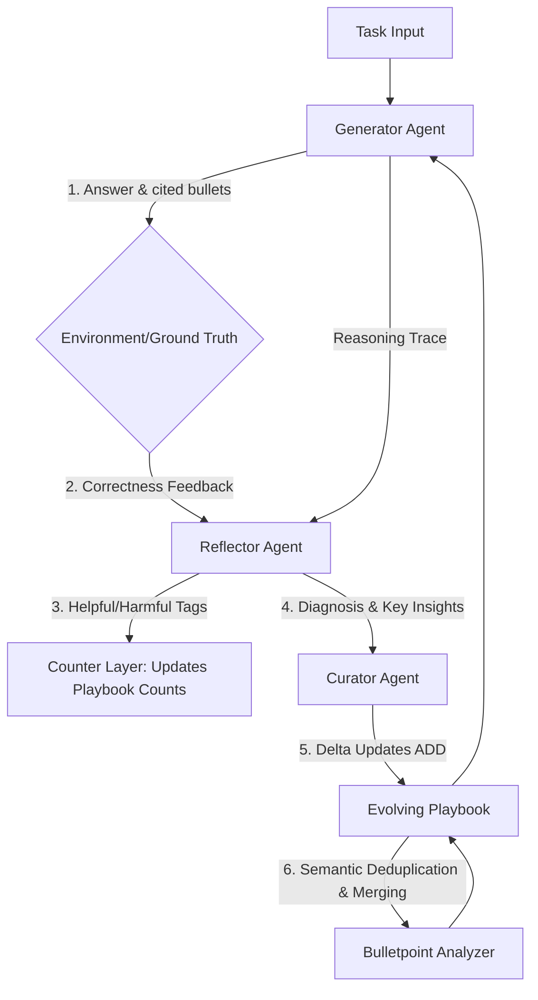

# Deep Analysis of the ACE (Agentic Context Engineering) Framework

## 🎯 Executive Summary & Introduction

The **ACE (Agentic Context Engineering)** framework is a self-improving prompt/context optimization system designed to enable Large Language Models (LLMs) to learn from experience without weight fine-tuning. 

Traditionally, context optimization methods suffer from **brevity bias** (omitting crucial domain-specific nuances) and **context collapse** (eroding prior knowledge during full-context rewrites). ACE addresses these limitations through a **Grow-and-Refine** paradigm:
*   **Grow**: It generates structured, incremental delta updates (lessons, rules, or formulas) rather than rewriting the entire prompt.
*   **Refine**: It isolates evaluation, assigns performance counters (`helpful` and `harmful` counts) to individual rules, and dynamically prunes or merges redundant ideas using semantic search and LLM deduplication.

This architecture results in highly efficient domain adaptation—demonstrating up to **86.9% lower adaptation latency** and significantly lower API token costs compared to traditional context-optimization frameworks.

---

## 🏗️ Core Architecture & Three-Role Agentic System

At its core, ACE orchestrates three distinct LLM agents, each assigned a specific role in a closed-loop system:



### 1. The Generator Agent
*   **Role**: Acts as the solver. It receives a query, the current playbook, and any previous task reflection.
*   **Input**: `GENERATOR_PROMPT` containing the playbook, recent reflection, question, and context.
*   **Mechanism**: Step-by-step reasoning. Crucially, the generator must output a JSON object indicating:
    1.  `reasoning`: Step-by-step calculations or chain of thought.
    2.  `bullet_ids`: A list of the specific playbook rules it cited to solve the task (e.g., `["fin-00002", "calc-00001"]`).
    3.  `final_answer`: The final output answer.
*   **Code Reference**: [generator.py](file:///c:/SharredData/autoresearch/ace/ace/core/generator.py) / [generator.py (Prompt)](file:///c:/SharredData/autoresearch/ace/ace/prompts/generator.py)

### 2. The Reflector Agent
*   **Role**: Diagnoses errors and evaluates rules.
*   **Input**: The original question, the generator's reasoning trace, the predicted answer, ground truth (optional), environment feedback, and the specific playbook rules used.
*   **Mechanism**: If the prediction is incorrect, the Reflector runs up to `max_num_rounds` (default: 3) to extract why the error occurred, what concept was misunderstood, and what correct strategy was missed. It tags each cited playbook rule as either `"helpful"`, `"harmful"`, or `"neutral"`.
*   **Counter Layer**: Based on these tags, the system deterministicially updates the counts on the playbook lines (e.g., `[fin-00002] helpful=2 harmful=1`). This allows the system to build empirical evidence of a rule's utility over time.
*   **Code Reference**: [reflector.py](file:///c:/SharredData/autoresearch/ace/ace/core/reflector.py) / [reflector.py (Prompt)](file:///c:/SharredData/autoresearch/ace/ace/prompts/reflector.py)

### 3. The Curator Agent
*   **Role**: Manages playbook growth and updates.
*   **Input**: Current playbook, recent reflection from the Reflector, question context, training step progress, token budget, and playbook stats (total bullets, high-performing, unused, and problematic bullets).
*   **Mechanism**: The curator parses the reflection and decides what new rule, formula, or mistake prevention strategy should be added to the playbook. Rather than rewriting the playbook, it outputs JSON delta operations.
*   **Supported Operations**: 
    *   `ADD`: Appends a new bullet point to a specific section.
    *   *Designed for Future Extensions (Partially Drafted in Code)*: `UPDATE` (edits a rule), `MERGE` (combines rules), `DELETE` (removes failed rules), and `CREATE_META` (high-level structural headers).
*   **Code Reference**: [curator.py](file:///c:/SharredData/autoresearch/ace/ace/core/curator.py) / [curator.py (Prompt)](file:///c:/SharredData/autoresearch/ace/ace/prompts/curator.py)

---

## 🔍 Bulletpoint Analyzer (Semantic Deduplication & Merging)

To prevent the playbook from exceeding context limits or becoming bloated with duplicate entries, ACE integrates a **BulletpointAnalyzer** component.


### Technical Workflow:
1.  **Parsing**: Reads the playbook and extracts bullet lines starting with `[slug-ID] helpful=H harmful=M :: content`.
2.  **Semantic Embedding**: Computes dense sentence embeddings of the content string using a SentenceTransformer model (default: `all-mpnet-base-v2`).
3.  **FAISS Similarity Search**: Generates a cosine similarity matrix using `FAISS` to discover pairs or clusters of rules with semantic similarity above a defined threshold (default: `0.90`).
4.  **LLM Merging**: For each cluster of similar bullets, the analyzer sends them to the LLM with a dedicated prompt that:
    *   Instructs it to combine their text content into a single comprehensive rule.
    *   Preserves the ID of the oldest/first bullet in the group.
    *   Sums their respective `helpful` and `harmful` metrics (e.g., merging `helpful=2` and `helpful=3` into `helpful=5`).
5.  **Deduplication (Alternative)**: If merging is disabled, it performs simple deduplication by keeping only the first element of each cluster.

*   **Code Reference**: [bulletpoint_analyzer.py](file:///c:/SharredData/autoresearch/ace/ace/core/bulletpoint_analyzer.py)

---

## ⚙️ Execution Modes

The ACE framework operates in three distinct training and testing modes:

### 1. Offline Adaptation Mode
*   **Workflow**:
    1.  Runs an **Initial Test** on the test set using an empty playbook to establish a baseline.
    2.  Iterates through `train_samples` epoch-by-epoch.
    3.  For each training sample, it runs `_train_single_sample` (Generation -> Correction/Reflection -> Curator Curation -> Bulletpoint Analyzer).
    4.  Periodically evaluates validation samples (`eval_steps`, default: 100) and saves the best-performing playbook (`best_playbook.txt`).
    5.  Runs a **Final Test** with the best playbook.
*   **Code Reference**: [ace.py:L632-833](file:///c:/SharredData/autoresearch/ace/ace/ace.py#L632-L833)

### 2. Online Adaptation Mode
*   **Workflow**: Mimics streaming or real-time environments.
    1.  Divides test samples into sequential windows (size controlled by `online_eval_frequency`, default: 15).
    2.  **Test-then-Train**:
        *   **Step 1**: Evaluates the model on the current window of samples using the current playbook.
        *   **Step 2**: Trains on the exact same window of samples, updating the playbook via reflection, curation, and merging.
    3.  Iterates through all windows, reporting cumulative test accuracy as it learns on the fly.
*   **Code Reference**: [ace.py:L877-1142](file:///c:/SharredData/autoresearch/ace/ace/ace.py#L877-L1142)

### 3. Evaluation Only Mode
*   **Workflow**: Strictly loads a pre-trained playbook (or starts empty) and evaluates it on the test set without running reflections, counters, or curation.
*   **Code Reference**: [ace.py:L836-875](file:///c:/SharredData/autoresearch/ace/ace/ace.py#L836-L875)

---

## 🚀 Advanced Optimizations & Scalability (ACEBatch)

For large datasets, sequential training is highly inefficient. ACE introduces **ACEBatch**, which implements parallelized execution and collaborative curation.

### The Batched Workflow:
1.  **Phase 1: Parallel Generation & Reflection (Thread-Safe)**
    *   Takes a read-only snapshot of the current playbook.
    *   Spawns concurrent worker threads (using `ThreadPoolExecutor`) to run generation and reflection for all samples in the mini-batch (size set by `batch_size`).
    *   Each thread runs local reflections and accumulates bullet tags without modifying the shared playbook.
2.  **Phase 2: Synced Curation & Merging**
    *   Gathers all reflections and bullet tags across the completed mini-batch.
    *   Determinstically updates the shared playbook counts using the aggregated tags.
    *   Feeds the combined reflection and question context into the Curator to perform updates.
    *   Applies the `BulletpointAnalyzer` to clean up the shared playbook.
3.  **Phase 3: Parallel Post-Curate Validation**
    *   Runs parallel generation on all samples in the batch with the newly updated playbook to track immediate improvement.

### The Hive Mechanism (Augmented Shuffling):
*   To ensure the Curator learns from all reflections in large batches, ACE employs **Augmented Shuffling**:
    *   Each reflection-context pair is duplicated by a scaling factor `augmented_shuffling_factor` (default: 2) and shuffled.
    *   This provides the Curator with more variations and opportunities to extract robust rules.

*   **Code Reference**: [ace_batch.py](file:///c:/SharredData/autoresearch/ace/ace/ace_batch.py)

---

## 📂 Project-Specific Implementations

The framework contains two primary domain evaluations showing how the core data processing interfaces with ACE:

### 1. Finance Project (`eval/finance`)
This implementation targets structured information retrieval and calculation from financial documents (like SEC filings, earnings reports).

*   **Data Parsing**:
    *   **FiNER**: Uses `parse_instruction_and_input` to extract financial statements and sentiment instructions.
    *   **Formula**: Uses `parse_context_and_question_formula` to isolate question strings (e.g., formula questions) and appends mathematical formatting hints.
*   **Correctness Logic**:
    *   `_finer_answer_is_correct`: Evaluates comma-separated lists of values. It parses string representations of numbers, strips currency symbols (`$`), and performs float evaluation to verify matches.
    *   `_formula_answer_is_correct`: Compares numerical answers by casting them to floating-point numbers.
*   **Code Reference**: [data_processor.py](file:///c:/SharredData/autoresearch/ace/eval/finance/data_processor.py) / [run.py](file:///c:/SharredData/autoresearch/ace/eval/finance/run.py)

### 2. Web Navigation Projects (`eval/mind2web` & `eval/mind2web2`)
This project tests complex, multi-step web agent capabilities. Given a webpage representation, it expects element selection and action parameters.

*   **Task Structure**: Given website history and candidate webpage interactive elements, select the index of the element and the operation (`CLICK`, `TYPE`, or `SELECT` with a value).
*   **Dataset Configuration**:
    *   `mind2web`: Evaluates web environments containing ~200 candidate elements.
    *   `mind2web2`: Evaluates a simplified web search space containing 50 candidate elements.
*   **Three-Level Verification Logic**:
    1.  **Element Index Matching**: Checks if the selected element index matches the target.
    2.  **Operation Matching**: Verifies the predicted action type (`CLICK`, `TYPE`, `SELECT`).
    3.  **Value Matching**: For `TYPE` and `SELECT`, it runs flexible casing and whitespace comparison on the input values.
*   **Code Reference**: [data_processor.py](file:///c:/SharredData/autoresearch/ace/eval/mind2web/data_processor.py) / [run.py](file:///c:/SharredData/autoresearch/ace/eval/mind2web/run.py)

---

## 🛠️ Extensibility: How to Add a New Task

Adding a new domain to ACE is structured and requires implementing only three methods under a new `DataProcessor` class:

```python
class DataProcessor:
    def process_task_data(self, raw_data: List[Dict]) -> List[Dict]:
        # Step 1: Preprocess raw data. Returns dict with:
        # 'context', 'question', 'target', and optional 'others' metadata.
        ...
        
    def answer_is_correct(self, predicted: str, ground_truth: str) -> bool:
        # Step 2: Custom comparison check. Returns True/False.
        ...
        
    def evaluate_accuracy(self, predictions: List[str], ground_truths: List[str]) -> float:
        # Step 3: Compute aggregate metrics. Returns accuracy score [0, 1].
        ...
```

Once the processor is ready, you configure a standard task configuration file pointing to the train/validation/test JSONL files and initiate the `ACE` or `ACEBatch` system in your training script, passing the custom processor.

---

## ⚙️ Robust Systems Programming: API Resilience (`llm.py`)

A critical aspect of the auto research system is its robust handler layer in `llm.py`. It is designed to survive real-world API anomalies:
1.  **Retries, Backoff, and Jitter**: Handles HTTP 429 (Rate Limits), HTTP 500/502/503 (Server Errors), and timeouts. It implements exponential backoff with random jitter (`0.5` to `1.5` multiplier) to prevent thundering-herd issues on SambaNova, Together, or OpenAI servers.
2.  **Empty Response Recovery**: If the LLM returns an empty content block, `llm.py` logs the payload to a `problematic_requests` directory and returns a placeholder `INCORRECT_DUE_TO_EMPTY_RESPONSE` repeated 4 times (representing the Finer NER output format) so training/testing can fail gracefully and continue.
3.  **Timings & Tokens Audit**: Every call records precise statistics, including prompt timing, network response duration, token usage counts, and character lengths, enabling post-training efficiency analysis.

*   **Code Reference**: [llm.py](file:///c:/SharredData/autoresearch/ace/llm.py)

## Update 
1. Institutional Attribution — Hilang
Dokumen ga nyebut siapa yang bikin. ACE adalah hasil kolaborasi dari Stanford University, SambaNova Systems, dan UC Berkeley. Ini penting karena SambaNova adalah industrial partner yang juga nge-host framework-nya secara publik. MarkTechPost
2. "Dynamic Cheatsheet" Predecessor — Tidak Disebut
ACE secara eksplisit dibangun di atas "Dynamic Cheatsheet" — paper sebelumnya yang memperkenalkan adaptive memory concept. ACE adalah successor langsung dari itu. The Moonlight
Dokumen lo ga nyebut Dynamic Cheatsheet sama sekali, padahal paper ACE sendiri menonjolkan ini sebagai titik berangkat. Kalau lo mau review atau present ini, konteks itu penting banget untuk ngerti positioning ACE.
3. mind2web dan mind2web2 — Tidak Ada di Paper Utama
Dokumen lo ngeframe eval/mind2web dan eval/mind2web2 sebagai "Web Navigation Projects" yang seolah setara dengan Finance sebagai domain evaluasi resmi.
Benchmark resmi di paper hanyalah AppWorld (agent tasks) dan FiNER/XBRL Formula (finance). Mind2Web tidak disebutkan di paper. MarkTechPost
Kemungkinan besar mind2web ada sebagai kode evaluasi tambahan di repo, tapi bukan bagian dari hasil yang dipublish. AI lo mungkin nemuin direktori itu di codebase dan meng-elevate-nya ke level yang sama dengan benchmark utama.
4. Venue Paper — Missing
Dokumen ga nyebut bahwa ini paper ICLR 2026 dari Stanford dan SambaNova. Bukan kesalahan fatal, tapi context penting kalau ini buat laporan akademis. Softmaxdata

## The Research of Dynamic CheatSheet
Dynamic Cheatsheet: Test-Time Learning with Adaptive Memory

Mirac Suzgun 1 Mert Yuksekgonul 1 Federico Bianchi 2 Dan Jurafsky 1 James Zou 1 2

Abstract
Despite their impressive performance on complex tasks, current language models (LMs) typically operate in
a vacuum: Each input query is processed separately, without retaining insights from previous attempts. Here,
we present Dynamic Cheatsheet (DC), a lightweight framework that endows a black-box LM with a persistent,
evolving memory. Rather than repeatedly re-discovering or re-committing the same solutions and mistakes, DC
enables models to store and reuse accumulated strategies, code snippets, and general problem-solving insights at
inference time. This test-time learning enhances performance substantially across a range of tasks without needing
explicit ground-truth labels or human feedback. Leveraging DC, Claude 3.5 Sonnet’s accuracy more than doubled
on AIME math exams once it began retaining algebraic insights across questions. Similarly, GPT-4o’s success rate
on the Game of 24 puzzle increased from about 10% to 99% after the model discovered and reused a Python-based
solution. In tasks prone to arithmetic mistakes, such as balancing equations, DC enabled GPT-4o and Claude to
reach near-perfect accuracy by recalling previously validated code, whereas their baselines stagnated around 50%.
Beyond arithmetic challenges, DC yields notable accuracy gains on knowledge-demanding tasks. Claude achieved
a 9% improvement in GPQA-Diamond and an 8% boost on MMLU-Pro Engineering and Physics problems.
Crucially, DC’s memory is self-curated, focusing on concise, transferable snippets rather than entire transcripts,
thereby facilitating meta-learning and avoiding context ballooning. Unlike fine-tuning or static retrieval methods,
DC adapts LMs’ problem-solving skills on the fly, without modifying their underlying parameters, and offers a
practical approach for continuously refining responses and cutting routine errors. Overall, our findings present
DC as a promising approach for augmenting LMs with persistent memory, bridging the divide between isolated
inference events and the cumulative, experience-driven learning characteristic of human cognition.*

5
2
0
2

r
p
A
0
1

]

G
L
.
s
c
[

1
v
2
5
9
7
0
.
4
0
5
2
:
v
i
X
r
a

Figure 1: Comparison of different baselines and Dynamic Cheatsheet (DC) variants on challenging reasoning benchmarks, including
AIME exams and GPQA-Diamond. Baseline represents a standard prompting approach with minimal guidance, while DC-∅ (a stronger
baseline) contains explicit structured instructions for problem solving, as well as for Python code generation and execution, but lacks a
memory component. Our proposed DC-Cu and DC-RS variants incorporate an evolving, text-based memory to enhance inference-time
learning. Results (accuracy, %) demonstrate substantial improvements, with Claude 3.5 Sonnet gaining 27% on AIME 2024 and 30% on
AIME 2025 under DC-Cu. In Game of 24, GPT-4o leaps from 10% (baseline) to 99% under DC-RS, reflecting its ability to retain and
apply Python-based solutions efficiently. Similarly, Claude 3.5 Sonnet’s accuracy more than doubles in Math Equation Solver, reaching
98%. Overall, these findings highlight the impact of test-time learning through controlled memory augmentation and efficient retrieval.

1Stanford University 2Together AI. (cid:0) Correspondence to: msuzgun@stanford.edu and jamesz@stanford.edu.
*§ We release all our data, results, and code at http://github.com/suzgunmirac/dynamic-cheatsheet.

1

Dynamic Cheatsheet: Test-Time Learning with Adaptive Memory

1. Introduction

Modern large language models (LLMs) can tackle complex
reasoning tasks, answer various questions, and generate ex-
tensive texts. Yet they still suffer from one critical limitation:
once deployed, these models are fixed prior to deployment
and typically retain no explicit or implicit memory of past
questions, successes, or mistakes during inference. They
approach each new problem de novo, often re-deriving the
same insights—and re-committing the same errors. In con-
trast, human cognition stands on a foundation of incremental
learning, continuously internalizing new experiences and
solutions into a persistent mental model.

In this work, we present Dynamic Cheatsheet (DC), a simple
and intuitive framework that endows black-box LLMs with
a persistent, evolving memory at inference time. Rather
than fine-tuning weights (for instance, through dynamic
evaluation (Krause et al., 2019) or domain adaptation (Gu-
rurangan et al., 2020)) or retrieving facts from a massive
static corpus (as in traditional retrieval-augmented genera-
tion systems (Guu et al., 2020; Zhang et al., 2024b)), DC
dynamically curates a compact library of reusable strate-
gies, solution sketches, and code snippets. Either before or
after each query, DC enables the system to decide which
lessons to store, what to discard, and how to refine existing
entries—thus effectively “learning” from successes and fail-
ures. It is a flexible online-learning approach that enables
a black-box LLM to improve itself without needing any
explicit ground truth labels or human feedback.

The overall workflow of DC is intuitive and compelling. In
one version of DC (DC-Cu.), when presented with a new
query, the LM first consults its external memory to see if any
prior insights, strategies or relevant model solutions have
been stored. It then proposes a solution by combining the re-
trieved insights with its own internal reasoning capabilities.
Upon generating an answer, it then proceeds to a curation
phase that updates the memory: If the approach seems to
be correct, useful, or practical, DC codifies it in its memory
for future use; if an error surfaces, DC may revise or prune
faulty heuristics. This all happens without gradient-based
parameter updates, so computational overhead remains mod-
est, and compatibility with black-box APIs (e.g., GPT-4 or
Claude) is fully preserved. See Figure 4.

We tested DC across multiple challenging benchmarks and
observed that it increases performance and reduces repeti-
tive mistakes. On AIME 2024, Claude 3.5 Sonnet jumped
from 23% to 50% accuracy, more than doubling its base-
line score, by retaining algebraic and combinatorial insights.
Likewise, it gained 30% accuracy on AIME 2025. Notably,
these improvements hold in knowledge-intensive tasks as
well. On GPQA-Diamond, which tests specialized domain
questions, DC lifted Claude by over 9%. In MMLU-Pro
Engineering and Physics, it provided up to an 8% boost in

Figure 2: Overall task performance of Claude 3.5 Sonnet under
the baseline prompting approach with minimal instructions (BL)
and Dynamic Cheatsheet with Retrieval & Synthesis (DC-RS).

performance by allowing the model to maintain a “toolkit”
of formulas and general problem-solving patterns.

An even more striking and compelling example is the Game
of 24, a puzzle that requires the solver to combine four digits
into an arithmetic expression equaling 24. GPT-4o’s base-
line performance (10%) increased to 99% under DC. Early
in the test sequence, the model discovered that an efficient
Python brute-force solver eliminated all manual guesswork.
Once this snippet was stored, GPT-4o simply retrieved it
for subsequent queries, avoiding manual arithmetic entirely.
We saw a similar pattern in Math Equation Balancer, where
GPT-4o and Claude soared from 45-50% to 98–100% by
“recalling” a straightforward code-based approach instead
of manually fumbling with numeric manipulations.

Nonetheless, DC is not a panacea. We found that smaller
models, such as GPT-4o-mini, benefit from DC in limited
amounts. These models generate too few correct solutions in
these challenging tasks in the first place, leaving the memory
populated with flawed or incomplete strategies. Worse,
they struggle to refine stored content. DC can amplify the
strengths of models that can already produce high-quality
outputs, but not fix foundational gaps in reasoning.

We also note that DC differs from naive “append the entire
conversation history” in-context learning approaches. Un-
der DC, memory is carefully curated, focusing on succinct,
useful, and transferable knowledge over raw transcripts.
This prevents ballooning context lengths (Liu et al., 2024a)
and helps ensure that repeated retrieval remains tractable.
Indeed, part of DC’s contribution is in formalizing a mecha-
nism for selective, evolving retention—storing just enough
to solve the next set of tasks without drowning in an ever-
growing text buffer. Cf. (Karpicke & Roediger III, 2008;
Roediger & Butler, 2011; Karpicke & Blunt, 2011)

2

Dynamic Cheatsheet: Test-Time Learning with Adaptive Memory

Figure 3: Algorithmic illustration of the Dynamic Cheatsheet (DC)-based approaches and other baseline methods. Here, Gen represents
the solution generator model, Cur the memory curator, and Retr the retriever. While we use the same black-box LLMs for both generation
and curation, we differentiate their roles via task-agnostic instructions (prompts). The retrieval mechanism ranks historical inputs based
on cosine similarity with the current query, selecting the most relevant past examples along with their generated solutions.

2. Dynamic Cheatsheet (DC) Methodology

DC, in its core, includes an external, non-parametric mem-
ory that evolves in tandem with the LLM’s inference process.
Rather than fine-tuning the underlying weights, DC tracks
successes and failures of the model at test time, then selec-
tively stores heuristics, strategies, or short textual artifacts
that can guide the LLM in future instances. Notably, this
approach respects the black-box nature of many commercial
LLM APIs: no gradient-based updates are required, and the
model’s core parameters remain untouched.

2.1. DC: Building Blocks and Iterative Loop

The DC framework consists of two core modules: genera-
tion and curation. Both modules can easily operate on top
of the same LM (prompted differently) or on separate LMs.

2.1.1. Solution Generation with Memory

Let’s consider a sequence of inputs (x1, x2, . . . , xn), where
each xi ∼ Dtest indicates a new query or problem posed
to the model sampled from the same distribution Dtest (a
typical setting in online learning). The distribution Dtest is
unknown to us. At the i-th step, the model is provided with
both the new query xi and the current memory state Mi,
which captures knowledge gleaned from previous successes
and failures. We denote the solution generator by Gen:

˜yi = Gen(xi, Mi)

(1)

Here, ˜yi is the candidate solution produced by the model.
Mi helps condition the model to reuse or adapt previously
stored solutions, insights, techniques, or heuristics.

2.1.2. Memory Curation Step

After the generator produces its answer ˜yi to xi, the curator,
Cur, updates the current content of the memory:

Mi+1 = Cur(Mi, xi, ˜yi)

(2)

During memory curation, Cur mainly considers: (i) the use-
fulness and generalizability of the newly produced answer

(i.e., if ˜yi is correct or provides valuable and generalizable
insights, it is distilled into a form suitable for later refer-
ence), (ii) refinement or removal of existing memory entries
(i.e., if an existing memory entry was incorrect or super-
seded by a more efficient or versatile strategy, Cur may
remove or update it), and (iii) clarity and compactness of
the entire memory (i.e., memory entries are consolidated to
retain succinct, high-impact references and heuristics).

Figure 4: Illustration of Dynamic Cheatsheet (DC-Cu variant).
Cur does not have access to ground-truth labels; so, it has
to assess the correctness and efficiency of the solutions by
itself before updating the memory. In our experiments, we
instruct a single model to perform this crucial step. Yet, in
practice, Cur can be implemented as a series of steps that in-
struct multiple tools and models, through different prompts,
to verify the validity and efficiency of the solution and to
transform the raw solution text into even more generalizable,
reliable, and efficient strategies, insights, and code snippets.

We refer to this version of DC above as DC-Cu (short for
DC-Cumulative). Under DC-Cu, the system first performs
solution generation based on the current memory (Eqn. 1)
and then updates the memory (Eqn. 2), by cumulatively
expanding and refining the memory items thus far. Unlike
DC-RS, which is discussed in the next part, DC-Cu, does
not contain a retrieval component, however.

2.2. DC with Retrieval & Synthesis (DC-RS)

DC-Cu has two potential drawbacks. First, it updates the
memory after processing an input query, rather than refining
it before generating a response. This means the model lacks

3

Memory Curator refines the cheatsheet by evaluating the accuracy and quality of the model’s output, keeping only the most useful, generalizable, and practical solution strategies and insights.Generator produces a response by combining the input query with relevant prior insights from memory.Language ModelMemory____________________________________________New Memory____________________________________________GENERATORMEMORY CURATORMixiMi + 1…..…..Generate a model output based on the current input and current memoryUpdate the memory based on the current input and model solutionInput QueryGENERATORCurrent CheatsheetMEMORY CURATORUpdated CheatsheetSOLUTION GENERATIONMEMORY CURATIONModel OutputDynamic Cheatsheet: Test-Time Learning with Adaptive Memory

the opportunity to incorporate new insights from the current
query while reasoning through its solution. Second, DC-
Cu does not store or revisit past input-output pairs unless
explicitly retained in memory. This omission prevents the
model from directly retrieving and leveraging historical
responses, which can be particularly valuable in benchmarks
covering diverse topics or domains (e.g., GPQA-Diamond).

To address these issues, DC-RS modifies the sequence
of memory updates and introduces a retrieval mechanism,
Retr, into the curation process. Retr allows the model to
retrieve the most relevant past input-output pairs from its
knowledge base. By refining the memory before responding
and retrieving prior cases when needed, DC-RS enhances
the model’s adaptability and reasoning efficiency.

DC-RS first retrieves1 top-k most similar inputs, along with
their model-generated outputs, from previously seen exam-
ples, which we denote by R(k)
(or simply Ri).2 It then
i
passes these select examples, Ri, along with the most recent
memory content, Mi−1, to the curator to update the memory,
that is to get Mi. Finally, it uses the generator to produce
˜yi, given xi and Mi. We summarize all these steps below:

Ri = Retr(xi, {(xj, ˜yj)}j<i, k)
Mi = Cur(Mi−1, xi, Ri)
˜yi = Gen(xi, Mi)

(3)

(4)

(5)

2.3. Baselines

To quantify the efficacy of memory-driven test-time learning,
we compare DC and its variants to four baselines:

(1) Baseline prompting (BL). This plain “vanilla” prompt-
ing approach, with minimal instructions, simply prompts the
model without any iterative memory or retrieval mechanism.
It reflects traditional one-off inference.3

(2) DC-∅ (empty memory). To isolate the effect of memory
curation, this DC baseline always keeps the memory content
effectively empty.4 DC-∅ allows us to measure how much
performance improvement arises purely from storing and
reusing knowledge over time. While there is no continuous
knowledge storage or strategy reuse, this method follows the
instructions in Figure 13 and is therefore a strong baseline.

1We used OpenAI’s text-embedding-3-small model to map

input queries (raw questions) to embedding vectors.

2We set k to 3 in all our experiments. (Initially, we considered
higher top-k values such as 5 and 7, but the gain was insignificant.)
3Please refer to Figure 12 to see the full instruction (prompt)
used in BLh. We experimented with the zero-shot CoT ap-
proach (Kojima et al., 2022) in our preliminary experiments, but it
did not yield any gains (Arcuschin et al., 2025). We, therefore, did
not include it as a baseline method in our experiments.

4We adopt the generator prompt template used in DC-RS,
namely Figure 13, for DC-∅, though we replace the memory place-
holder with the text “(empty cheatsheet)”.

4

(3) Full-History Appending (FH). This is a naive approach
that appends the entire conversation history to the model
input without any curation or truncation.5 FH can exceed
context-window limits and include redundant or low-value
information, but nonetheless, it provides a useful compari-
son for methods that actively curate content.6

(4) Dynamic Retrieval (DR). A final baseline uses retrieval
but no curation. Specifically, for each new query, it retrieves
the most similar past interactions and directly pastes them,
verbatim, into the prompt. DR can help the model see rele-
vant input-output pairs but not directly codify any abstract
or generalized solutions.7

Figure 3 (above) contains pseudocodes of all the primary
methods and baselines considered in this paper.

3. Experimental Setup

3.1. Tasks and Datasets

To rigorously evaluate DC’s effectiveness, we focus on chal-
lenging tasks where contemporary state-of-the-art LLMs,
such as GPT-4o and Claude 3.5, still face limitations. Rather
than evaluating on benchmarks where performance is near
saturation (e.g., BBH (Suzgun et al., 2023b), MGSM (Shi
et al., 2023), GSM8K (Cobbe et al., 2021)), we prioritize
tasks that demand multi-step reasoning, heuristic search,
strategic adaptation, and cumulative learning—that is, tasks
in which iterative memory refinement can yield tangible
improvements over time.8

Overall, the selected datasets include algorithmic, logical,
and domain-specific reasoning tasks, each chosen to stress-
test the model’s ability to refine its reasoning over time.

(a) AIME 2020–2025 Exam Questions: The American
Invitational Mathematics Examination (AIME) is a presti-
gious high-school competition featuring complex problems
across algebra, combinatorics, number theory, geometry,
and probability. These questions require deep mathemati-
cal reasoning and multi-step problem-solving. We consider
three subsets: AIME 20249 (30 questions), AIME 202510
(30 questions), and AIME 2020–202411 (133 questions).

5We consider and test this baseline only on AIME 2024 and
AIME 2025, which are relatively small in their size (each contains
30 examples) compared to other benchmarks.

6We use the generator prompt template in Figure 13 again, but
include the entire raw input-output pairs from the previous steps in
the memory—without any curation, truncation, or synthesis.

7FH is similar to DR, but we include only a select (most rele-

vant) input-output pairs in the memory content.

8We release all the original input-output pairs in our codebase:

http://github.com/suzgunmirac/dynamic-cheatsheet.

9huggingface.co/datasets/HuggingFaceH4/aime 2024
10huggingface.co/datasets/yentinglin/aime 2025.
11huggingface.co/datasets/di-zhang-fdu/AIME 1983 2024.

Dynamic Cheatsheet: Test-Time Learning with Adaptive Memory

(b) GPQA-Diamond (Rein et al., 2024): A high-quality,
difficult subset of the Graduate-Level Google-Proof Q&A
(GPQA) benchmark, GPQA-Diamond contains 198 expert-
validated questions across natural sciences, including bi-
ology, chemistry, and physics. These questions were cor-
rectly answered by domain experts but often missed by
non-experts, making them ideal for evaluating DC’s ability
to handle complex, multi-hop reasoning tasks.

(c) Game of 24 (Yao et al., 2023; Suzgun & Kalai, 2024): A
heuristic-driven arithmetic challenge where the objective is
to form an expression that evaluates to 24 using four given
numbers exactly once. For instance, if the input values
were “7 7 8 11,” one valid answer would be “8*(7+7-11).”
This task emphasizes systematic search, strategic reasoning,
and pattern recognition. We use the 100 examples from
(Suzgun & Kalai, 2024) to assess DC’s capacity for refining
computational heuristics and strategy over manual attempts.

(d) Math Equation Balancer: Focused on elementary arith-
metic reasoning, this dataset requires the model to complete
equations by inserting the appropriate operators to form
valid expressions. The task emphasizes the sequential place-
ment of operators, as illustrated by the example “1 ? 2 ? 3 =
6,” where the model must identify the correct operators to
satisfy the equation (“1 + 2 + 3 = 6” or “1 * 2 * 3 = 6”). We
compiled 250 arithmetic expressions for this task.

(e) MMLU-Pro (Engineering and Physics) (Wang et al.,
2024b): A professional-level subset of the MMLU bench-
mark focused on physics and engineering. All questions are
presented in a multiple-choice form. The original dataset
contains 1,299 physics and 969 engineering questions. We
sampled 250 questions from each subset.

3.2. Language Models

We evaluate the efficacy of DC across a range of language
models. Our selection includes both state-of-the-art LLMs
such as GPT-4o and Claude 3.5 Sonnet and their smaller-
scale counterparts (namely, GPT-4o-mini and Claude 3.5
Haiku), as well as models such as DeepSeek R1 that are
designed specifically for reasoning-intensive tasks.

3.3. Evaluation Protocol

To ensure standardized and reliable evaluation, all models
are instructed to format their final answers in a structured,
machine-readable format. All model answers are expected
to be wrapped in the following XML-style tags:

<answer>
(final answer)
</answer>

This explicit format ensures accurate and consistent parsing,
eliminating errors arising from extraneous text or ambiguous
outputs. Once extracted, the final answers are evaluated

5

using their corresponding task-specific accuracy metric.

3.3.1. Accuracy Metrics

Given the diversity of the tasks, we use different accuracy
metrics tailored to the specific requirements of each dataset.

Soft Match (SM) is a lenient metric that considers an an-
swer correct if it matches the ground truth after ignoring
minor formatting differences, such as punctuation or whites-
pace variations. We apply this metric to GPQA-Diamond,
and MMLU Pro (Engineering and Physics), in which ques-
tions are presented in a multiple-choice format.

Functionally Correct (FC) is an even more flexible metric
that evaluates whether the model’s output satisfies the task-
specific constraints, even if the exact numeral presentation
or formatting differs slightly from the reference solution.
We apply this metric to the Game of 24, Math Equation
Balancer, and AIME benchmarks.

4. Main Results

4.1. DC enables test-time learning and reduces

repetitive errors

One of the most compelling illustrations of DC’s capabili-
ties emerges from the Game of 24 task. As seen in Table 1,
GPT-4o’s baseline accuracy on this arithmetic puzzle was
just 10%. Under DC-RS, its performance increased to 99%,
illustrating DC’s capacity for test-time learning and iterative
refinement. Early in the task sequence, GPT-4o discovered
a reliable, Python-based brute-force method to solve Game
of 24 and later on recognized the repetitive structure of the
problem. The model then encoded this approach into its
memory. Once established, GPT-4o consistently retrieved
and applied the more or less same Python solution for sub-
sequent examples, leading to rapid and accurate results.

The performance under DC-∅ (19%) further highlights the
positive impact of memory curation and retrieval. DC-∅ uses
the same core generator but keeps the memory empty, thus
lacking the mechanism to store and reuse solutions. The
large gap between 19% (DC-∅) and 99% (DC-RS) confirms
that effective memory usage, in which past solutions are
retrieved and generalized, is the main driver of GPT-4o’s
transformation from ad-hoc solver to near-perfect performer
in Game of 24.

In contrast, Claude 3.5 Sonnet showed marginal gain, mov-
ing from 12% to 14%. Despite DC’s scaffolding, Claude did
not internalize a generalized approach but instead continued
to rely on manual arithmetic solutions. This underscores
that while DC provides the framework for test-time adap-
tation, its ultimate success hinges on the model’s innate
capacity to identify and encode robust, reusable strategies.

Dynamic Cheatsheet: Test-Time Learning with Adaptive Memory

Tasks

Claude 3.5 Sonnet

GPT-4o

BL DC-∅ DR DC-Cu. DC-RS

BL DC-∅ DR DC-Cu. DC-RS

AIME 2024
AIME 2025
AIME 2020–24
Game of 24
GPQA Diamond
Math Eqn. Balancer
MMLU Pro Eng.
MMLU Pro Physics

23.3
6.7
6.7
12.0
59.6
44.8
61.2
74.0

36.7
23.3
30.1
10.0
60.1
56.4
57.2
75.6

43.3
23.3
39.1
11.0
63.6
60.4
65.2
80.4

50.0
36.7
38.4
14.0
61.1
100
66.8
77.6

46.7
30.0
40.6
14.0
68.7
97.8
67.6
82.0

20.0
6.7
9.8
10.0
57.1
50.0
53.2
75.6

36.7
10.0
24.1
19.0
57.1
88.0
51.6
70.8

26.7
10.0
24.1
6.0
55.1
100
48.8
75.6

36.7
16.7
20.3
93.0
58.1
100
44.0
70.4

40.0
20.0
24.8
99.0
57.1
99.2
51.2
75.2

Table 1: Performance comparison of Dynamic Cheatsheet (DC) variants for Claude 3.5 Sonnet and GPT-4o across multiple benchmarks.
BL (Baseline): standard inference without memory; DC-∅ (Empty Memory): includes structured problem-solving and explicit tool-use
instructions but no memory retention mechanism; DR (Dynamic Retrieval): uses retrieval but lacks curated memory updates; DC-Cu
(Cumulative Memory): iteratively accumulates model solutions but lacks retrieval; and DC-RS (Retrieval & Synthesis): combines
retrieval with memory refinement/synthesis. These results highlight substantial accuracy gains under DC: Claude 3.5 Sonnet’s AIME
2024 accuracy jumps by 27% under DC-Cu, and GPT-4o’s Game of 24 accuracy leaps from 10% to 99% under DC-RS.

4.2. DC provides substantial improvements across
various challenging reasoning benchmarks

Beyond Game of 24, DC yielded significant gains across a
range of complex mathematical and algorithmic tasks. See
Table 1. The results below illustrate how iterative solution
reuse can helpful in complex reasoning problems.

AIME Exam Problems. The AIME exams provided some
of the most dramatic improvements under DC. For Claude
3.5 Sonnet, performance on AIME 2020–2024 surged from
6.7% to 40.6% under DC-RS. A similar upward trend ap-
peared on AIME 2024 (23.3% to 50.0%) and AIME 2025
(6.7% to 36.7%) under DC-Cu. DC-Cu, where the model
curates memory after processing the input and does not in-
volve a retrieval stage, also proved potent in recent exam
sets, achieving highest accuracy scores in AIME 2024 and
2025. GPT-4o also showed some noteworthy gains. Its
AIME 2024 performance raised from 20.0% to 40.0% un-
der DC-RS, while its AIME 2025 score climbed from 6.7%
to 20.0%. These boosts suggests that structured test-time-
produced memory can help tackle difficult math problems.

GPQA-Diamond. On GPQA-Diamond, Claude 3.5 Son-
net improved from 59.6% to 68.7% under DC-RS, a robust
9.1% gain purely from test-time adaptation. DR (63.6%)
demonstrated that retrieval alone helps, but the further jump
to 68.7% highlights how memory curation and synthesis can
yield additional benefits. By contrast, GPT-4o experienced
only a slight increase from 57.1% to 58.1% with DC-RS;
our quantitative analysis of the model’s outputs and mem-
ory showed us that retrieval can, in some cases, introduce
confusion, especially if suboptimal examples are recalled.
This contrast between different models underscores how
the success of retrieval-based adaptation partly depends on
model-specific generation and curation capabilities.

Math Equation Balancer. As Table 1 shows, the base-

line performance for Claude 3.5 Sonnet (44.8%) rose to
98–100% with DC-RS and DC-Cu, while GPT-4o similarly
improved from 50.0% to near-perfect accuracy (99–100%).
As observed in Game of 24, the models quickly learned an
algorithmic or Python-based balancing routine, stored it in
external memory, and repeatedly retrieved it, achieving ex-
ceptional consistency once the core method was established.

MMLU-Pro Tasks. For MMLU-Pro Eng. and Physics,
Claude 3.5 Sonnet exhibited consistent gains, rising by up
to 8.0% in Physics (from 74% to 82%). Our examination of
the curated memory entries shows that Claude temporarily
stored and retrieved compact “reference guides” on engi-
neering and physics principles, which might have proved
beneficial for thematically similar questions. GPT-4o, on
the other hand, observed slight decreases from the baseline
on these tasks, suggesting that domain complexity and base-
line knowledge gaps may attenuate DC’s benefits if curated
memory is less reliable or consistent.

4.3. Memory curation (DC) fosters generalization and

provides gains over full-history-appending (FH)

Whereas FH (full-history) simply appends every previous
dialogue turn into the prompt, DC actively filters and syn-
thesizes high-value content. As shown in Table 2, Sonnet
under FH reached 26.7% accuracy in 2024 questions, while
DC-based methods hit 50.0%. Similarly, GPT-4o managed
a baseline of 20.0% but fell to 6.7% using FH, in direct
contrast to 40.0% with DC-RS. Excessive uncurated input-
output pairs can not only overwhelm the model’s context
window, dilute crucial insights and hamper retrieval effi-
ciency, but also significantly increase inference costs over
time. On the other hand, DC’s selective memory curation en-
sures that problem-solving tips or code snippets remain read-
ily accessible without clutter, thus facilitating more robust
and consistent improvements across consecutive queries.

6

Dynamic Cheatsheet: Test-Time Learning with Adaptive Memory

Tasks

Claude 3.5 Sonnet

GPT-4o

BL

FH DC-Cu.

BL

FH DC-RS

AIME 2024
AIME 2025

23.3
6.7

26.7
6.7

50.0
36.7

20.0
6.7

13.3
3.3

40.0
20.0

Table 2: Performance breakdown of BL (default baseline), FH
(full history), DC-Cu, and DC-RS approaches under AIME 2024
and 2025. FH stores all past queries and outputs, while DC-Cu
and DC-RS selectively refine stored memory. Results indicate
that targeted memory curation in DC-RS leads to greater accuracy
gains compared to full history retention, supporting the need for
structured, self-updating knowledge mechanisms.

4.5. Model scale and capacity impact DC effectiveness

Our current results indicate that the effectiveness of DC is
strongly tied to the model’s scale and underlying generative
capacity. While Claude 3.5 Sonnet and GPT-4o showed
notable gains across multiple tasks under DC, their smaller
counterparts, Claude 3.5 Haiku and GPT-4o-mini, showed
more limited and inconsistent gains.

Table 3, for instance, shows that Claude 3.5 Haiku achieved
moderate gains under DC, with its accuracy on AIME 2024
rising from 10.0% (baseline) to 36.7% under DC-Cu. But
gains on AIME 2025 were weaker, reaching only 13.3%
under DC-∅ and DC-Cu. Interestingly, GPQA-Diamond
saw an improvement from 43.4% to 49.0% under DC-RS,

Figure 5: Excerpt from GPT-4o’s external memory after process-
ing 100 examples from Game of 24 under DC-RS. Early in the
test sequence, the model discovered a Python-based brute-force
solution, stored it, and subsequently retrieved it for subsequent
puzzles. This shift to structured code reuse resulted in a dramatic
performance increase from 10% to 99% accuracy, eliminating
arithmetic errors and redundant problem-solving efforts.

4.4. DC fosters efficient tool usage / code generation

A successful behavior under DC is the LLMs’ inclination
toward code generation to handle computationally intensive
tasks. GPT-4o’s near-complete reliance on Python scripts
for Game of 24 exemplifies this shift. Rather than perform-
ing manual arithmetic repeatedly, GPT-4o recognized that
code-based brute force is more systematic. It generated,
stored, and iteratively refined a Python function that tested
permutations of numbers and operations, allowing it to solve
each instance of Game of 24 with high accuracy.

This inclination toward automation illustrates DC’s poten-
tial to nurture efficient tool-usage: the capacity to recognize
when external tools (e.g., Python, symbolic math engines,
or dedicated solvers) are more robust than internally verbal-
ized chain-of-thought calculations. While we restricted the
scope of tool usage to Python interpreter in this study, future
expansions could easily explore a broader suite of tools,
potentially amplifying LLM performance in specialized do-
mains such as computational biology or legal research.

Figure 6: Example of Claude 3.5 Sonnet’s curated memory after
processing 20 AIME 2024 questions under DC-Cu. The memory
captures key solution strategies, enables the model to generalize
across similar computational problems, and boosts its accuracy.

7

Reusable Code Snippets and Solution Strategies<memory_item></memory_item>Count: 99<example>Steps:1. Understand the Problem: - Input: Four integers. - Goal: Combine the numbers using arithmetic operations and parentheses to evaluate to 24. - Constraints: Each number must be used exactly once. 2. Approach: - Use brute force or systematic trial-and-error to test all possible combinations of numbers, operations, and parentheses. - Prioritize operations that simplify the problem (e.g., division resulting in integers, subtraction reducing values). - Check edge cases (e.g., repeated numbers, large/small values). 3. Example Solution: - Input: 6, 8, 8, 12- Solution: (6 * ((8 + 8) - 12) = 24) 4. Tips: - Use parentheses to control operation precedence. - Division should result in valid integers or fractions. - Test all permutations of the numbers and operations systematically.Python Code for Automation</example><description> Game 24 Solver Strategy: Solve the 24 Game by systematically testing combinations of four numbers with arithmetic operations (+, -, *, /) and parentheses to achieve a result of 24. Each number must be used exactly once.</description>GENERAL META-REASONING STRATEGIES<memory_item></memory_item>Count: 20——————————————————————————————<memory_item>Count: 15<example>Example application:1. Requirements: list all given conditions2. Observations: identify applicable theorems3. Patterns: look for structural relationships4. Sub-problems: break into steps5. Verification: test against examples6. Implementation: use Python for verification</example><description> Systematic Problem Analysis Framework (Reference: Q1-Q20)For complex mathematical problems:1. State problem requirements clearly2. List key observations and theorems applicable3. Identify patterns and relationships4. Break into manageable sub-problems5. Verify against examples6. Consider computational approach when analytical solution is complex7. For grid problems, analyze movement patterns and symmetries8. For combinatorial problems, use appropriate counting techniques9. Implement verification code when possible10. Consider edge cases and constraints11. For grid coloring problems, consider row/column patterns</description><description> Solution Verification Strategy (Reference: Q5-Q20)When verifying mathematical solutions:1. Use both analytical and computational approaches2. Implement multiple verification methods3. Check edge cases and boundary conditions4. For grid problems, verify movement patterns5. For combinatorial problems, verify counting logic6. Test solution against given examples7. Implement computational verification when possible8. Verify symmetry considerations9. For grid coloring, verify color constraints</description><example> </example>Dynamic Cheatsheet: Test-Time Learning with Adaptive Memory

Figure 7: Cumulative performance progression under DC for GPQA-Diamond (left) and Game of 24 (right). In GPQA-Diamond, Claude
3.5 Sonnet steadily improves as it accumulates relevant knowledge snippets (the first few points are noisy because y measures cumulative
accuracy). Meanwhile, in Game of 24, GPT-4o rapidly transitions from trial-and-error arithmetic to near-perfect performance once it
recognizes and stores a Python-based solution. These trends highlight DC’s ability to enhance accuracy via iterative test-time learning.

suggesting that retrieval-based adaptation might still provide
utility in smaller models.

Tasks

Claude 3.5 Haiku

BL DC-∅ DC-Cu. DC-RS

AIME 2024
AIME 2025
GPQA-Diamond

10.0
0.0
43.4

26.7
13.3
41.9

36.7
13.3
43.7

30.0
10.0
49.0

Tasks

GPT-4o-mini

BL DC-∅ DC-Cu. DC-RS

AIME 2024
AIME 2025
GPQA-Diamond

16.7
10.0
34.3

20.0
13.3
34.3

13.3
13.3
33.8

13.3
16.7
32.3

Table 3: Performance of Claude 3.5 Haiku and GPT-4o-mini, the
smaller counterparts of Claude 3.5 Sonnet and GPT-4o, across
AIME (2024, 2025) and GPQA-Diamond. These smaller models
struggle to fully leverage DC, suggesting that memory-based adap-
tation is most effective when the base LM has sufficient generative
competence. Performance improvements are more muted, high-
lighting the dependency of DC on model-scale reasoning ability.

That said, GPT-4o-mini (Table 3) showed even smaller gains,
with some variants leading to slight declines in performance.
On AIME 2024, DC-∅ provided a 20.0% boost, but both
DC-Cu and DC-RS performed worse than baseline. AIME
2025 showed a minor improvement, peaking at 16.7% under
DC-RS. On GPQA-Diamond, GPT-4o-mini’s performance,
however, remained largely stagnant or slightly declined un-
der memory-based adaptation, suggesting that it struggled
to leverage stored information effectively.

These imply two drawbacks of smaller models under DC:

(a) Generative competence. For DC to be effective, the base
model must produce correct solutions with sufficient fre-
quency to populate the memory with high-quality, reusable
strategies. Smaller models, such as GPT-4o-mini and
Claude 3.5 Haiku, generate correct solutions less reliably,

leading to a sparse or low-quality memory repository. As a
result, iterative refinement stalls because the stored knowl-
edge consists mostly of incorrect or partial attempts.

(b) Contextual and memory curation limitations. Smaller
models struggle with long-context understanding/genera-
tion and memory retrieval, leading to inefficient or irrele-
vant memory usage. Unlike their larger counterparts, which
can more effectively retrieve and synthesize solutions from
stored heuristics, smaller models often fail to retrieve the
most relevant past solutions or misapply retrieved knowl-
edge to new problems. This results in inconsistent perfor-
mance under DC-RS, particularly in tasks requiring complex
reasoning or strategic adaptation.

4.6. Test-time task similarity and example ordering can

amplify DC’s overall impact

Another central insight is that DC thrives when test ex-
amples share structural similarities. In both Game of 24
and Math Equation Balancer, once GPT-4o identified an
efficient solution, it reused it consistently for subsequent
tasks. Similarly, in AIME, discovering a geometry or com-
binatorics strategy allowed for easy transfer across ques-
tions of analogous structure. Consequently, tasks arranged
to present related questions early may accelerate and im-
prove the model’s test-time learning. This suggests that
curriculum-style learning (Bengio et al., 2009), where sim-
pler or archetypal problems are presented first to build a
repository of valid heuristics, may potentially bootstrap per-
formance. Cf. (Lopez-Paz & Ranzato, 2017; Zelikman et al.,
2022; Chen et al., 2024)

5. Additional Analyses and Discussions

Reasoning and information efficiency. One key insight is
that DC reduces the need to “reinvent the wheel” for each
query. By encoding and reusing well-established techniques

8

Dynamic Cheatsheet: Test-Time Learning with Adaptive Memory

(e.g., Python-based solving for Game of 24), models can
bypass repeated rediscovery of the same strategies. This
significantly cuts down reasoning overhead and token usage
in subsequent queries, though the initial cost of discovering
a robust approach and curating it remains non-trivial.

DC performs better than majority voting (MV). To test
if DC provides advantages over conventional MV at in-
ference, we also tested Sonnet on AIME 2024 and 2025
using both approaches. MV, which selects the most com-
mon answer from three independent generations, yielded
no improvements over single-shot inference. As seen in
Table 4, on AIME 2024, MV performed identically to the
baseline (23.3%), while on AIME 2025, it remained at 6.7%,
offering no tangible gain. Even with DC-∅, MV slightly un-
derperformed (33.3% vs. 36.7%). In contrast, DC-Cu out-
performed MV, reaching 50.0% on AIME 2024 and 36.7%
on AIME 2025. Unlike MV, which passively aggregates out-
puts, DC actively refines knowledge over time, eliminating
errors and improving solution quality. This confirms that
memory-based adaptation is far more effective than simple
statistical voting in complex reasoning tasks.

Tasks

Claude 3.5 Sonnet

BL MV(BL) DC-∅ MV(DC-∅) DC-Cu.

AIME 2024
AIME 2025

23.3
6.7

23.33
6.7

36.7
23.3

33.3
23.3

50.0
36.7

Table 4: Comparison of majority voting (MV) with DC on AIME.

Clustering of errors and corrections. Our experiments
suggest that errors and their corrections often cluster in a
latent embedding space. See Figure 10. Once a model
acquires a high-quality heuristic for a cluster of related
queries, it can apply this knowledge to tightly embedded
neighbors. However, faulty heuristics that slip into memory
can be equally amplified. Ensuring that the memory remains
“clean” thus requires careful curation and, if necessary, prun-
ing to avoid propagating erroneous strategies.

Transferability of memory content across models. We
also observed that larger models, such as Claude 3.5 Sonnet
and GPT-4o, can sometimes produce higher-quality strate-
gies that, in principle, could benefit smaller models if the
memory is transferred. However, if a smaller model lacks
the generative capacity to interpret or refine those strategies
correctly, its performance can stall or degrade. In our abla-
tion experiments, we observed mixed results. This indicates
that memory entries, while helpful, cannot fully compensate
for inadequate base capability.

Long-context generation versus understanding. Most
large LLMs excel at processing lengthy inputs but struggle
to generate comparably long12 and well-organized outputs.

12See, e.g., (Liu et al., 2024b).

9

DC’s memory curation after each query can demand pre-
cise reproduction or modification of prior knowledge. We
observed instances where the model merely references or
abbreviates the existing memory (e.g., “Previous content
[...] preserved”) instead of explicitly rewriting it. Such
truncated memory updates can reduce the quality of stored
heuristics over time. Potential solutions include maintaining
a structured, external database that the LM can reference
without regenerating large swaths of text each time.

Retrieval bottlenecks and noise. While retrieval-based
variants (e.g., DC-RS) can substantially improve accu-
racy, poorly filtered retrieval mechanisms can introduce
confusion, particularly when presented with highly di-
verse or loosely related queries. For example, in our ex-
periments, GPT-4o’s performance occasionally dipped in
GPQA-Diamond due to suboptimal retrieval choices. This
underscores the importance of robust retrieval methods (e.g.,
dense vector search, advanced ranking algorithms) that can
reliably surface higher quality exemplars or heuristics while
suppressing irrelevant or contradictory texts.

Hierarchical and modular memory. As LLM deploy-
ments scale, specialized domains may benefit from subdi-
viding or hierarchically organizing memory. For instance, a
system could maintain separate curated memories for topics
like combinatorics or physics, each updated by a specialized
retrieval or curation mechanism. This may reduce the load
on a unified memory store and help isolate errors within
their respective domains, with the goal of further improving
the clarity and reliability of retrieved heuristics.

Time and token complexity. Although DC requires mem-
ory curation after each query, it optimizes efficiency over
time by reducing redundant computation and token usage.13
As the model retrieves and refines solutions, memory main-
tenance becomes a net gain rather than a cost. However,
its sequential structure still poses challenges for large-scale
parallel or batch tasks requiring independent inference.

Smaller or more specialized models and R1 experiments.
Finally, we note that smaller models, such as GPT-4o-mini,
show limited gains under DC, as seen in Table 3. Additional
experiments with “R1” models such as DeepSeek R1 and
o1 similarly showed minimal or inconsistent improvements.
In these cases, these models’ generative ability appears too
restricted to produce reliable strategies for storage or to in-
terpret retrieved heuristics effectively. The solutions were
far too verbose and long. Without sufficiently accurate and
efficient base solutions, memory curation cannot yield sub-
stantial gains. This limitation ties back to the core premise
that effective DC demands a capable foundation model to
seed and refine the curated knowledge.

13On AIME 2024, Claude Sonnet averaged 370 tokens under
BL, 494 under DC-∅, 1035 under DC-RS, and 1831 under DC-Cu.

Dynamic Cheatsheet: Test-Time Learning with Adaptive Memory

Overall, DC offers a useful and practical framework for
continuous, test-time learning in LLMs. Our findings em-
phasize the synergy between model capacity and memory
curation, the importance of structural task similarity and
retrieval precision, and the benefits of offloading repeated
computations to flexible external stores (e.g., Python scripts).
At the same time, alternative mechanisms (e.g., specialized
sub-memories or adaptive example ordering) and more so-
phisticated retrieval techniques (e.g., topological clustering)
remain promising directions for further research.

Acknowledgments

We thank Batu El, Sabri Eyuboglu, Tayfun Gur, Emily Shen,
Jake Silberg, Elana Simon, and Kyle Swanson for their help-
ful comments and suggestions. We also thank the members
of the James Zou Lab at Stanford for their feedback in the
early stages of this project. Suzgun gratefully acknowledges
the support of an HAI-SAP Fellowship.

References

Amari, S.-I. Natural gradient works efficiently in learning.

Neural computation, 10(2):251–276, 1998.

Arcuschin, I., Janiak, J., Krzyzanowski, R., Rajamanoharan,
S., Nanda, N., and Conmy, A. Chain-of-thought reason-
ing in the wild is not always faithful. In Workshop on Rea-
soning and Planning for Large Language Models, 2025.
URL https://openreview.net/forum?id=L8094Whth0.

Asai, A., Wu, Z., Wang, Y., Sil, A., and Hajishirzi, H. Self-
rag: Learning to retrieve, generate, and critique through
self-reflection. In The Twelfth International Conference
on Learning Representations, 2023.

Bengio, Y., Louradour, J., Collobert, R., and Weston, J.
Curriculum learning. In Proceedings of the 26th annual
international conference on machine learning, pp. 41–48,
2009.

Besta, M., Blach, N., Kubicek, A., Gerstenberger, R., Pod-
stawski, M., Gianinazzi, L., Gajda, J., Lehmann, T.,
Niewiadomski, H., Nyczyk, P., et al. Graph of thoughts:
Solving elaborate problems with large language models.
In Proceedings of the AAAI Conference on Artificial In-
telligence, volume 38, pp. 17682–17690, 2024.

Borgeaud, S., Mensch, A., Hoffmann, J., Cai, T., Rutherford,
E., Millican, K., Van Den Driessche, G. B., Lespiau, J.-B.,
Damoc, B., Clark, A., et al. Improving language models
by retrieving from trillions of tokens. In International
conference on machine learning, pp. 2206–2240. PMLR,
2022.

Bottou, L. and Cun, Y. Large scale online learning. Ad-
vances in neural information processing systems, 16,
2003.

Bottou, L. and Le Cun, Y. On-line learning for very large
data sets. Applied stochastic models in business and
industry, 21(2):137–151, 2005.

Boudiaf, M., Mueller, R., Ben Ayed, I., and Bertinetto, L.
Parameter-free online test-time adaptation. In Proceed-
ings of the IEEE/CVF Conference on Computer Vision
and Pattern Recognition, pp. 8344–8353, 2022.

Bulatov, A., Kuratov, Y., and Burtsev, M. Recurrent memory
transformer. Advances in Neural Information Processing
Systems, 35:11079–11091, 2022.

Chen, Z., Deng, Y., Yuan, H., Ji, K., and Gu, Q. Self-play
fine-tuning converts weak language models to strong lan-
guage models. arXiv preprint arXiv:2401.01335, 2024.

Cobbe, K., Kosaraju, V., Bavarian, M., Chen, M., Jun, H.,
Kaiser, L., Plappert, M., Tworek, J., Hilton, J., Nakano,
R., Hesse, C., and Schulman, J. Training verifiers to solve
math word problems. arXiv preprint arXiv:2110.14168,
2021.

Feng, T., Han, P., Lin, G., Liu, G., and You, J.
Thought-retriever: Don’t just retrieve raw data, retrieve
thoughts, 2024. URL https://openreview.net/forum?
id=SkDNQbMQba.

Feng, Y., Li, F., Song, Z., Zheng, B., and Koehn, P. Learn
to remember: Transformer with recurrent memory for
arXiv preprint
document-level machine translation.
arXiv:2205.01546, 2022.

Golovneva, O., O’Brien, S., Pasunuru, R., Wang, T.,
Zettlemoyer, L., Fazel-Zarandi, M., and Celikyilmaz,
A. Pathfinder: Guided search over multi-step reasoning
paths. arXiv preprint arXiv:2312.05180, 2023.

Gou, Z., Shao, Z., Gong, Y., Shen, Y., Yang, Y., Duan, N.,
and Chen, W. Critic: Large language models can self-
correct with tool-interactive critiquing. arXiv preprint
arXiv:2305.11738, 2023.

Graves, A. Generating sequences with recurrent neural

networks. arXiv preprint arXiv:1308.0850, 2013.

Graves, A., Wayne, G., and Danihelka, I. Neural turing

machines. arXiv preprint arXiv:1410.5401, 2014.

Gururangan, S., Marasovi´c, A., Swayamdipta, S., Lo, K.,
Beltagy, I., Downey, D., and Smith, N. A. Don’t stop
pretraining: Adapt language models to domains and tasks.
arXiv preprint arXiv:2004.10964, 2020.

10

Dynamic Cheatsheet: Test-Time Learning with Adaptive Memory

Guu, K., Lee, K., Tung, Z., Pasupat, P., and Chang, M.
In
Retrieval augmented language model pre-training.
International conference on machine learning, pp. 3929–
3938. PMLR, 2020.

He, Z., Karlinsky, L., Kim, D., McAuley, J., Krotov, D.,
and Feris, R. Camelot: Towards large language models
with training-free consolidated associative memory. arXiv
preprint arXiv:2402.13449, 2024.

Joulin, A. and Mikolov, T. Inferring algorithmic patterns
with stack-augmented recurrent nets. Advances in neural
information processing systems, 28, 2015.

Karpicke, J. D. and Blunt, J. R. Retrieval practice produces
more learning than elaborative studying with concept
mapping. Science, 331(6018):772–775, 2011.

Karpicke, J. D. and Roediger III, H. L. The critical im-
portance of retrieval for learning. science, 319(5865):
966–968, 2008.

Karpukhin, V., Oguz, B., Min, S., Lewis, P. S., Wu, L.,
Edunov, S., Chen, D., and Yih, W.-t. Dense passage
retrieval for open-domain question answering. In EMNLP
(1), pp. 6769–6781, 2020.

Khandelwal, U., Levy, O., Jurafsky, D., Zettlemoyer, L.,
and Lewis, M. Generalization through memorization:
In International
Nearest neighbor language models.
Conference on Learning Representations, 2020. URL
https://openreview.net/forum?id=HklBjCEKvH.

Kojima, T., Gu, S. S., Reid, M., Matsuo, Y., and Iwasawa,
Y. Large language models are zero-shot reasoners. Ad-
vances in neural information processing systems, 35:
22199–22213, 2022.

Krause, B., Kahembwe, E., Murray, I., and Renals, S. Dy-
namic evaluation of transformer language models. arXiv
preprint arXiv:1904.08378, 2019.

Lazaridou, A., Gribovskaya, E., Stokowiec, W. J., and Grig-
orev, N. Internet-augmented language models through
few-shot prompting for open-domain question answer-
ing, 2023. URL https://openreview.net/forum?id=
hFCUPkSSRE.

Lewis, P., Perez, E., Piktus, A., Petroni, F., Karpukhin, V.,
Goyal, N., K¨uttler, H., Lewis, M., Yih, W.-t., Rockt¨aschel,
T., et al. Retrieval-augmented generation for knowledge-
intensive nlp tasks. Advances in neural information pro-
cessing systems, 33:9459–9474, 2020.

Liu, N. F., Lin, K., Hewitt, J., Paranjape, A., Bevilacqua,
M., Petroni, F., and Liang, P. Lost in the middle: How
language models use long contexts. Transactions of the
Association for Computational Linguistics, 12:157–173,
2024a.

Liu, X., Dong, P., Hu, X., and Chu, X. Longgenbench:
Long-context generation benchmark. arXiv preprint
arXiv:2410.04199, 2024b.

Liu, Y., Kothari, P., Van Delft, B., Bellot-Gurlet, B., Mordan,
T., and Alahi, A. Ttt++: When does self-supervised
test-time training fail or thrive? Advances in Neural
Information Processing Systems, 34:21808–21820, 2021.

Long, J. Large language model guided tree-of-thought.

arXiv preprint arXiv:2305.08291, 2023.

Lopez-Paz, D. and Ranzato, M. Gradient episodic memory
for continual learning. Advances in neural information
processing systems, 30, 2017.

Lu, P., Peng, B., Cheng, H., Galley, M., Chang, K.-W.,
Wu, Y. N., Zhu, S.-C., and Gao, J. Chameleon: Plug-and-
play compositional reasoning with large language models.
Advances in Neural Information Processing Systems, 36:
43447–43478, 2023.

Madaan, A., Tandon, N., Clark, P., and Yang, Y. Memory-
assisted prompt editing to improve gpt-3 after deploy-
ment. In Proceedings of the 2022 Conference on Em-
pirical Methods in Natural Language Processing, pp.
2833–2861, 2022.

Madaan, A., Tandon, N., Gupta, P., Hallinan, S., Gao,
L., Wiegreffe, S., Alon, U., Dziri, N., Prabhumoye, S.,
Yang, Y., et al. Self-refine: Iterative refinement with self-
feedback. Advances in Neural Information Processing
Systems, 36:46534–46594, 2023.

McCloskey, M. and Cohen, N. J. Catastrophic interfer-
ence in connectionist networks: The sequential learning
problem. In Psychology of learning and motivation, vol-
ume 24, pp. 109–165. Elsevier, 1989.

Mikolov, T., Karafi´at, M., Burget, L., Cernock`y, J., and
Khudanpur, S. Recurrent neural network based lan-
guage model. In Interspeech, volume 2, pp. 1045–1048.
Makuhari, 2010.

Munkhdalai, T., Sordoni, A., Wang, T., and Trischler, A.
Metalearned neural memory. Advances in Neural Infor-
mation Processing Systems, 32, 2019.

Niu, S., Wu, J., Zhang, Y., Chen, Y., Zheng, S., Zhao, P.,
and Tan, M. Efficient test-time model adaptation with-
out forgetting. In International conference on machine
learning, pp. 16888–16905. PMLR, 2022.

Qin, Y., Liang, S., Ye, Y., Zhu, K., Yan, L., Lu, Y., Lin, Y.,
Cong, X., Tang, X., Qian, B., et al. Toolllm: Facilitating
large language models to master 16000+ real-world apis.
arXiv preprint arXiv:2307.16789, 2023.

11

Dynamic Cheatsheet: Test-Time Learning with Adaptive Memory

Rannen-Triki, A., Bornschein, J., Pascanu, R., Hutter, M.,
Gy¨orgy, A., Galashov, A., Teh, Y. W., and Titsias, M. K.
Revisiting dynamic evaluation: Online adaptation for
large language models. arXiv preprint arXiv:2403.01518,
2024.

Rein, D., Hou, B. L., Stickland, A. C., Petty, J., Pang, R. Y.,
Dirani, J., Michael, J., and Bowman, S. R. GPQA: A
graduate-level google-proof q&a benchmark. In First
Conference on Language Modeling, 2024. URL https:
//openreview.net/forum?id=Ti67584b98.

Roediger, H. L. and Butler, A. C. The critical role of re-
trieval practice in long-term retention. Trends in cognitive
sciences, 15(1):20–27, 2011.

Schick, T., Dwivedi-Yu, J., Dess`ı, R., Raileanu, R., Lomeli,
M., Hambro, E., Zettlemoyer, L., Cancedda, N., and
Scialom, T. Toolformer: Language models can teach
themselves to use tools. Advances in Neural Information
Processing Systems, 36:68539–68551, 2023.

Shen, Y., Song, K., Tan, X., Li, D., Lu, W., and Zhuang,
Y. HuggingGPT: Solving AI tasks with chatGPT and its
friends in hugging face. In Thirty-seventh Conference
on Neural Information Processing Systems, 2023. URL
https://openreview.net/forum?id=yHdTscY6Ci.

Shi, F., Fried, D., Ghazvininejad, M., Zettlemoyer, L., and
Wang, S. I. Natural language to code translation with
execution. In Proceedings of the 2022 Conference on
Empirical Methods in Natural Language Processing, pp.
3533–3546, 2022.

Shi, F., Suzgun, M., Freitag, M., Wang, X., Srivats, S.,
Vosoughi, S., Chung, H. W., Tay, Y., Ruder, S., Zhou, D.,
Das, D., and Wei, J. Language models are multilingual
chain-of-thought reasoners. In The Eleventh International
Conference on Learning Representations, 2023. URL
https://openreview.net/forum?id=fR3wGCk-IXp.

Shi, W., Min, S., Yasunaga, M., Seo, M., James, R., Lewis,
M., Zettlemoyer, L., and Yih, W.-t. REPLUG: Retrieval-
augmented black-box language models.
In Duh, K.,
Gomez, H., and Bethard, S. (eds.), Proceedings of the
2024 Conference of the North American Chapter of the
Association for Computational Linguistics: Human Lan-
guage Technologies (Volume 1: Long Papers), pp. 8371–
8384, Mexico City, Mexico, June 2024. Association
for Computational Linguistics. doi: 10.18653/v1/2024.
naacl-long.463. URL https://aclanthology.org/2024.
naacl-long.463/.

Sun, Y., Wang, X., Liu, Z., Miller, J., Efros, A., and Hardt,
M. Test-time training with self-supervision for generaliza-
tion under distribution shifts. In International conference
on machine learning, pp. 9229–9248. PMLR, 2020.

Sun, Y., Li, X., Dalal, K., Xu, J., Vikram, A., Zhang, G.,
Dubois, Y., Chen, X., Wang, X., Koyejo, S., et al. Learn-
ing to (learn at test time): Rnns with expressive hidden
states. arXiv preprint arXiv:2407.04620, 2024.

Sur´ıs, D., Menon, S., and Vondrick, C. Vipergpt: Visual
inference via python execution for reasoning. In Pro-
ceedings of the IEEE/CVF International Conference on
Computer Vision, pp. 11888–11898, 2023.

Suzgun, M. and Kalai, A. T. Meta-prompting: Enhancing
language models with task-agnostic scaffolding. arXiv
preprint arXiv:2401.12954, 2024.

Suzgun, M., Gehrmann, S., Belinkov, Y., and Shieber,
S. M. Memory-augmented recurrent neural networks
can learn generalized dyck languages. arXiv preprint
arXiv:1911.03329, 2019.

Suzgun, M., Melas-Kyriazi, L., and Jurafsky, D. Follow
the wisdom of the crowd: Effective text generation via
minimum bayes risk decoding. In Findings of the As-
sociation for Computational Linguistics: ACL 2023, pp.
4265–4293, 2023a.

Suzgun, M., Scales, N., Sch¨arli, N., Gehrmann, S., Tay, Y.,
Chung, H. W., Chowdhery, A., Le, Q., Chi, E., Zhou, D.,
et al. Challenging big-bench tasks and whether chain-of-
thought can solve them. In Findings of the Association for
Computational Linguistics: ACL 2023, pp. 13003–13051,
2023b.

Suzgun, M., Shieber, S. M., and Jurafsky, D. string2string:
A modern python library for string-to-string algorithms.
In Proceedings of the 62nd Annual Meeting of the Associ-
ation for Computational Linguistics (Volume 3: System
Demonstrations), pp. 278–285, 2024.

Syed, N. A., Liu, H., and Sung, K. K. Handling concept
drifts in incremental learning with support vector ma-
chines. In Proceedings of the fifth ACM SIGKDD inter-
national conference on Knowledge discovery and data
mining, pp. 317–321, 1999.

Thrun, S. and Mitchell, T. M. Lifelong robot learning.
Robotics and autonomous systems, 15(1-2):25–46, 1995.

Shinn, N., Cassano, F., Gopinath, A., Narasimhan, K., and
Yao, S. Reflexion: Language agents with verbal rein-
forcement learning. Advances in Neural Information
Processing Systems, 36:8634–8652, 2023.

Vu, T., Iyyer, M., Wang, X., Constant, N., Wei, J., Wei, J.,
Tar, C., Sung, Y.-H., Zhou, D., Le, Q., et al. Freshllms:
Refreshing large language models with search engine
augmentation. arXiv preprint arXiv:2310.03214, 2023.

12

Dynamic Cheatsheet: Test-Time Learning with Adaptive Memory

Computational Linguistics: Human Language Technolo-
gies (Volume 1: Long Papers), pp. 2386–2398, Mexico
City, Mexico, June 2024a. Association for Computational
Linguistics. doi: 10.18653/v1/2024.naacl-long.132. URL
https://aclanthology.org/2024.naacl-long.132/.

Zhang, M., Levine, S., and Finn, C. Memo: Test time
robustness via adaptation and augmentation. Advances in
neural information processing systems, 35:38629–38642,
2022.

Zhang, T., Patil, S. G., Jain, N., Shen, S., Zaharia, M.,
Stoica, I., and Gonzalez, J. E. RAFT: Adapting language
model to domain specific RAG. In First Conference on
Language Modeling, 2024b. URL https://openreview.
net/forum?id=rzQGHXNReU.

Zhong, Z., Lei, T., and Chen, D. Training language models
with memory augmentation. In Goldberg, Y., Kozareva,
Z., and Zhang, Y. (eds.), Proceedings of the 2022 Confer-
ence on Empirical Methods in Natural Language Process-
ing, pp. 5657–5673, Abu Dhabi, United Arab Emirates,
December 2022. Association for Computational Linguis-
tics. doi: 10.18653/v1/2022.emnlp-main.382. URL
https://aclanthology.org/2022.emnlp-main.382/.

Zhou, D., Sch¨arli, N., Hou, L., Wei, J., Scales, N., Wang,
X., Schuurmans, D., Cui, C., Bousquet, O., Le, Q., et al.
Least-to-most prompting enables complex reasoning in
large language models. arXiv preprint arXiv:2205.10625,
2022.

Wang, D., Shelhamer, E., Liu, S., Olshausen, B., and Darrell,
T. Tent: Fully test-time adaptation by entropy minimiza-
tion. arXiv preprint arXiv:2006.10726, 2020.

Wang, X., Wei, J., Schuurmans, D., Le, Q. V., Chi,
E. H., Narang, S., Chowdhery, A., and Zhou, D. Self-
consistency improves chain of thought reasoning in lan-
In The Eleventh International Confer-
guage models.
ence on Learning Representations, 2023. URL https:
//openreview.net/forum?id=1PL1NIMMrw.

Wang, Y., Gao, Y., Chen, X., Jiang, H., Li, S., Yang, J., Yin,
Q., Li, Z., Li, X., Yin, B., et al. Memoryllm: Towards
self-updatable large language models. arXiv preprint
arXiv:2402.04624, 2024a.

Wang, Y., Ma, X., Zhang, G., Ni, Y., Chandra, A., Guo, S.,
Ren, W., Arulraj, A., He, X., Jiang, Z., Li, T., Ku, M.,
Wang, K., Zhuang, A., Fan, R., Yue, X., and Chen, W.
MMLU-pro: A more robust and challenging multi-task
language understanding benchmark. In The Thirty-eight
Conference on Neural Information Processing Systems
Datasets and Benchmarks Track, 2024b. URL https:
//openreview.net/forum?id=y10DM6R2r3.

Wei, J., Wang, X., Schuurmans, D., Bosma, M., Xia, F., Chi,
E., Le, Q. V., Zhou, D., et al. Chain-of-thought prompting
elicits reasoning in large language models. Advances in
neural information processing systems, 35:24824–24837,
2022.

Weston, J., Chopra, S., and Bordes, A. Memory networks.

arXiv preprint arXiv:1410.3916, 2014.

Yang, L., Yu, Z., Zhang, T., Cao, S., Xu, M., Zhang, W.,
Gonzalez, J. E., and Cui, B. Buffer of thoughts: Thought-
augmented reasoning with large language models. Ad-
vances in Neural Information Processing Systems, 37:
113519–113544, 2025.

Yao, S., Yu, D., Zhao, J., Shafran, I., Griffiths, T. L., Cao,
Y., and Narasimhan, K. Tree of Thoughts: Deliberate
problem solving with large language models, 2023.

Yuksekgonul, M., Bianchi, F., Boen, J., Liu, S., Lu, P.,
Huang, Z., Guestrin, C., and Zou, J. Optimizing gener-
ative ai by backpropagating language model feedback.
Nature, 639:609–616, 2025.

Zelikman, E., Wu, Y., Mu, J., and Goodman, N. Star: Boot-
strapping reasoning with reasoning. Advances in Neural
Information Processing Systems, 35:15476–15488, 2022.

Zhang, K., Kang, Y., Zhao, F., and Liu, X. LLM-based
medical assistant personalization with short- and long-
term memory coordination. In Duh, K., Gomez, H., and
Bethard, S. (eds.), Proceedings of the 2024 Conference
of the North American Chapter of the Association for

13

Dynamic Cheatsheet: Test-Time Learning with Adaptive Memory

A. Background & Related Work

A.1. Test-time learning (online learning)

Test-time learning—also referred to as online or incremen-
tal learning (adaptation)—encompasses a family of meth-
ods in which a stochastic model updates its predictions
by incorporating information seen during inference, with-
out undergoing conventional, full-scale offline finetuning.
Early versions of test-time adaptation focused on local or
transductive learning, where a model re-fit or re-weighted
its parameters with each new test instance or batch (Mc-
Closkey & Cohen, 1989; Thrun & Mitchell, 1995; Amari,
1998; Syed et al., 1999; Bottou & Cun, 2003; Bottou &
Le Cun, 2005, inter alia). In computer vision, for example,
methods like test-time training have been shown to mitigate
domain shifts by optimizing a self-supervised loss on in-
coming data (Wang et al., 2020; Sun et al., 2020; Liu et al.,
2021; Boudiaf et al., 2022; Niu et al., 2022; Zhang et al.,
2022; Sun et al., 2024). In the context of natural-language
generation, test-time adaptation has appeared under terms
such as “dynamic evaluation” (Mikolov et al., 2010; Graves,
2013; Krause et al., 2019; Rannen-Triki et al., 2024), in
which a language model is updated with gradient steps on
the test-time data itself.

However, directly updating language model weights at test
time can be computationally expensive and requires the ca-
pacity to modify parameters. For large-scale, black-box
APIs (e.g., GPT-3 or Claude), one often lacks the ability to
perform parameter updates easily, thereby making such an
approach difficult, if not completely infeasible (Shi et al.,
2024). To address this, a growing body of work has ex-
plored parameter-free adaptation, whereby one structurally
modifies immediate model inputs (e.g., prompting) or draws
from external memory to “update” the model’s effective
reasoning. Our approach aligns with this direction by allow-
ing an LM to iteratively record solutions, explanations, or
heuristics in an external memory component over successive
interactions, avoiding weight updates entirely.

In the broader test-time learning literature, reflexive, com-
positional, and iterative refinement approaches like Re-
flexion (Shinn et al., 2023), Self-Refine (Madaan et al.,
2023), (Self-)Critic (Gou et al., 2023), Chameleon (Lu et al.,
2023), Meta-Prompting (Suzgun & Kalai, 2024), and Self-
RAG (Asai et al., 2023) inter alia, use feedback loops or
verification mechanisms to correct mistakes in solutions.
TextGrad (Yuksekgonul et al., 2025) similarly draws on the
notion of “textual gradients” as an alternative to parameter-
based gradients and provides a pathway for improvement
based on the content of mistakes. Our proposed DC frame-
work differs by focusing explicitly on storing generalizable
heuristics, solutions, or meta-level insights that can be re-
peatedly retrieved and applied across tasks, not just to cor-
rect a single solution. Furthermore, DC does not require a

new training loop for each batch or scenario; instead, the
memory itself is updated to reflect newly found solutions,
errors, or strategies without touching the model weights.

A.2. Test-time compute and reasoning

It is now widely known and accepted that contemporary
LLMs such as GPT-4 can exhibit substantial improvements
in reasoning and generation capability when additional com-
pute is devoted to inference-time strategies (e.g., chain-of-
thought prompting (Wei et al., 2022; Kojima et al., 2022;
Zhou et al., 2022), tree-of-thought expansions (Yao et al.,
2023; Long, 2023), minimum Bayes risk decoding (Suz-
gun et al., 2023a; Shi et al., 2022; Golovneva et al., 2023),
majority-vote sampling (Wang et al., 2023)). Prompting
methods such as Tree-of-Thought (Yao et al., 2023), Graph-
of-Thought (Besta et al., 2024), and other non-linear com-
positional reasoning paradigms systematically enlarge the
inference-time search space. They allow models to explore
various reasoning paths and exploit consensus or iterative
corrections to arrive at more accurate and reliable conclu-
sions (Wei et al., 2022; Wang et al., 2023).

However, these expansions come at the cost of increased
computational overhead per test instance (Yao et al., 2023).
They are, however, typically ephemeral: once a solution is
generated, subsequent tasks or input samples do not gen-
erally benefit from the heavy compute spent earlier, unless
the user manually engineers advanced prompt-sharing or
in-context demonstration strategies. Cf. (Zelikman et al.,
2022). Our work, on the other hand, aims to reduce repeated
overhead across multiple test instances of a similar domain
by building a memory that persists from one query to the
next. This memory not only reduces repetitive mistakes,
but also consolidates and codifies robust solution strate-
gies—effectively amortizing or “sharing” the cost of initial
reflection across future tasks.14

Another related thread involves tool usage or code execu-
tion (Schick et al., 2023; Lu et al., 2023; Shen et al., 2023;
Qin et al., 2023; Sur´ıs et al., 2023; Suzgun & Kalai, 2024).
These studies have explored how LLMs can call external
Python interpreters, symbolic solvers, or other specialized

14Some lines of work—such as majority voting or sampling-
based self-consistency—combine multiple inference passes for a
single question but still lack a persistent knowledge base that spans
different queries. DC differs in that we treat consecutive tasks
in a sequence as a chance to refine a persistent, external store of
learned lessons. The memory curation step selectively compiles
relevant solutions, heuristics, expansions, or code blocks into a
form that can be reused for upcoming queries. Thus, while the
compute for the first few tasks may be higher, future tasks be-
come simpler because the system can consult and adapt previously
curated knowledge. This approach echoes the underlying motiva-
tion of test-time training—performing ongoing improvement at
inference—but capitalizes on a cheap, external memory update in
lieu of repeated or expensive parameter updates.

14

Dynamic Cheatsheet: Test-Time Learning with Adaptive Memory

While these works reveal the many strategies for harnessing
memory or feedback, DC emphasizes selectively storing
the most relevant insights and heuristics. DC aims to avoid
naive accumulation of full raw transcripts and ephemeral
chain-of-thought expansions that can lead to memory bloat.
Moreover, unlike methods that assume the model can be re-
trained or finetuned to incorporate memory items, we remain
fully external and training-free; this aligns with “plug-and-
play” usage principle, in which an off-the-shelf model is
augmented by an external memory that it reads from and
writes to, but does not require any gradient-based adapta-
tion.

services and APIs to offload complex computations. Our
empirical findings too illustrate that once an LLM under
DC recognizes a systematic way (e.g., Python-based brute
force algoritgm) to handle a certain class of problems (like
arithmetic puzzles), it can store that approach in memory
and repeatedly retrieve it. Thus, DC not only invests extra
compute in a single session but spreads that computational
benefit across multiple interactions, effectively learning to
use tools more consistently and reliably over time.

A.3. Memory-augmented generation and reasoning

Augmenting language models with external memory has
seen renewed interest in recent years (Munkhdalai et al.,
2019; Guu et al., 2020; Khandelwal et al., 2020; Bulatov
et al., 2022; Borgeaud et al., 2022; Zhong et al., 2022;
Feng et al., 2022; He et al., 2024; Wang et al., 2024a)—
see also (Graves et al., 2014; Weston et al., 2014; Joulin &
Mikolov, 2015; Suzgun et al., 2019) for early studies. Mod-
ern retrieval-augmented LLM approaches generally consult
an external corpus of documents (i.e., a knowledge base) to
improve factuality and reduce hallucination (Lewis et al.,
2020; Lazaridou et al., 2023; Vu et al., 2023; Zhang et al.,
2024b), but the retrieval corpus is almost always fixed prior
to inference and does not evolve over time. These methods
have been especially effective for open-domain question
answering (Lewis et al., 2020; Guu et al., 2020; Karpukhin
et al., 2020), where the model’s own parameters may not
hold all relevant knowledge. In practice, retrieval augmen-
tation typically involves selecting and concatenating top-k
passages from a knowledge-base—while useful for factual
queries, the approach, however, does not inherently solve
iterative improvement or learning from mistakes in the sense
of building upon prior solutions at inference time.

Another line of research more closely aligns with our vi-
sion by storing not just reference knowledge but also the
reasoning processes and solution strategies of language
models. Several recent works have explored this direc-
tion. Thought-Retriever (Feng et al., 2024) logs the model’s
chain-of-thought from past queries and uses them for new,
analogous queries. Buffer-of-Thoughts (BoT; Yang et al.,
2025) takes a slightly different approach by distilling high-
level “thought templates” from problem-solving processes,
though it relies on predefined templates that seem to be
tailored towards specific task types that were considered in
their experiments. Madaan et al. (2022) have demonstrated
that deployed models like GPT-3 can be improved through
memory mechanisms that capture user feedback on errors,
preventing similar mistakes in future interactions. Zhang
et al. (2024a) have proposed a dual memory architecture
combining long-term and short-term storage for medical
applications, though their approach requires fine-tuning to
incorporate new knowledge.

15

Dynamic Cheatsheet: Test-Time Learning with Adaptive Memory

B. Additional Figures and Tables

B.1. Performance Comparison of Baseline and DC-RS Approaches

Figure 8: Overall performance of Claude 3.5 Sonnet under the baseline prompting approach with minimal instructions (Baseline) and
Dynamic Cheatsheet with Retrieval & Synthesis (DC-RS).

Figure 9: Overall performance of GPT-4o under the baseline prompting approach with minimal instructions (Baseline) and Dynamic
Cheatsheet with Retrieval & Synthesis (DC-RS).

16

Dynamic Cheatsheet: Test-Time Learning with Adaptive Memory

B.2. Clustering of Errors and Corrections

Figure 10: t-SNE visualization of the embeddings of the raw questions in GPQA-Diamond. Note that correct and incorrect answers often
cluster in latent embedding space. DC can help transfer learned strategies within these clusters, but without careful curation, erroneous
heuristics may also spread, thus requiring careful memory refinement and verification of solution strategies.

17

Dynamic Cheatsheet: Test-Time Learning with Adaptive Memory

B.3. Evolution of Memory Content under Dynamic Cheatsheet

Figure 11: This figure illustrates how memory content of GPT-4o evolves over time in Game of 24, quantified using a longest-common-
subsequence (LCS)-similarity metric (Suzgun et al., 2024) between consecutive states (measured at the word level). While both DC-Cu
and DC-RS show high stability after the first few iterations, DC-Cu experiences slightly greater fluctuations in the second half of inference.

18

Dynamic Cheatsheet: Test-Time Learning with Adaptive Memory

B.4. Solution Generator and Memory Curator Prompts

B.4.1. Prompt Used by the Generator Model in Baseline

Figure 12: Prompt used in the baseline (BL) approach, where the model receives minimal instructions. The prompt simply asks the
model to answer the given question without any structured guidance, additional reasoning steps, or tool-use encouragement. This setup
represents a traditional one-off inference method, reflecting how LLMs typically operate by default.

19

Please answer the following question.————## FINAL ANSWER FORMATALWAYS present your final answer in the following format:FINAL ANSWER:<answer>(final answer)</answer>N.B. Make sure that the final answer is properly wrapped inside the <answer> block.* For multiple-choice questions: Only provide the letter choice (e.g., (A))* For numerical answers: Only provide the final number (e.g., 42)* For other types of answers, including free-response answers: Provide the complete final answerExample:Q: What is the meaning of life?A: [...]FINAL ANSWER:<answer>42</answer>————INPUT:'''[[QUESTION]]'''Dynamic Cheatsheet: Test-Time Learning with Adaptive Memory

B.4.2. Prompt Used by the Generator Model in DR, FH, and DC Approaches

Figure 13: Generator prompt used in the DR, FH, and DC approaches, where the model receives structured high-level instructions on
solution development, strategy selection, and tool usage. This prompt explicitly encourages Python code generation and execution for
computational tasks. Notably, this same structured prompt is used in all non-BL methods, including DC-∅, DR, FH, DC-Cu, and DC-RS.
We also remark that during the initial phases of our experiments, we used “cheatsheet” and “memory” interchangeably to describe stored
problem-solving content. However, to maintain consistency, we formally define Mi as memory throughout this paper. Since this was
purely a semantic choice, we did not find it necessary to rerun our experiments to reflect this terminology shift.

20

# GENERATOR (PROBLEM SOLVER)Instruction: You are an expert problem-solving assistant tasked with analyzing and solving various questions using a combination of your expertise and provided reference materials. Each task will include:1. A specific question or problem to solve2. A cheatsheet containing relevant strategies, patterns, and examples from similar problems————## 1. ANALYSIS & STRATEGY- Carefully analyze both the question and cheatsheet before starting- Search for and identify any applicable patterns, strategies, or examples within the cheatsheet- Create a structured approach to solving the problem at hand- Review and document any limitations in the provided reference materials————## 2. SOLUTION DEVELOPMENT- Present your solution using clear, logical steps that others can follow and review- Explain your reasoning and methodology before presenting final conclusions- Provide detailed explanations for each step of the process- Check and verify all assumptions and intermediate calculations————## 3. PROGRAMMING TASKSWhen coding is required:- Write clean, efficient Python code- Follow the strict code formatting and execution protocol (always use the Python code formatting block; furthermore, after the code block, always explicitly request execution by appending: “EXECUTE CODE!”):  ```python  # Your code here  ```  EXECUTE CODE!- All required imports and dependencies should be clearly declared at the top of your code- Include clear inline comments to explain any complex programming logic- Perform result validation after executing your code- Apply optimization techniques from the cheatsheet when applicable- The code should be completely self-contained without external file dependencies—it should be ready to be executed right away- Do not include any placeholders, system-specific paths, or hard-coded local paths- Feel free to use standard and widely-used pip packages- Opt for alternative methods if errors persist during execution- Exclude local paths and engine-specific settings (e.g., avoid configurations like chess.engine.SimpleEngine.popen_uci("/usr/bin/stockfish"))————## 4. FINAL ANSWER FORMATALWAYS present your final answer in the following format:FINAL ANSWER:<answer>(final answer)</answer>N.B. Make sure that the final answer is properly wrapped inside the <answer> block.* For multiple-choice questions: Only provide the letter choice (e.g., (A))* For numerical answers: Only provide the final number (e.g., 42)* For other types of answers, including free-response answers: Provide the complete final answerExample:Q: What is the meaning of life?A: [...]FINAL ANSWER:<answer>42</answer>————CHEATSHEET:'''[[CHEATSHEET]]'''————————Now it is time to solve the following question.CURRENT INPUT:'''[[QUESTION]]'''Dynamic Cheatsheet: Test-Time Learning with Adaptive Memory

B.4.3. Prompt Used by the Memory Curation Model under DC-RS

Figure 14: Prompt used for the memory curator under DC-RS, which is responsible for maintaining an evolving repository of problem-
solving strategies, code snippets, and heuristics. The curator selectively retains high-value insights, refines existing strategies, and
organizes memory efficiently. This ensures the memory (cheatsheet) remains concise, generalizable, and action-oriented, continuously
improving test-time reasoning. (Once again, we note that during the initial phases of our experiments, we used “cheatsheet” and “memory”
interchangeably to describe stored problem-solving content. However, to maintain consistency, we formally define Mi as memory
throughout this paper. Since this was purely a semantic choice, we did not find it necessary to rerun our experiments to reflect this
terminology shift.)

21

# CHEATSHEET  CURATOR### Purpose and GoalsYou are responsible for maintaining, refining, and optimizing the Dynamic Cheatsheet, which serves as a compact yet evolving repository of problem-solving strategies, reusable code snippets, and meta-reasoning techniques. Your goal is to enhance the model’s long-term performance by continuously updating the cheatsheet with high-value insights while filtering out redundant or trivial information.- The cheatsheet should include quick, accurate, reliable, and practical solutions to a range of technical and creative challenges. - After seeing each input, you should improve the content of the cheatsheet, synthesizing lessons, insights, tricks, and errors learned from past problems and adapting to new challenges.————### Core ResponsibilitiesSelective Knowledge Retention:- Preserve only high-value strategies, code blocks, insights, and reusable patterns that significantly contribute to problem-solving.- Discard redundant, trivial, or highly problem-specific details that do not generalize well.- Ensure that previously effective solutions remain accessible while incorporating new, superior methods.Continuous Refinement & Optimization:- Improve existing strategies by incorporating more efficient, elegant, or generalizable techniques.- Remove duplicate entries or rephrase unclear explanations for better readability.- Introduce new meta-strategies based on recent problem-solving experiences.Structure & Organization:- Maintain a well-organized cheatsheet with clearly defined sections:  - Reusable Code Snippets and Solution Strategies  - General Problem-Solving Heuristics  - Optimization Techniques & Edge Cases  - Specialized Knowledge & Theorems- Use tagging (e.g., Q14, Q22) to reference previous problems that contributed to a given strategy.————### Principles and Best PracticesFor every new problem encountered:1. Evaluate the Solution’s Effectiveness     - Was the applied strategy optimal?   - Could the solution be improved, generalized, or made more efficient?   - Does the cheatsheet already contain a similar strategy, or should a new one be added?2. Curate & Document the Most Valuable Insights   - Extract key algorithms, heuristics, and reusable code snippets that would help solve similar problems in the future.   - Identify patterns, edge cases, and problem-specific insights worth retaining.   - If a better approach than a previously recorded one is found, replace the old version.3. Maintain Concise, Actionable Entries   - Keep explanations clear, actionable, concise, and to the point.   - Include only the most effective and widely applicable methods.   - Seek to extract useful and general solution strategies and/or Python code snippets.4. Implement a Usage Counter   - Each entry must include a usage count: Increase the count every time a strategy is successfully used in problem-solving.   - Use the count to prioritize frequently used solutions over rarely applied ones.————### Memory Update FormatUse the following structure for each memory item:```<memory_item><description>[Briefly describe the problem context, purpose, and key aspects of the solution.] (Reference: Q1, Q2, Q6, etc.)</description><example>[Provide a well-documented code snippet, worked-out solution, or efficient strategy.]</example></memory_item>** Count:  [Number of times this strategy has been used to solve a problem.]<memory_item>[...]</memory_item>** Count: [...][...]<memory_item>[...]</memory_item>```- Prioritize accuracy, efficiency & generalizability: The cheatsheet should capture insights that apply across multiple problems rather than just storing isolated solutions.- Ensure clarity & usability: Every update should make the cheatsheet more structured, actionable, and easy to navigate.- Maintain a balance: While adding new strategies, ensure that old but effective techniques are not lost.- Keep it evolving: The cheatsheet should be a living document that continuously improves over time, enhancing test-time meta-learning capabilities.N.B. Keep in mind that once the cheatsheet is updated, any previous content not directly included will be lost and cannot be retrieved. Therefore, make sure to explicitly copy any (or all) relevant information from the previous cheatsheet to the new cheatsheet! Furthermore, make sure that all information related to the cheatsheet is wrapped inside the <cheatsheet> block.————## Cheatsheet TemplateUse the following format for creating and updating the cheatsheet:NEW CHEATSHEET:```<cheatsheet>Version: [Version Number]## Reusable Code Snippets and Solution Strategies<memory_item>[...]</memory_item>[...]## General Problem-Solving Heuristics<memory_item>[...]</memory_item>[...][...]</cheatsheet>```N.B. Make sure that all information related to the cheatsheet is wrapped inside the <cheatsheet> block. The cheatsheet can be as long as circa 2000-2500 words.————## PREVIOUS CHEATSHEET[[PREVIOUS_CHEATSHEET]]————## NOTES FOR CHEATSHEET[[PREVIOUS_INPUT_OUTPUT_PAIRS]]————Make sure that the cheatsheet can aid the model tackle the next question.## NEXT INPUT:[[NEXT_INPUT]]Dynamic Cheatsheet: Test-Time Learning with Adaptive Memory

Figure 15: The rest of the prompt used by the memory curator under DC-RS (Figure 14).

22

# CHEATSHEET  CURATOR (cont’d)[...]## Cheatsheet TemplateUse the following format for creating and updating the cheatsheet:NEW CHEATSHEET:```<cheatsheet>Version: [Version Number]## Reusable Code Snippets and Solution Strategies<memory_item>[...]</memory_item>[...]## General Problem-Solving Heuristics<memory_item>[...]</memory_item>[...][...]</cheatsheet>```N.B. Make sure that all information related to the cheatsheet is wrapped inside the <cheatsheet> block. The cheatsheet can be as long as circa 2000-2500 words.————## PREVIOUS CHEATSHEET[[PREVIOUS_CHEATSHEET]]————## NOTES FOR CHEATSHEET[[PREVIOUS_INPUT_OUTPUT_PAIRS]]————Make sure that the cheatsheet can aid the model tackle the next question.## NEXT INPUT:[[NEXT_INPUT]]