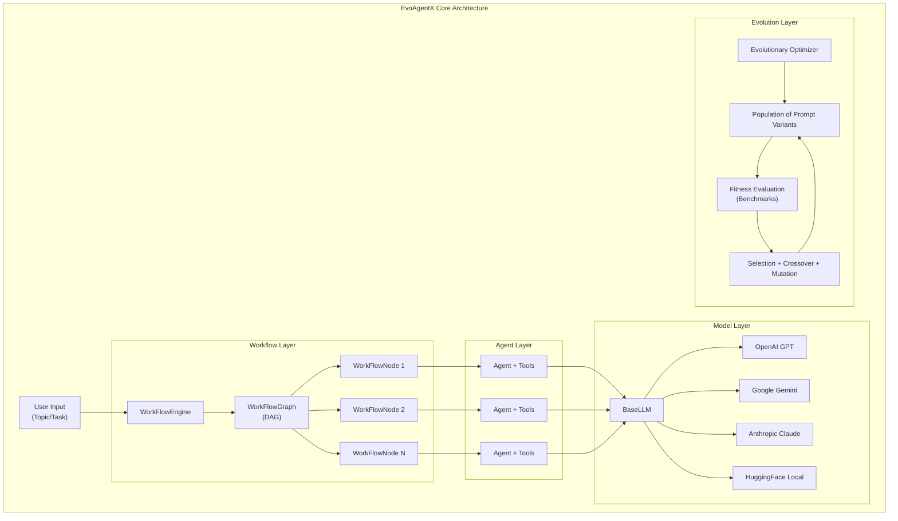
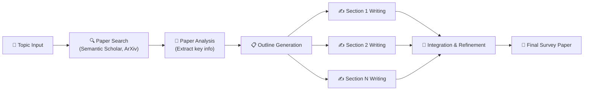

# 🧬 EvoAgentX — Evolutionary Agent Framework

> **Bagian dari**: Deep Analysis: Sistem Auto Research di 4 Project
> **Tanggal Analisis**: 3 Juni 2026

---

## 1.1 Overview

**EvoAgentX** adalah framework open-source untuk membangun, mengoptimalkan, dan mengevolusikan sistem multi-agent AI menggunakan algoritma evolusioner dikombinasikan dengan LLM.

- **Repository**: `c:\SharredData\autoresearch\EvoAgentX`
- **Tagline**: *"An Open-Source Framework for Compositional & Evolutionary AI Agent Systems"*
- **Bahasa**: Python
- **Fitur Utama**: DAG-based multi-agent workflows, evolutionary prompt optimization, automated paper survey generation

---

## 1.2 Arsitektur Sistem



---

## 1.3 Module-by-Module Breakdown

### 1.3.1 Models Layer (`src/evoagentx/models/`)

Lapisan integrasi LLM yang mendukung multiple provider:

| File | Provider | Fitur |
|---|---|---|
| `base_model.py` | Abstract Base | Token counting, cost tracking, retry logic |
| `openai_model.py` | OpenAI | GPT-3.5/4/4o, streaming, function calling |
| `google_model.py` | Google | Gemini Pro/Ultra |
| `anthropic_model.py` | Anthropic | Claude 3/3.5 |
| `huggingface_model.py` | HuggingFace | Local model inference |
| `custom_model.py` | Custom | Self-hosted endpoints |

**Cara kerja `BaseLLM`:**
- Menyediakan unified interface `generate()` untuk semua provider
- Menghitung token usage dan estimasi biaya per-call
- Implementasi retry logic dengan exponential backoff
- Mendukung chat mode dan completion mode
- Streaming response support

### 1.3.2 Agent Layer (`src/evoagentx/agents/`)

| Component | File | Fungsi |
|---|---|---|
| **Agent** | `agent.py` | Core agent — LLM + system prompt + tools + memory |
| **AgentManager** | `agent_manager.py` | Mengelola pool of agents, assignment ke workflow nodes |

Setiap Agent memiliki:
- **System Prompt**: Template instruksi yang bisa di-evolve
- **Tools**: Daftar tools yang bisa dipanggil (search, code execution, RAG)
- **Memory**: Conversation history dan context window management
- **Actions**: Langkah-langkah eksekusi yang bisa dilakukan

### 1.3.3 Workflow Engine (`src/evoagentx/workflow/`)

Ini adalah **jantung dari sistem auto research** EvoAgentX:

| File | Class | Fungsi |
|---|---|---|
| `workflow.py` | `WorkFlow` | Mendefinisikan DAG (Directed Acyclic Graph) dari tasks |
| `workflow_graph.py` | `WorkFlowGraph` | Mengelola nodes dan edges dalam graph |
| `workflow_node.py` | `WorkFlowNode` | Satu unit tugas — agent, inputs, outputs, task description |
| `workflow_engine.py` | `WorkFlowEngine` | Eksekutor yang menjalankan DAG secara topological |

**Cara kerja WorkFlowEngine:**
1. Menerima `WorkFlow` definition (DAG)
2. Melakukan topological sort untuk menentukan urutan eksekusi
3. Untuk setiap node:
   - Load agent yang ditugaskan
   - Siapkan inputs dari parent nodes
   - Eksekusi agent (LLM call + tool use)
   - Simpan outputs untuk child nodes
4. Output dari final node = hasil akhir

### 1.3.4 Tools & Actions (`src/evoagentx/actions/`)

| Tool | File | Fungsi |
|---|---|---|
| **Search** | `search.py` | Web search via Google/Bing API |
| **Code Execution** | `code_execution.py` | Execute Python code dalam sandbox |
| **RAG** | `rag.py` | Retrieval Augmented Generation |
| **Custom Tools** | `tool.py` | User-defined tools |

### 1.3.5 Benchmarks (`src/evoagentx/benchmark/`)

Framework evaluasi komprehensif:

| Benchmark | File | Domain |
|---|---|---|
| MMLU | `mmlu.py` | Multi-task language understanding |
| GPQA | `gpqa.py` | Graduate-level Q&A |
| GSM8K | `gsm8k.py` | Grade school math |
| HotpotQA | `hotpotqa.py` | Multi-hop Q&A |
| HumanEval | `humaneval.py` | Code generation |
| MATH | `math_benchmark.py` | Mathematical problem solving |
| DROP | `drop.py` | Discrete reasoning |
| ARC | `arc.py` | AI2 Reasoning Challenge |

### 1.3.6 Evolutionary Optimization (`src/evoagentx/core/`)

Ini adalah **fitur paling unik** dari EvoAgentX:

| File | Fungsi |
|---|---|
| `module.py` | `Module` base class dengan parameter yang bisa di-optimize |
| `callbacks.py` | Training callbacks untuk monitoring evolusi |

**Proses Evolusi:**
1. **Inisialisasi**: Buat populasi varian prompt (misal: 10 varian system prompt berbeda)
2. **Evaluasi**: Jalankan setiap varian pada benchmark → dapatkan fitness score
3. **Seleksi**: Pilih varian dengan score tertinggi (tournament selection / elitism)
4. **Crossover**: Kombinasikan bagian-bagian dari 2 parent prompts yang sukses
5. **Mutasi**: Modifikasi random pada prompt (via LLM-based rewriting)
6. **Repeat**: Ulangi sampai konvergensi atau budget habis

---

## 1.4 🔬 Auto Research Pipeline: Paper Survey Workflow

**Lokasi**: `examples/paper_survey/`

Ini adalah implementasi paling konkret dari "auto research" di EvoAgentX:



**Step-by-step proses:**

| Step | Agent | Input | Output | Proses Detail |
|---|---|---|---|---|
| 1 | **Topic Agent** | User topic string | Structured research questions | Memecah topik menjadi sub-questions yang bisa di-search |
| 2 | **Search Agent** | Research questions | List of papers (title, abstract, metadata) | Menggunakan Semantic Scholar API dan ArXiv API untuk menemukan papers relevan |
| 3 | **Analysis Agent** | Paper abstracts + metadata | Structured summaries per paper | LLM mengekstrak: kontribusi utama, metode, hasil, limitasi dari setiap paper |
| 4 | **Outline Agent** | Paper summaries | Survey outline (sections + sub-sections) | LLM mengorganisir papers ke dalam tema/kategori dan membuat outline logis |
| 5 | **Section Writers** (parallel) | Outline section + relevant paper summaries | Written section text | Setiap section ditulis oleh agent terpisah dengan akses ke paper summaries relevan |
| 6 | **Integration Agent** | All section texts | Final cohesive survey | Menggabungkan semua sections, menambah introduction/conclusion, memastikan koherensi |

---

## 1.5 Konfigurasi

```python
# Model Configuration
model_config = OpenAIConfig(
    model="gpt-4",
    api_key="...",
    temperature=0.7,
    max_tokens=4096
)

# Workflow defined programmatically
workflow = WorkFlow(
    nodes=[...],  # List of WorkFlowNode
    edges=[...],  # Connections between nodes
    engine_config={...}
)
```

**Environment Variables:**
- `OPENAI_API_KEY`, `GOOGLE_API_KEY`, `ANTHROPIC_API_KEY` — LLM provider keys
- `SEARCH_API_KEY` — Web search API key

---

## 1.6 Keunggulan Unik

1. **Evolutionary Prompt Optimization** — Prompt bukan di-tulis manual, tapi di-evolve secara otomatis
2. **DAG-based Workflows** — Pipeline research yang fleksibel dan composable
3. **Multi-Provider LLM** — Tidak terkunci ke satu vendor
4. **Pre-built Research Pipeline** — Paper survey workflow siap pakai
5. **Comprehensive Benchmarking** — 8+ academic benchmarks
6. **Type-safe Configuration** — Pydantic-based validation

---

## Quick Reference

| File | Fungsi |
|---|---|
| `src/evoagentx/workflow/workflow_engine.py` | DAG execution engine |
| `src/evoagentx/agents/agent.py` | Core agent class |
| `src/evoagentx/models/base_model.py` | LLM abstraction |
| `src/evoagentx/core/module.py` | Evolutionary optimization base |
| `examples/paper_survey/` | Auto research pipeline |

## Update

1. Mekanisme Evolusi — FUNDAMENTAL MISREPRESENTATION 🚨
Ini yang paling parah. Dokumen lo mendeskripsikan evolusi sebagai genetic algorithm klasik:

"Population of Prompt Variants → Selection + Crossover + Mutation"

Ini salah total. Fitur utama dari evolving layer EvoAgentX adalah integrasi tiga algoritma optimisasi: TextGrad, AFlow, dan MIPRO, untuk iteratively refine agent prompts, tool configurations, dan workflow topologies. arxiv
Ketiga algoritma ini secara fundamental berbeda dari genetic algorithm:

TextGrad = gradient-based text optimization (bukan crossover/mutation)
AFlow = MCTS-based workflow structure search
MIPRO = Bayesian-based prompt optimization

Dokumen lo ga nyebut satupun dari ketiga ini. Kalau ada reviewer yang baca dokumen lo terus cek paper-nya, bakal langsung keliatan lo belum baca paper-nya secara teknis.
2. Benchmark List — Mayoritas Salah
Dokumen lo: MMLU, GPQA, GSM8K, HotpotQA, HumanEval, MATH, DROP, ARC
Benchmark yang dipakai di paper aslinya adalah: HotPotQA, MBPP, MATH, dan GAIA. arxiv
Overlap antara dokumen lo dan kenyataan: cuma HotpotQA dan MATH. Sisanya — MMLU, GPQA, GSM8K, HumanEval, DROP, ARC — tidak ada di paper EvoAgentX. Dan MBPP dan GAIA yang justru penting malah ga masuk.
3. Tagline Salah
Dokumen lo: "An Open-Source Framework for Compositional & Evolutionary AI Agent Systems"
Judul paper aslinya adalah "EvoAgentX: An Automated Framework for Evolving Agentic Workflows" — sebuah demo paper yang dipresentasikan di EMNLP 2025 di Suzhou, China. gla
4. Lima Layer, Bukan Empat
EvoAgentX punya arsitektur 5 layer: basic components, agent, workflow, evolving, dan evaluation layers. arxiv
Dokumen lo nge-diagram-in 4 subsystem (Model, Agent, Workflow, Evolution) dan ngeframe Benchmark sebagai komponen terpisah — tapi evaluation layer sebagai layer mandiri ga keliatan di arsitektur diagram dokumen lo.
5. Atribusi Institusi — Hilang Sama Sekali
EvoAgentX dibuat oleh Yingxu Wang (Mohamed bin Zayed University of AI), Siwei Liu (University of Aberdeen), Jinyuan Fang dan Zaiqiao Meng (University of Glasgow). arxiv
Bukan Stanford, bukan Google, bukan lab big tech manapun. Dokumen lo ga nyebut institutional origin sama sekali — ini penting untuk academic credibility kalau ini buat laporan.
6. Paper Survey Pipeline — Unverified
Dokumen lo nge-highlight examples/paper_survey/ dengan Semantic Scholar & ArXiv API sebagai fitur utama. Gue ga bisa konfirmasi ini exist di GitHub-nya. Paper resmi sama sekali tidak menyebut paper survey sebagai use case. Ini kemungkinan besar fitur yang di-reconstruct/dikarang sendiri berdasarkan asumsi tentang "auto research."