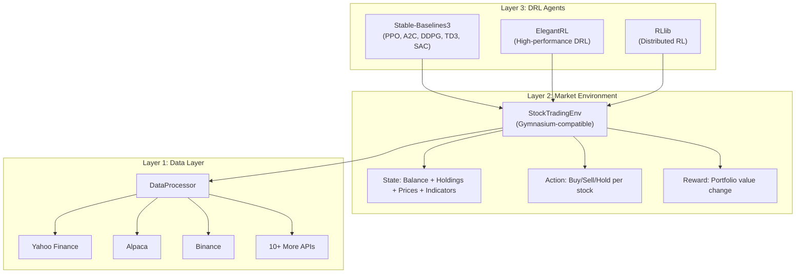

# 📊 FinRL — Deep Reinforcement Learning for Finance

> **Bagian dari**: Deep Analysis: Sistem Auto Research di 4 Project
> **Tanggal Analisis**: 3 Juni 2026

---

## 2.1 Overview

**FinRL** adalah framework open-source deep reinforcement learning (DRL) untuk kuantitatif finance. Ini **bukan** sistem auto research untuk literature survey, melainkan pipeline otomatis untuk riset trading.

- **Repository**: `c:\SharredData\autoresearch\FinRL`
- **Organization**: AI4Finance Foundation
- **Bahasa**: Python
- **Fitur Utama**: Automated data → environment → training → backtesting pipeline

---

## 2.2 Arsitektur Tiga Layer



---

## 2.3 Automated Trading Research Pipeline

```mermaid
graph LR
    A["⚙️ Configuration<br/>(tickers, dates, indicators)"] --> B["📥 Data Download<br/>(OHLCV from APIs)"]
    B --> C["🧹 Data Cleaning<br/>(handle missing values)"]
    C --> D["📐 Feature Engineering<br/>(MACD, RSI, CCI, ADX)"]
    D --> E["🏗️ Environment Creation<br/>(StockTradingEnv)"]
    E --> F["🎓 Agent Training<br/>(PPO/A2C/DDPG)"]
    F --> G["📈 Backtesting<br/>(out-of-sample trading)"]
    G --> H["📊 Evaluation<br/>(Sharpe ratio, returns)"]
```



**Detail setiap step:**

| Step | Module | File | Proses Detail |
|---|---|---|---|
| 1. Config | `config.py` | `finrl/config.py` | Set tickers (DOW30, NAS100, etc.), date ranges, indicator list |
| 2. Download | `DataProcessor` | `finrl/meta/data_processor.py` | Download OHLCV data dari 10+ API sources |
| 3. Clean | `DataProcessor.clean_data()` | Same | Handle missing values, forward/backward fill |
| 4. Features | `DataProcessor.add_technical_indicator()` | Same | Compute MACD, Bollinger Bands, RSI, CCI, DX, SMA |
| 5. Environment | `StockTradingEnv` | `finrl/meta/env_stock_trading/env_stocktrading.py` | Gym environment: state → action → reward → next state |
| 6. Training | SB3/ElegantRL/RLlib | `finrl/agents/stablebaselines3/models.py` | Train DRL agent pada historical data |
| 7. Backtest | Trained agent | Same | Agent trades pada unseen data |
| 8. Evaluate | `plot.py` | `finrl/plot.py` | Compare vs DJIA benchmark, compute Sharpe ratio |

---

## 2.4 Core Components Detail

### 2.4.1 DataProcessor (`finrl/meta/data_processor.py`)

Unified interface untuk download dan preprocess market data:

```python
class DataProcessor:
    def download_data(ticker_list, start_date, end_date, source)
    def clean_data()
    def add_technical_indicator(tech_indicator_list)
    def add_turbulence()  # Mahalanobis distance-based market turbulence
    def add_vix()         # CBOE Volatility Index
    def df_to_array()     # Convert to numpy for RL training
```

**Supported data sources**: Alpaca, WRDS, Yahoo Finance, Binance, CCXT, Joinquant, Quantconnect, Ricequant, Tushare, Baostock

### 2.4.2 StockTradingEnv (`finrl/meta/env_stock_trading/`)

Gymnasium-compatible environment:

- **State Space**: `[balance, holdings_per_stock, prices, MACD, RSI, CCI, ADX, ...]`
- **Action Space**: Continuous `[-1, 1]` per stock (negative = sell, positive = buy, 0 = hold)
- **Reward**: Δ(total portfolio value) = Δ(cash + Σ(shares × price))
- **Turbulence Index**: Jika market turbulence > threshold, agent hanya bisa sell

### 2.4.3 DRL Agents (`finrl/agents/`)

| Library | Algorithms | Use Case |
|---|---|---|
| **Stable-Baselines3** | PPO, A2C, DDPG, TD3, SAC | Standard training, good defaults |
| **ElegantRL** | PPO, SAC, TD3, DDPG | High-performance, GPU-optimized |
| **RLlib** | PPO, A2C, DDPG | Distributed training at scale |

---

## 2.5 Configuration System

File: `finrl/config.py`

```python
# Key configuration variables
TRAINED_MODEL_DIR = "trained_models"
TENSORBOARD_LOG_DIR = "tensorboard_log"
DATA_SAVE_DIR = "datasets"

TRAIN_START_DATE = "2009-01-01"
TRAIN_END_DATE = "2020-07-01"
TRADE_START_DATE = "2020-07-01"
TRADE_END_DATE = "2021-10-29"

INDICATORS = ["macd", "boll_ub", "boll_lb", "rsi_30",
              "cci_30", "dx_30", "close_30_sma", "close_60_sma"]

# Model hyperparameters per algorithm
A2C_PARAMS = {"n_steps": 5, "ent_coef": 0.01, "learning_rate": 0.0007}
PPO_PARAMS = {"n_steps": 2048, "ent_coef": 0.01, "learning_rate": 0.00025, ...}
DDPG_PARAMS = {"batch_size": 128, "buffer_size": 50000, ...}
```

---

## 2.6 Keunggulan Unik

1. **10+ Data Sources** — Unified interface ke multiple market data providers
2. **3 DRL Libraries** — Plug-and-play antara SB3, ElegantRL, RLlib
3. **Turbulence Index** — Market regime detection untuk risk management
4. **Gym-Compatible** — Standard RL interface, mudah di-extend
5. **Comprehensive Tutorials** — NeurIPS competition notebooks included

---

## Quick Reference

| File | Fungsi |
|---|---|
| `finrl/config.py` | Central configuration |
| `finrl/meta/data_processor.py` | Data download & processing |
| `finrl/meta/env_stock_trading/env_stocktrading.py` | Trading environment |
| `finrl/agents/stablebaselines3/models.py` | DRL agent wrapper |
| `finrl/plot.py` | Backtesting visualization |


## Update
⚠️ Yang Perlu Dikoreksi / Outdated
1. Date ranges di config.py — OUTDATED
Ini yang paling signifikan. Dokumen lo nulis:
TRAIN_START_DATE = "2009-01-01"
TRAIN_END_DATE = "2020-07-01"
TRADE_START_DATE = "2020-07-01"
TRADE_END_DATE = "2021-10-29"
Tutorial terbaru FinRL 2026 (v0.3.8) pakai training set 2014–2025 dan trading set 2026-01-01 sampai 2026-03-20. Jadi tanggal yang ada di dokumen lo itu dari tutorial lama (ICAIF 2020 era), bukan current config. GitHub
2. ElegantRL & RLlib — Possibly Diminished Support
Latest release v0.3.8 (Maret 2026) hanya menyebut 5 DRL agents: A2C, DDPG, PPO, TD3, SAC via Stable-Baselines3. ElegantRL dan RLlib memang pernah ada di arsitektur FinRL lama, tapi di versi terbaru tampaknya SB3 jadi primary. Dokumen lo ngeframe ElegantRL & RLlib seolah setara padahal mungkin udah legacy. GitHub
3. Turbulence Behavior — Oversimplified
Dokumen lo bilang: "Jika market turbulence > threshold, agent hanya bisa sell"
Lebih tepatnya: Di versi FinRL-Meta terbaru, turbulence index bahkan diganti dengan VIX yang bisa diakses real-time, karena kalkulasi turbulence index terlalu lambat untuk live trading. Dan behavior-nya bukan sekadar "hanya bisa sell" — agent cenderung melikuidasi seluruh posisi (force sell-off), bukan sekadar disable aksi beli. arxiv
4. "Gymnasium-compatible" vs "OpenAI Gym"
Dokumen lo bilang Gymnasium-compatible. Secara teknis, environment FinRL originally berbasis OpenAI Gym framework. Migrasi ke Gymnasium (fork modernnya) ada di versi-versi tertentu tapi framing dokumen ini agak misleading kalau seolah FinRL natively Gymnasium dari awal. 