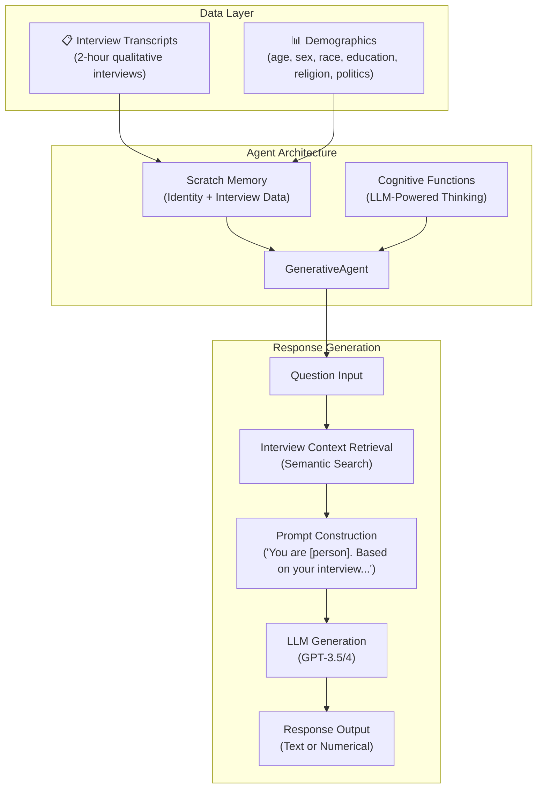
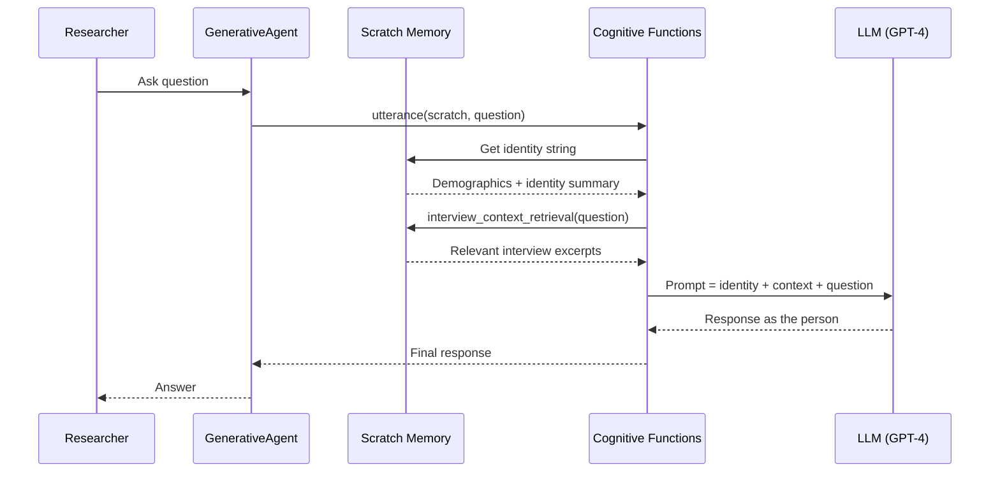

# 🧠 GenAgents — Generative Simulations of 1,000 People

> **Bagian dari**: Deep Analysis: Sistem Auto Research di 4 Project
> **Tanggal Analisis**: 3 Juni 2026

---

## 4.1 Overview

**GenAgents** adalah sistem dari Stanford HCI Lab untuk membuat **replika komputasional dari orang nyata** menggunakan data wawancara + LLM.

- **Repository**: `c:\SharredData\autoresearch\genagents`
- **Organization**: Stanford HCI
- **Paper**: *"Generative Agent Simulations of 1,000 People"*
- **Bahasa**: Python
- **Fitur Utama**: Interview-grounded human simulation, 1,052 agents, survey prediction

---

## 4.2 Arsitektur Sistem



---

## 4.3 Core Components Detail

### 4.3.1 GenerativeAgent (`simulation_engine/agent.py`)

```python
class GenerativeAgent:
    def __init__(self, folder):
        self.scratch = Scratch(folder)  # Load identity + interview data

    def utterance(self, question):
        """Generate a text response as this person would respond."""
        return cognitive_functions.utterance(self.scratch, question)

    def numerical_resp(self, question, min_val, max_val):
        """Generate a numerical response (Likert scale, etc.)."""
        return cognitive_functions.numerical_resp(self.scratch, question, min_val, max_val)
```

| Method | Input | Output | Use Case |
|---|---|---|---|
| `utterance()` | Open-ended question | Free-text response | Interview-style Q&A |
| `numerical_resp()` | Scale question + range | Integer | Survey responses (1-5 Likert, 0-100, etc.) |

### 4.3.2 Scratch Memory (`simulation_engine/scratch.py`)

Menyimpan identitas dan data wawancara setiap agent:

| Data | Source | Format |
|---|---|---|
| Demographics | `demographics.json` | Structured JSON (age, sex, race, education, religion, political affiliation) |
| Interview | `interview_transcript.txt` | Full text transcript (split into thematic sections) |
| Identity | `identity.txt` | Natural language summary of the person |

Folder structure per agent:
```
agent_bank/
├── agent_001/
│   ├── demographics.json
│   ├── interview_transcript.txt
│   └── identity.txt
├── agent_002/
│   ├── ...
└── ...  (1,052 agents total)
```

### 4.3.3 Cognitive Functions (`simulation_engine/cognitive_functions.py`)

Ini adalah "otak" dari setiap agent:

| Function | Proses |
|---|---|
| `utterance(scratch, question)` | 1. Retrieve relevant interview context → 2. Build prompt dengan identity + context → 3. LLM generates response as the person |
| `numerical_resp(scratch, question, min, max)` | Same tapi forces numerical output |
| `interview_context_retrieval(scratch, question)` | Semantic similarity search dalam interview transcript untuk menemukan bagian yang relevan dengan pertanyaan |

**Prompt Template (simplified):**
```
You are {name}, a {age}-year-old {race} {sex} from {location}.
Your education level is {education}. You identify as {religion} and {political_affiliation}.

Based on your interview, you said:
{relevant_interview_excerpts}

Now, please answer the following question as you would in real life:
{question}
```

---

## 4.4 Data Flow Detail



---

## 4.5 LLM Integration

File: `simulation_engine/settings.py`

| Setting | Value | Description |
|---|---|---|
| `model` | `gpt-4` / `gpt-3.5-turbo` | LLM model to use |
| `api_key` | Environment variable | OpenAI API key |
| `temperature` | 0.7 (typical) | Sampling temperature |

---

## 4.6 Evaluation & Validation

Project memvalidasi fidelitas agent melalui:

| Test | Metric | Result |
|---|---|---|
| **General Social Survey (GSS)** | Response accuracy vs real humans | ~85% match |
| **Big Five Personality** | Personality trait prediction | High correlation |
| **Economic Games** | Decision-making patterns | Matches real behavior |
| **Demographic Patterns** | Group-level response distributions | Reproduces real-world patterns |

---

## 4.7 Keunggulan Unik

1. **Interview-Grounded** — Responses based on real interview data, bukan general LLM knowledge
2. **Validated at Scale** — 1,052 agents dibandingkan dengan real human responses
3. **Demographic Faithful** — Reproduces group-level demographic patterns
4. **Ethical Framework** — Comprehensive ethical considerations untuk human simulation
5. **Practical Applications** — Virtual focus groups, policy testing, social science research

---

## Quick Reference

| File | Purpose |
|---|---|
| `simulation_engine/agent.py` | Core GenerativeAgent class |
| `simulation_engine/scratch.py` | Agent memory/identity management |
| `simulation_engine/cognitive_functions.py` | LLM-powered response generation |
| `simulation_engine/settings.py` | API configuration |
| `simulation_engine/global_methods.py` | Shared utilities |
| `agent_bank/` | Pre-built agent data (1,052 agents) |
| `experiment_scripts/` | Validation experiment scripts |

## Update

1. LLM version di settings.py — SALAH
Dokumen lo nulis gpt-4 / gpt-3.5-turbo. Kenyataannya:
Default LLM yang dipakai di settings.py adalah gpt-4o-mini, bukan gpt-3.5-turbo atau gpt-4 klasik. GitHub
Ini bukan hal kecil — kalau ada yang coba jalanin dan bingung kenapa config-nya ga match, ini penyebabnya.
2. Method categorical_resp() — HILANG DARI DOKUMEN
Ada tiga method utama: utterance(), numerical_resp(), dan categorical_resp() untuk pertanyaan pilihan ganda (misalnya "Yes/No/Sometimes"). Dokumen lo cuma nyebut dua. Ini bukan minor — categorical_resp() itu use case utama untuk survey simulation. GitHub
3. Memory features — Completely missing
Agent punya method remember() untuk menyimpan pengalaman baru, reflect() untuk membentuk insight dari memori, dan update_scratch() untuk update atribut personal agent. Semua ini ga dibahas sama sekali di dokumen lo padahal itu core dari memory stream architecture-nya. GitHub
4. Attribution organisasi — Incomplete
Dokumen lo bilang "Stanford HCI". Faktanya ini adalah kolaborasi Stanford dan Google DeepMind — bukan cuma Stanford HCI. Percy Liang dari Stanford NLP juga co-author-nya. Framing "Stanford HCI Lab" terlalu narrow. ResearchGate
5. Demographic fields — Incomplete
Dokumen bilang: age, sex, race, education, religion, politics. Tapi dari paper aslinya, stratifikasi sampel mencakup usia, census division, pendidikan, etnis, gender, income, neighborhood, ideologi politik, dan orientasi seksual — lebih lengkap dan beda framing (bukan "religion" tapi ada banyak dimensi lain). arXiv
6. Import path simulation_engine/agent.py — Probably wrong
Berdasarkan README resmi, GenerativeAgent diimport dari genagents.genagents, bukan dari simulation_engine/agent.py. File path yang dokumen lo tulis kemungkinan besar salah atau mengacu ke internal structure yang berbeda. GitHub