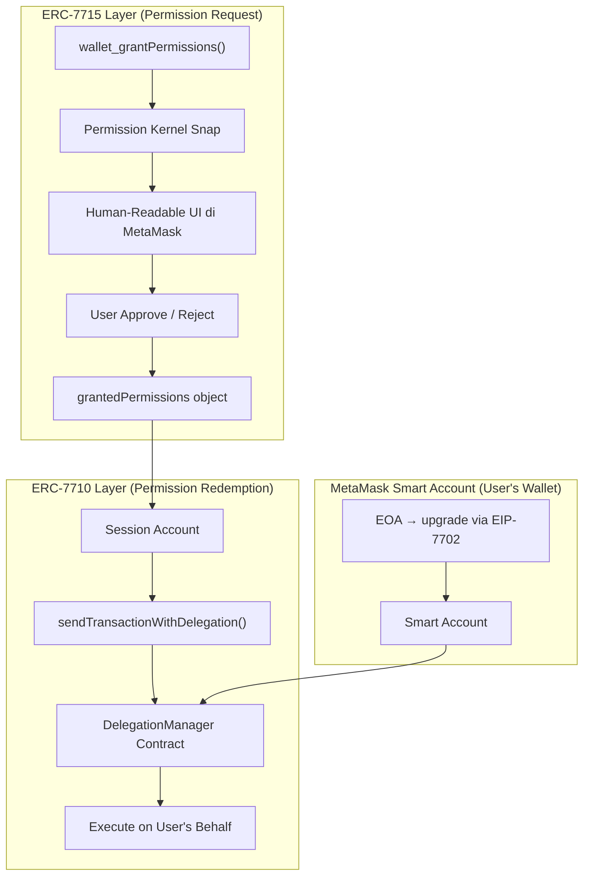
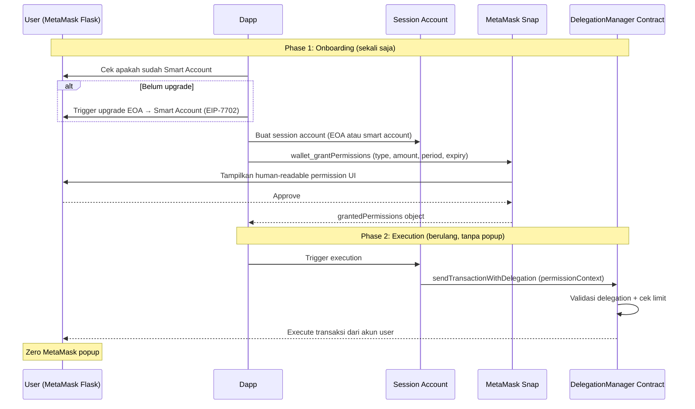

# 🦊 MetaMask Smart Accounts Kit — Advanced Permissions (ERC-7715)

> **Bagian dari**: Deep Analysis: Sistem Auto Research di 4 Project
> **Tanggal Analisis**: 9 Juni 2026

---

## 9.1 Overview

**MetaMask Smart Accounts Kit** adalah SDK resmi MetaMask untuk membangun dapp dengan embedded smart contract wallets dan Advanced Permissions berbasis ERC-7715.

- **Repository**: `@metamask/smart-accounts-kit` (npm)
- **Organization**: MetaMask / Consensys
- **Bahasa**: TypeScript (Viem-based)
- **Versi Flask Minimum**: MetaMask Flask 13.5.0+
- **Fitur Utama**: Intent-based execution, session accounts, one-time permission approval

**Masalah yang dipecahkan:**

Secara historis, setiap transaksi di wallet Web3 butuh approval manual dari user. Ini menghasilkan tiga masalah besar:

| Masalah | Dampak |
|---|---|
| Approval fatigue | User kebingungan approve transaksi terus-menerus |
| Tidak ada standard permission scoping | Setiap dapp buat workaround sendiri |
| Active connection required | Tidak bisa execute kalau user offline |

Advanced Permissions menyelesaikan ini dengan model **intent-based execution**: user mendefinisikan scope permission sekali, dan transaksi berjalan otomatis dalam scope tersebut.

---

## 9.2 Arsitektur Sistem

### 9.2.1 Two-Layer Standard



ERC-7715 dan ERC-7710 adalah dua standar yang saling melengkapi:

| Standar | Fungsi | Method |
|---|---|---|
| **ERC-7715** | Mendefinisikan format request permission | `wallet_grantPermissions` |
| **ERC-7710** | Mendefinisikan cara meredem (mengeksekusi) permission | `sendTransactionWithDelegation` |

---

## 9.2.2 Full Permission Lifecycle



---

## 9.3 Core Components Detail

### 9.3.1 Session Account

Session account adalah "perantara" yang digunakan dapp untuk meredem permission. Ia **tidak menyimpan token** — hanya bertindak sebagai signer.

| Properti | Detail |
|---|---|
| **Tipe** | Bisa EOA atau Smart Account |
| **Fungsi** | Request dan redeem Advanced Permissions |
| **Token** | Tidak menyimpan token apapun |
| **Lifetime** | Sampai permission expired atau di-revoke user |

```typescript
import { createSmartAccountClient } from "@metamask/smart-accounts-kit";
import { sepolia as chain } from "viem/chains";

// Session account bisa berupa EOA sederhana
const sessionAccount = privateKeyToAccount(generatePrivateKey());
```

### 9.3.2 Wallet Client (Viem Integration)

Viem Wallet Client di-extend dengan dua action set berbeda untuk dua fase:

```typescript
import { createWalletClient, custom } from "viem";
import {
  erc7715ProviderActions,  // untuk Grant phase
  erc7710WalletActions,    // untuk Redeem phase
} from "@metamask/smart-accounts-kit/actions";

// Client untuk request permission (Phase 1)
const walletClient = createWalletClient({
  transport: custom(window.ethereum),
}).extend(erc7715ProviderActions());

// Client untuk redeem permission (Phase 2)
const sessionClient = createWalletClient({
  account: sessionAccount,
  transport: custom(window.ethereum),
}).extend(erc7710WalletActions());
```

### 9.3.3 Smart Account Upgrade Check

Sebelum request permission, dapp harus memverifikasi bahwa user sudah upgrade ke Smart Account:

```typescript
import { getSmartAccountsEnvironment } from "@metamask/smart-accounts-kit";

const code = await publicClient.getCode({ address: userAddress });

if (code) {
  // EOA sudah delegasi ke Smart Account via EIP-7702
  // Format: 0xef0100 || delegatorAddress
  const delegatorAddress = `0x${code.substring(8)}`;
  const env = getSmartAccountsEnvironment(chain.id);
  
  const isUpgraded = delegatorAddress.toLowerCase() ===
    env.implementations.EIP7702StatelessDeleGatorImpl.toLowerCase();
    
  if (!isUpgraded) {
    // Trigger upgrade programmatically atau minta user switch manual
  }
}
```

---

## 9.4 Empat Tipe Permission

Smart Accounts Kit mendukung 4 tipe permission yang bisa di-request via `wallet_grantPermissions`:

| Tipe | Token | Mekanisme | Use Case |
|---|---|---|---|
| `erc20-token-periodic` | ERC-20 | Reset per periode | DCA harian, subscription bulanan |
| `erc20-token-stream` | ERC-20 | Akumulasi linear per detik | Auto-compounding, streaming payment |
| `native-token-periodic` | ETH/native | Reset per periode | Gas fee periodic |
| `native-token-stream` | ETH/native | Akumulasi linear per detik | Continuous native token flow |

Setiap permission type menerima parameter:

| Parameter | Tipe | Fungsi |
|---|---|---|
| `expiry` | Unix timestamp | Kapan permission expired |
| `justification` | string | Human-readable alasan (tampil di UI MetaMask) |
| `isAdjustmentAllowed` | boolean | Apakah user bisa edit amount di UI |
| `periodAmount` | bigint | Jumlah token per periode |
| `periodDuration` | number (detik) | Durasi satu periode |

### 9.4.1 Contoh: ERC-20 Periodic (paling relevan untuk DeFi)

```typescript
const currentTime = Math.floor(Date.now() / 1000);
const expiry = currentTime + 604800; // 1 minggu

const grantedPermissions = await walletClient.requestExecutionPermissions([{
  chainId: chain.id,
  expiry,
  signer: {
    type: "account",
    data: { address: sessionAccount.address },
  },
  permission: {
    type: "erc20-token-periodic",
    data: {
      tokenAddress: "0x...", // USDC address
      // 10 USDC per hari (USDC = 6 decimals)
      periodAmount: parseUnits("10", 6),
      // 1 hari dalam detik
      periodDuration: 86400,
      justification: "Auto-compound USDC yield setiap hari",
    },
    isAdjustmentAllowed: true,
  },
}]);
```

### 9.4.2 Contoh: ERC-20 Stream (untuk use case continuous)

```typescript
const permission = {
  type: "erc20-token-stream",
  data: {
    tokenAddress: USDC_ADDRESS,
    amountPerSecond: parseUnits("0.1", 6), // 0.1 USDC/detik
    initialAmount: parseUnits("1", 6),     // langsung release 1 USDC
    maxAmount: parseUnits("100", 6),       // cap di 100 USDC
    startTime: currentTime,
    justification: "Streaming USDC untuk yield farming",
  },
};
```

---

## 9.5 Alur Data End-to-End

```mermaid
graph LR
    A["👤 User buka dapp<br/>(sekali saja)"] --> B["🔍 Cek Smart Account status"]
    B -->|Belum upgrade| C["⬆️ Upgrade EOA → Smart Account<br/>(EIP-7702)"]
    B -->|Sudah| D
    C --> D["🔑 Buat Session Account"]
    D --> E["📋 wallet_grantPermissions<br/>(type + amount + expiry)"]
    E --> F["✅ User approve di MetaMask<br/>(satu kali, human-readable UI)"]
    F --> G["💾 grantedPermissions object disimpan dapp"]

    G --> H["⏰ Trigger (jadwal / event)"]
    H --> I["🚀 sendTransactionWithDelegation<br/>(permissionContext)"]
    I --> J["📜 DelegationManager Contract<br/>validasi + cek limit"]
    J --> K["💸 Execute dari akun user<br/>Zero popup"]
    K --> H
```



---

## 9.6 Requirements & Constraints

| Requirement | Detail |
|---|---|
| **MetaMask Flask** | Versi 13.5.0 atau lebih baru (bukan MetaMask regular) |
| **User account** | Harus upgrade ke MetaMask Smart Account (bukan EOA biasa) |
| **Network** | Saat ini terutama Sepolia testnet; mainnet support tergantung deployment DelegationManager |
| **Snaps** | Permission Kernel Snap + Gator Permission Snap otomatis terinstall saat user approve |
| **Session account** | Bisa EOA atau Smart Account, tidak perlu punya token |

### Catatan Penting untuk Vibing Farmer

1. **User harus pakai MetaMask Flask**, bukan MetaMask biasa. Ini friction point terbesar untuk onboarding — perlu komunikasi jelas di UI.

2. **Smart Account upgrade sekali saja** — kalau user sudah upgrade, tidak perlu upgrade lagi di session berikutnya.

3. **Permission bisa di-revoke user kapan saja** via MetaMask UI, bukan hanya ketika expired. Agent harus handle skenario ini (permission revoked mid-session).

4. **`periodAmount` di-reset per periode, bukan kumulatif** — kalau sisa allowance periode ini tidak dipakai, tidak carry over ke periode berikutnya.

5. **Dua client terpisah** — walletClient (untuk grant, pakai `erc7715ProviderActions`) dan sessionClient (untuk redeem, pakai `erc7710WalletActions`). Sering jadi source of confusion.

---

## 9.7 Perbandingan: Advanced Permissions vs. Regular Delegations

| Aspek | Regular Delegations | Advanced Permissions (ERC-7715) |
|---|---|---|
| **Human-readable UI** | ❌ Tidak | ✅ Ya (ditampilkan MetaMask) |
| **Request via extension** | ❌ Tidak bisa | ✅ Bisa |
| **Signed by user** | ✅ Ya | ✅ Ya |
| **Standard format** | ❌ Custom per dapp | ✅ Standar ERC-7715 |
| **AI agent support** | Manual | ✅ Explicitly designed for |
| **Risk** | Tinggi (bisa expose full wallet) | Rendah (scoped permission) |

---

## Quick Reference

| Method | Action Set | Fungsi |
|---|---|---|
| `requestExecutionPermissions()` | `erc7715ProviderActions` | Request permission dari user (Phase 1) |
| `sendTransactionWithDelegation()` | `erc7710WalletActions` | Eksekusi menggunakan permission (Phase 2) |
| `getSmartAccountsEnvironment()` | `@metamask/smart-accounts-kit` | Ambil contract addresses per chain |

| File/Module | Fungsi |
|---|---|
| `@metamask/smart-accounts-kit` | Package utama |
| `@metamask/smart-accounts-kit/actions` | `erc7715ProviderActions`, `erc7710WalletActions` |
| `erc7715ProviderActions` | Extend walletClient untuk grant phase |
| `erc7710WalletActions` | Extend sessionClient untuk redeem phase |
| `DelegationManager` | Smart contract yang validasi dan eksekusi delegation |