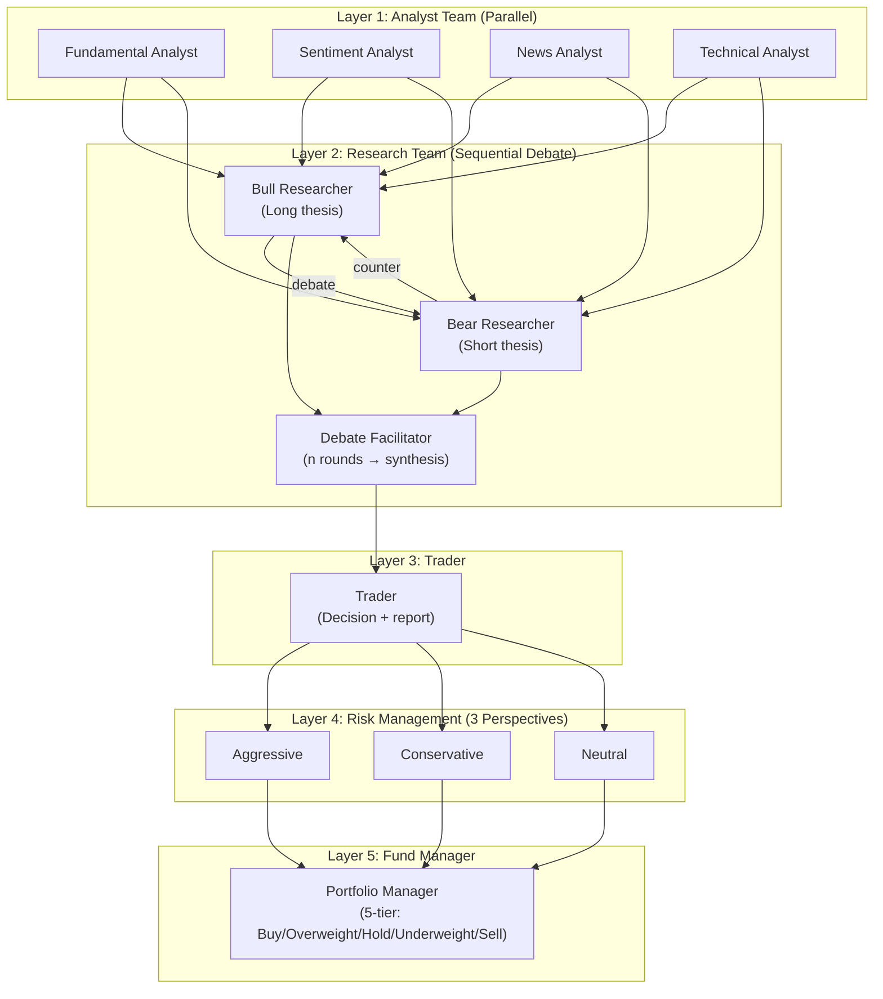
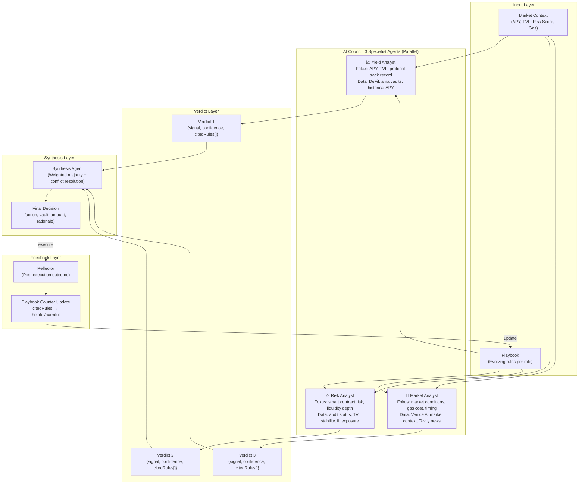

# 🧠 AI Council — Multi-Agent Debate System (Vibing Farmer)

> **Bagian dari**: Deep Analysis: Vibing Farmer Architecture
> **Tanggal Analisis**: 9 Juni 2026
> **Inspired by**: TradingAgents (TauricResearch, arXiv 2412.20138)

---

## 6.1 Overview

**AI Council** adalah sistem multi-agent debate di Vibing Farmer yang menggabungkan dua pattern dari penelitian terdepan:

| Pattern | Source | Kontribusi |
|---|---|---|
| Parallel specialist verdicts + Bull/Bear debate | TradingAgents (UCLA + MIT, 2024) | Role decomposition, adversarial reasoning |
| `citedRules` + Reflector counter update | ACE Framework (Stanford + SambaNova, 2025) | Playbook accountability |

Kombinasi keduanya menghasilkan sistem yang tidak hanya membuat keputusan kolaboratif, tapi juga **accountable ke playbook** — setiap verdict bisa di-trace ke rule mana yang dipake, dan rule tersebut mendapat feedback empiris dari outcome.

---

## 6.2 Konteks: Kenapa TradingAgents Relevan

TradingAgents menyelesaikan masalah fundamental LLM trading agent:

> *"Most LLM trading bots adalah single model dengan giant prompt, dan suffer dari confirmation bias — sekali membentuk initial thesis, mereka cherry-pick evidence. TradingAgents counters this structurally dengan 5 layers of explicit role-based agents yang argue with each other."*

Insight ini langsung applicable ke DeFi yield farming: single-agent yang evaluate vault APY bisa terjebak di confirmation bias, especially ketika market volatile. AI Council mensimulasikan "internal debate" untuk surface counterarguments sebelum keputusan final.

---

## 6.3 Arsitektur TradingAgents (Referensi)

Untuk konteks, arsitektur asli TradingAgents memiliki 5 layers dan ~12 agents:



**Kunci**: Analyst team (Layer 1) berjalan **parallel**. Researcher debate (Layer 2) berjalan **sequential**, n rounds. Ini perbedaan penting yang sering disalahpahami.

---

## 6.4 AI Council: Adaptasi untuk DeFi Yield Farming

Vibing Farmer mengadaptasi TradingAgents menjadi 3-specialist parallel architecture yang lebih lean, disesuaikan untuk context DeFi:



---

## 6.5 Perbedaan dari TradingAgents Original

| Aspek | TradingAgents | AI Council (Vibing Farmer) |
|---|---|---|
| **Jumlah agents** | ~12 (5 layers) | 3 specialist + 1 synthesis |
| **Debate style** | Sequential, n rounds Bull vs Bear | Parallel verdicts + synthesis |
| **Domain** | Stock trading (equity) | DeFi yield farming |
| **Output format** | 5-tier rating (Buy → Sell) | Action + vault + amount + rationale |
| **Playbook system** | ❌ Tidak ada | ✅ ACE-inspired, per-role subset |
| **Rule accountability** | ❌ Tidak ada | ✅ `citedRules` per verdict |
| **Feedback loop** | ❌ Stateless per run | ✅ Reflector → counter update |
| **Persistent memory** | SQLite decision log | Playbook counter evolution |

---

## 6.6 Core Components Detail

### 6.6.1 Specialist Agent Structure

Setiap specialist agent menerima:

```javascript
{
  role: "yield_analyst" | "risk_analyst" | "market_analyst",
  systemPrompt: roleSpecificPrompt,         // berbeda per role
  playbook: filteredRulesForRole,           // subset playbook yang relevan
  marketData: roleRelevantData,             // dimensi data yang berbeda
  question: "Should we deposit X USDC into vault Y?"
}
```

Dan menghasilkan:

```javascript
{
  signal: "DEPOSIT" | "HOLD" | "WITHDRAW",
  confidence: 0.0 - 1.0,
  reasoning: "step-by-step rationale",
  citedRules: ["yld-00003", "risk-00001"],  // rule IDs dari playbook
  concerns: ["high gas", "low TVL trend"]   // flag untuk synthesis agent
}
```

### 6.6.2 Kenapa `citedRules` Penting

`citedRules` adalah innovation yang **tidak ada di TradingAgents**. Ini menghubungkan verdict ke rule playbook yang spesifik, memungkinkan:

1. **Traceability** — kenapa agent decide seperti itu bisa di-audit
2. **Rule feedback** — kalau deposit yang di-recommended dengan rule X ternyata rugi, rule X mendapat `harmful` counter
3. **Playbook evolution** — rule yang consistently helpful naik prioritas, yang harmful di-prune

```javascript
// Setelah execution outcome diketahui:
if (outcome === "profitable") {
  citedRules.forEach(id => playbook.increment(id, "helpful"))
} else {
  citedRules.forEach(id => playbook.increment(id, "harmful"))
}
```

### 6.6.3 Playbook Per-Role

Berbeda dari single playbook, setiap role mendapat subset yang relevan:

| Role | Playbook Subset |
|---|---|
| Yield Analyst | Rules tentang APY threshold, TVL minimum, protocol reputation |
| Risk Analyst | Rules tentang audit requirements, IL tolerance, liquidity depth |
| Market Analyst | Rules tentang gas limits, market regime detection, timing |

Ini mencegah noise — Yield Analyst tidak perlu lihat gas optimization rules, Risk Analyst tidak perlu lihat APY comparison heuristics.

### 6.6.4 Synthesis Agent

Synthesis agent bukan sekedar majority vote. Ia melakukan:

```
1. Cek unanimity → kalau 3/3 sepakat, langsung execute dengan high confidence
2. Cek dominant signal → kalau 2/3 sepakat, weight berdasarkan confidence score
3. Cek conflict → kalau split, trigger conflict resolution:
   - Identifikasi source of disagreement (dari concerns field)
   - Weight berdasarkan relevansi concern ke current market condition
   - Output final decision dengan lower confidence + explicit caveats
4. Hard veto → kalau Risk Analyst signal WITHDRAW dengan confidence > 0.85,
   override semua sinyal lain (safety mechanism)
```

---

## 6.7 Debate Rounds: Gap vs TradingAgents

TradingAgents menggunakan **multi-round debate** (`max_debate_rounds` configurable):

```
Round 1: Bull menulis long thesis
Round 1: Bear menulis short thesis
Round 2: Bull counter-argues Bear's thesis
Round 2: Bear counter-argues Bull's thesis
...Round n...
Facilitator: reviews full debate history → picks prevailing perspective
```

AI Council Vibing Farmer saat ini menggunakan **single-round parallel verdict**. Ini adalah simplifikasi yang valid untuk latency reasons (DeFi timing matters), tapi kehilangan nilai dari iterative debate.

**Rekomendasi upgrade (opsional, post-deadline):**

```javascript
// Optional: 2-round debate untuk kasus conflict
if (synthesis.hasConflict) {
  // Round 2: setiap agent lihat verdict agent lain
  const round2Verdicts = await Promise.all(
    agents.map(agent => agent.reconsider(
      originalVerdict,
      otherAgentsVerdicts  // agent sekarang tau apa yang orang lain pikir
    ))
  )
  // Re-synthesize dengan updated verdicts
}
```

Bahkan 2 rounds ini jauh lebih kuat dari single-round, dan lebih defensible ke judges kalau ditanya soal metodologi.

---

## 6.8 Validasi: Kenapa Multi-Agent > Single Agent untuk Use Case Ini

Dari paper TradingAgents, eksperimen pada AAPL (Jun–Nov 2024):

- TradingAgents: **26.62% cumulative return**
- Buy-and-hold baseline: **-5.23%**
- Sharpe ratio dan max drawdown juga lebih baik

Mekanisme yang explain improvement ini:

> *"Agents engage in natural language dialogue exclusively during agent-to-agent conversations and debates. These concise, focused discussions have been shown to promote deeper reasoning and integrate diverse perspectives, enabling more balanced decisions in complex, long-horizon scenarios."*

Untuk DeFi context, analoginya: single agent yang evaluate vault APY bisa miss bahwa protocol tersebut punya audit concern (yang hanya terlihat kalau ada risk-specialist perspective yang berbeda).

---

## 6.9 Alignment dengan Hackathon Judging Criteria

AI Council berkontribusi ke dua track sekaligus:

**Best Agent track** — mendemonstrasikan agent yang reason secara multi-dimensional, tidak hanya rule-based execution. Venice AI dipakai sebagai intelligence layer untuk Market Analyst (market context via Tavily).

**Best A2A Coordination track** — AI Council adalah fondasi untuk redelegation flow: setelah Council decide, tiap specialist agent bisa redelegate ke execution agent dengan scoped permission sesuai role-nya.

---

## Quick Reference

| Komponen | File | Fungsi |
|---|---|---|
| `aiCouncil.js` | `src/agents/aiCouncil.js` | Orchestrate 3 specialist + synthesis |
| `yieldAgent.js` | `src/agents/specialists/yieldAgent.js` | APY/TVL analysis |
| `riskAgent.js` | `src/agents/specialists/riskAgent.js` | Smart contract risk |
| `marketAgent.js` | `src/agents/specialists/marketAgent.js` | Market conditions via Venice |
| `playbook.js` | `src/core/playbook.js` | Per-role rule storage + counters |
| `reflector.js` | `src/core/reflector.js` | Post-execution counter update |

---

## Referensi

- TradingAgents paper: arXiv 2412.20138 (Xiao, Sun, Luo, Wang — UCLA + MIT, 2024)
- TradingAgents GitHub: github.com/TauricResearch/TradingAgents (59.9k stars, v0.2.4)
- ACE Framework: arXiv 2510.04618 (Stanford + SambaNova, ICLR 2026)