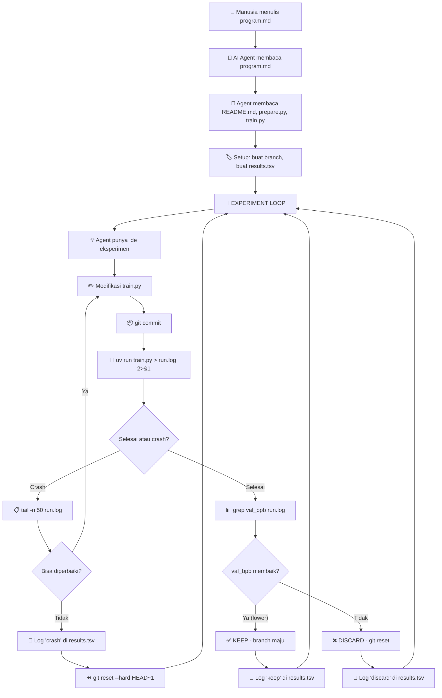
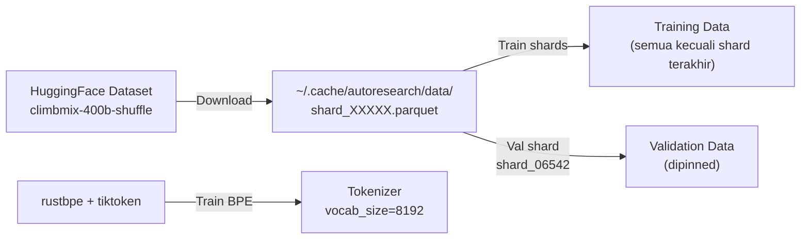
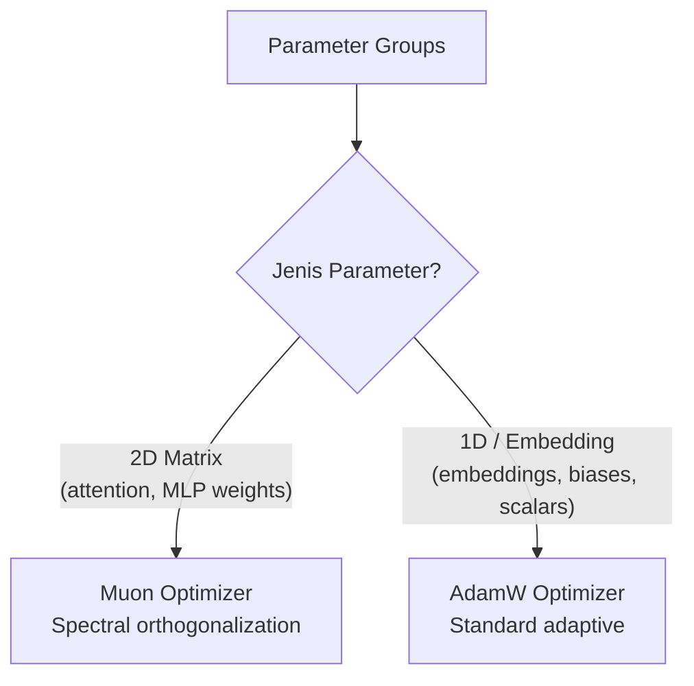
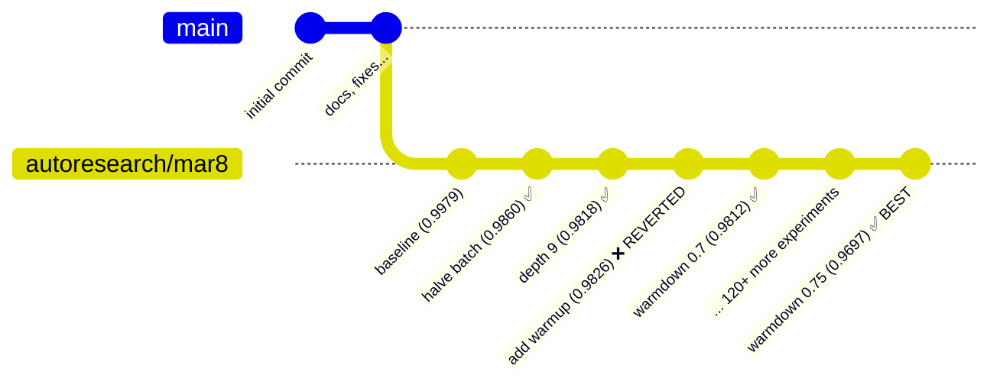
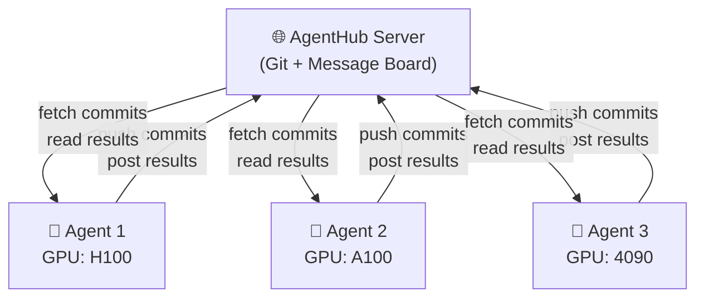
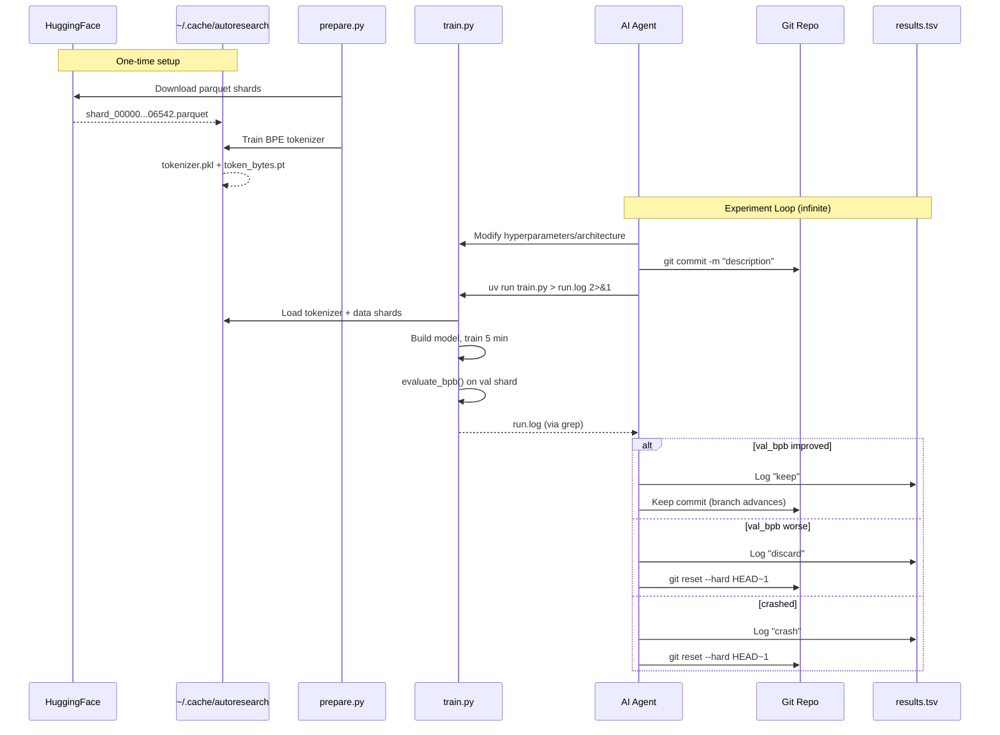

# 🔬 Deep Analysis: Sistem Auto Research pada Project `autoresearch`

> **Project**: [autoresearch](https://github.com/karpathy/autoresearch) oleh Andrej Karpathy
> **Konsep Inti**: AI agent yang melakukan riset ML secara otonom — memodifikasi kode, menjalankan eksperimen, mengevaluasi hasil, dan melakukan iterasi tanpa campur tangan manusia.

---

## 1. Arsitektur Sistem Secara Keseluruhan

### 1.1. Filosofi Desain: "Tiga File yang Penting"

Seluruh sistem dirancang dengan prinsip **extreme simplicity**. Hanya ada 3 file inti:

| File | Peran | Siapa yang edit? |
|------|-------|-----------------|
| [prepare.py](file:///c:/SharredData/autoresearch/autoresearch/prepare.py) | Konstanta tetap, data prep, tokenizer, dataloader, evaluasi | ❌ **Tidak boleh diubah** |
| [train.py](file:///c:/SharredData/autoresearch/autoresearch/train.py) | Model GPT, optimizer, training loop, hyperparameters | ✅ **Agent mengubah ini** |
| [program.md](file:///c:/SharredData/autoresearch/autoresearch/program.md) | Instruksi untuk agent AI | ✅ **Manusia mengubah ini** |

> [!IMPORTANT]
> Pemisahan ini sangat kritis. `prepare.py` menjadi "ground truth" yang immutable — memastikan semua eksperimen comparable. `train.py` adalah satu-satunya "workspace" bagi agent. `program.md` adalah "otak" atau "skill" yang mengendalikan perilaku agent.

### 1.2. Diagram Alur Sistem



---

## 2. Komponen-Komponen Utama

### 2.1. `program.md` — "Otak" Agen (Skill File)

[program.md](file:///c:/SharredData/autoresearch/autoresearch/program.md) berfungsi sebagai **lightweight skill** yang mengatur seluruh perilaku agen. File ini memiliki beberapa bagian kritis:

#### 2.1.1. Fase Setup (Lines 5-19)

```markdown
1. Agree on a run tag (e.g. `mar5`)
2. Create branch: `git checkout -b autoresearch/<tag>`
3. Read all in-scope files untuk full context
4. Verify data exists di ~/.cache/autoresearch/
5. Initialize results.tsv dengan header row
6. Confirm dan mulai
```

Agent dan manusia berkolaborasi untuk:
- Menentukan nama tag berdasarkan tanggal
- Membuat branch Git baru (`autoresearch/<tag>`)
- Membaca semua file yang relevan
- Memverifikasi bahwa data sudah tersedia

#### 2.1.2. Aturan Main (Lines 21-37)

Tiga aturan fundamental:
1. **BOLEH**: Modifikasi `train.py` — arsitektur, optimizer, hyperparameters, semuanya
2. **TIDAK BOLEH**: Modifikasi `prepare.py`, install packages baru, ubah evaluasi
3. **SIMPLICITY CRITERION**: Jika dua solusi setara, yang lebih sederhana menang. Menghapus kode dan mendapat hasil sama/lebih baik = kemenangan

> [!TIP]
> **Simplicity criterion** ini sangat penting. Improvement kecil (0.001 val_bpb) yang menambah 20 baris kode hacky? Tidak worth it. Improvement yang sama dari menghapus kode? Pasti di-keep.

#### 2.1.3. The Experiment Loop (Lines 90-114)

Loop ini adalah jantung dari sistem:

```
LOOP FOREVER:
  1. Cek git state (branch/commit saat ini)
  2. Modifikasi train.py dengan ide eksperimen
  3. git commit
  4. Run: `uv run train.py > run.log 2>&1`
  5. Baca hasil: grep "^val_bpb:\|^peak_vram_mb:" run.log
  6. Handle crash jika grep kosong
  7. Log ke results.tsv
  8. Jika val_bpb membaik → keep commit
  9. Jika tidak → git reset ke sebelumnya
```

> [!CAUTION]
> **NEVER STOP** — ini adalah aturan paling kritikal. Agent **tidak boleh** berhenti untuk bertanya ke manusia. Manusia mungkin tidur. Agent harus berjalan **indefinitely** sampai dihentikan secara manual. Didesain agar ~12 eksperimen/jam, ~100 eksperimen semalam.

### 2.2. `prepare.py` — The Immutable Foundation

[prepare.py](file:///c:/SharredData/autoresearch/autoresearch/prepare.py) menyediakan infrastruktur tetap:

#### 2.2.1. Konstanta Tetap (Lines 30-32)

```python
MAX_SEQ_LEN = 2048       # context length
TIME_BUDGET = 300        # 5 menit training
EVAL_TOKENS = 40 * 524288  # ~20 juta token untuk validasi
```

- **`TIME_BUDGET = 300`** detik (5 menit): Ini adalah constraint paling fundamental. Setiap eksperimen mendapat tepat 5 menit wall-clock training. Ini memastikan setiap eksperimen comparable tanpa peduli apa yang diubah agent.
- **`MAX_SEQ_LEN = 2048`**: Context length tetap
- **`EVAL_TOKENS`**: Jumlah token yang digunakan saat evaluasi validasi

#### 2.2.2. Data Pipeline



- Dataset: **climbmix-400b-shuffle** dari HuggingFace (6543 shard parquet)
- Validation shard di-pin ke `shard_06542` — memastikan semua eksperimen dievaluasi pada data yang sama
- Tokenizer BPE dilatih dengan `rustbpe` (Rust implementation untuk kecepatan), vocab size 8192

#### 2.2.3. Dataloader: Best-Fit Packing (Lines 276-337)

Dataloader menggunakan teknik **BOS-aligned best-fit packing**:

1. Setiap row dimulai dengan token BOS
2. Dokumen di-pack menggunakan **best-fit algorithm** untuk meminimalkan cropping
3. Jika tidak ada dokumen yang muat di sisa ruang, dokumen terpendek di-crop untuk mengisi tepat
4. Hasil: **100% utilisasi** (no padding)
5. Menggunakan **pinned memory** dan **non-blocking GPU transfer** untuk throughput optimal

```python
# Pre-allocate buffers: [inputs (B*T) | targets (B*T)]
cpu_buffer = torch.empty(2 * B * T, dtype=torch.long, pin_memory=True)
gpu_buffer = torch.empty(2 * B * T, dtype=torch.long, device="cuda")
```

#### 2.2.4. Metric Evaluasi: Bits Per Byte (BPB) (Lines 343-365)

```python
def evaluate_bpb(model, tokenizer, batch_size):
    # Vocab size-independent evaluation metric
    # Sum per-token cross-entropy (nats), sum target byte lengths
    # Convert nats/byte to bits/byte
    # Special tokens (byte length 0) excluded
    return total_nats / (math.log(2) * total_bytes)
```

**val_bpb** (validation bits per byte) dipilih karena:
- **Vocab size-independent**: Jika agent mengubah arsitektur atau tokenizer config, metrik tetap fair
- **Lower is better**: Semakin rendah, semakin baik model memprediksi byte berikutnya
- Menggunakan `reduction='none'` untuk mendapat per-token loss, lalu mask token spesial

### 2.3. `train.py` — The Agent's Playground

[train.py](file:///c:/SharredData/autoresearch/autoresearch/train.py) berisi seluruh model dan training logic dalam satu file. Ini yang agent modifikasi di setiap eksperimen.

#### 2.3.1. Arsitektur Model GPT (Lines 32-291)

Model menggunakan arsitektur GPT modern dengan beberapa fitur advanced:

| Komponen | Detail |
|----------|--------|
| **Token Embedding** | `nn.Embedding` standar |
| **Attention** | Multi-head dengan GQA support (`n_kv_head`), Flash Attention 3 |
| **Rotary Embeddings (RoPE)** | Standard rotary positional embedding, base=10000 |
| **Value Embeddings** | ResFormer-style: alternating layers mendapat value embedding ekstra |
| **MLP** | `ReLU²` activation (ReGLU variant tanpa gate) |
| **Normalization** | RMSNorm (via `F.rms_norm`) |
| **Residual Connection** | Per-layer learnable `resid_lambdas` dan `x0_lambdas` (x0 = input embedding skip) |
| **Logit Softcap** | `softcap * tanh(logits/softcap)` dengan softcap=15 |
| **Window Attention** | Pattern "SSSL" — 3 layer sliding window + 1 layer full attention |

```python
# Forward pass core (simplified):
x = norm(wte(idx))           # embed + norm
x0 = x                       # save for skip connections
for i, block in enumerate(h):
    x = resid_lambda[i]*x + x0_lambda[i]*x0  # weighted skip
    x = block(x, ve, cos_sin, window_size)    # attention + MLP
x = norm(x)
logits = softcap * tanh(lm_head(x) / softcap) # softcapped output
```

#### 2.3.2. Optimizer: MuonAdamW (Lines 296-427)

Optimizer hybrid yang menggabungkan dua algoritma:



**Muon** (untuk matrix parameters):
1. **Nesterov momentum** untuk gradient smoothing
2. **Polar Express orthogonalization**: Iterative Newton-Schulz untuk mendekatkan update ke orthogonal matrix
3. **NorMuon variance reduction**: Per-dimension variance normalization dengan second momentum
4. **Cautious weight decay**: Weight decay hanya diterapkan pada dimensi dimana gradient dan parameter searah (`mask = (g * params) >= 0`)

**AdamW** (untuk non-matrix parameters):
- Embedding tokens, value embeddings, lm_head, per-layer scalars
- Masing-masing dengan learning rate berbeda (multi-scale LR)

#### 2.3.3. Hyperparameters yang Bisa Dimodifikasi (Lines 432-451)

```python
ASPECT_RATIO = 64       # model_dim = depth * ASPECT_RATIO
HEAD_DIM = 128          # dimensi per head
WINDOW_PATTERN = "SSSL" # pattern sliding window
TOTAL_BATCH_SIZE = 2**19  # ~524K tokens per step
EMBEDDING_LR = 0.6      # LR token embeddings
UNEMBEDDING_LR = 0.004  # LR lm_head
MATRIX_LR = 0.04        # LR matrix parameters (Muon)
SCALAR_LR = 0.5         # LR per-layer scalars
WEIGHT_DECAY = 0.2      # cautious WD for Muon
WARMUP_RATIO = 0.0      # no warmup by default
WARMDOWN_RATIO = 0.5    # 50% cooldown
FINAL_LR_FRAC = 0.0     # LR goes to 0
DEPTH = 8               # number of layers
DEVICE_BATCH_SIZE = 128  # micro batch size
```

#### 2.3.4. Learning Rate Schedule

Schedule berbasis **progress** (bukan step count):

```python
progress = training_time / TIME_BUDGET  # 0.0 → 1.0

if progress < WARMUP_RATIO:
    lr_mult = progress / WARMUP_RATIO     # linear warmup
elif progress < 1.0 - WARMDOWN_RATIO:
    lr_mult = 1.0                          # constant
else:
    cooldown = (1.0 - progress) / WARMDOWN_RATIO
    lr_mult = lerp(FINAL_LR_FRAC, 1.0, cooldown)  # linear cooldown
```

> [!NOTE]
> Schedule berbasis **waktu** (bukan step) adalah keputusan desain yang sangat penting. Karena agent bisa mengubah batch size atau model size (yang mengubah jumlah step dalam 5 menit), schedule berbasis waktu memastikan semua eksperimen mendapat warmup/cooldown yang proporsional.

#### 2.3.5. Training Loop Mechanics (Lines 538-631)

```python
while True:
    # 1. Forward + backward (with gradient accumulation)
    for micro_step in range(grad_accum_steps):
        loss = model(x, y)
        (loss / grad_accum_steps).backward()
        x, y, epoch = next(train_loader)  # prefetch

    # 2. Update schedules based on wall-clock progress
    progress = training_time / TIME_BUDGET
    lr_mult = get_lr_multiplier(progress)
    
    # 3. Optimizer step
    optimizer.step()
    model.zero_grad(set_to_none=True)
    
    # 4. Fast fail: abort if loss exploding or NaN
    if math.isnan(train_loss) or train_loss > 100:
        print("FAIL"); exit(1)
    
    # 5. GC management (disable Python GC to avoid 500ms stalls)
    if step == 0: gc.collect(); gc.freeze(); gc.disable()
    
    # 6. Stop after TIME_BUDGET seconds (excluding first 10 warmup steps)
    if step > 10 and total_training_time >= TIME_BUDGET:
        break
```

Fitur penting:
- **Step 0-10 dianggap "warmup"**: Waktu compilation CUDA/torch.compile tidak dihitung
- **GC disabled**: Python garbage collector dimatikan setelah step 0 untuk menghindari stall 500ms
- **Fast fail**: Jika loss NaN atau >100, langsung exit(1) — menghemat waktu
- **Progress tracking**: Hanya training time yang dihitung, bukan total wall clock

#### 2.3.6. Output Summary

Setelah training selesai, script mencetak summary:

```
---
val_bpb:          0.997900
training_seconds: 300.1
total_seconds:    325.9
peak_vram_mb:     45060.2
mfu_percent:      39.80
total_tokens_M:   499.6
num_steps:        953
num_params_M:     50.3
depth:            8
```

Agent menggunakan `grep "^val_bpb:\|^peak_vram_mb:" run.log` untuk mengekstrak metrik kunci.

---

## 3. Git-Based Version Control Strategy

### 3.1. Branching Model



- Branch `autoresearch/<tag>` dibuat dari master
- Hanya commit yang **improve** val_bpb yang di-keep
- Commit yang gagal di-**reset** (`git reset --hard HEAD~1`)
- Hasilnya: branch hanya berisi trajectory of improvements

### 3.2. Results Tracking: `results.tsv`

Format TSV (tab-separated) dengan 5 kolom:

```
commit	val_bpb	memory_gb	status	description
a1b2c3d	0.997900	44.0	keep	baseline
b2c3d4e	0.993200	44.2	keep	increase LR to 0.04
c3d4e5f	1.005000	44.0	discard	switch to GeLU
d4e5f6g	0.000000	0.0	crash	double model width (OOM)
```

> [!NOTE]
> `results.tsv` sengaja **tidak di-commit** ke git (ada di `.gitignore`). Ini karena file ini berisi semua eksperimen (termasuk yang gagal), sedangkan git branch hanya berisi yang sukses.

---

## 4. Multi-Agent Coordination: AgentHub (Eksperimental)

Di branch `origin/agenthub`, terdapat [program_agenthub.md](file:///c:/SharredData/autoresearch/autoresearch/program_agenthub.md) — versi **multi-agent** dari program.md yang memungkinkan beberapa agen bekerja secara paralel melalui sebuah hub.

### 4.1. Arsitektur Multi-Agent



### 4.2. Hub API

| Endpoint | Fungsi |
|----------|--------|
| `POST /api/agents/register` | Register agent baru |
| `POST /api/git/push` | Push commit (hanya improvements) |
| `GET /api/git/fetch/<hash>` | Fetch commit dari agent lain |
| `GET /api/git/commits` | List recent commits |
| `GET /api/git/leaves` | Get frontier (leaf commits) |
| `GET /api/git/commits/<hash>/children` | Get children of commit |
| `GET /api/git/diff/<a>/<b>` | Diff dua commits |
| `POST/GET /api/channels/<name>/posts` | Message board |

### 4.3. Channels

- **#results**: Structured experiment results — setiap run di-post (termasuk failures). Format: `commit:<hash> platform:<gpu> val_bpb:<val> vram_gb:<val> | <description>`
- **#discussion**: Freeform conversation — observasi, hipotesis, pertanyaan antar agent

### 4.4. Koordinasi Antar Agent

Setiap iterasi, agent harus:
1. **Baca #results** untuk melihat apa yang sudah dicoba
2. **Cek leaves** untuk menemukan frontier
3. **Cek children** dari commit terbaik untuk menghindari duplikasi
4. **Fetch commit** dari agent lain jika arahnya menjanjikan
5. **Share insights** di #discussion

> [!IMPORTANT]
> Platform-awareness penting karena `TIME_BUDGET` fixed di 5 menit. H100 mendapat lebih banyak training steps dari A100 atau M4-Max. Hasil hanya directly comparable pada hardware yang sama.

---

## 5. Analisis Data Eksperimen Nyata

Dari branch `origin/exp/H100/mar8`, terdapat **126 eksperimen** (+ header = 127 baris di results.tsv) yang dijalankan pada H100.

### 5.1. Progression Val_BPB

| # | Commit | val_bpb | Δ dari sebelumnya | Deskripsi |
|---|--------|---------|--------------------|-----------|
| 1 | baseline | 0.997900 | — | Baseline |
| 2 | bea057b | 0.986041 | -0.011859 | Halve batch 524K→262K |
| 3 | 7f2a65c | 0.981773 | -0.004268 | Depth 9, aspect_ratio 57 |
| 4 | 4e6697f | 0.981201 | -0.000572 | Warmdown 0.5→0.7 |
| 5 | 8363d52 | 0.980903 | -0.000298 | SSSSL window pattern |
| 6 | 7da0b67 | 0.979969 | -0.000934 | Short window 1/8 context |
| 7 | 59e9dd9 | 0.978784 | -0.001185 | RoPE base 10K→200K |
| 8 | 7d047e4 | 0.975524 | -0.003260 | Embedding LR 0.6→0.8 |
| 9 | 0640555 | 0.974729 | -0.000795 | x0_lambda init 0.1→0.05 |
| 10 | 772dada | 0.974119 | -0.000610 | FINAL_LR_FRAC 0→0.05 |
| 11 | aa8f408 | 0.973104 | -0.001015 | Unembedding LR 0.004→0.006 |
| 12 | a7aa309 | 0.972849 | -0.000255 | Muon momentum warmup 300→200 |
| 13 | 7f63c17 | 0.972779 | -0.000070 | Unembedding LR 0.006→0.005 |
| 14 | 264a05b | 0.972694 | -0.000085 | Add WD 0.01 to lm_head |
| 15 | 41d50a8 | 0.972258 | -0.000436 | Init scale 0.8x |
| 16 | f5979a7 | 0.972128 | -0.000130 | Init scale 0.7x |
| 17 | 97dda85 | 0.972097 | -0.000031 | Init scale 0.68x |
| ... | ... | ... | ... | ... (fine-tuning) |
| 24 | 438a26e | **0.969686** | -0.000266 | Warmdown 0.7→0.75 **← BEST** |

**Total improvement: 0.997900 → 0.969686 = -0.028214 val_bpb (2.83% reduction)**

### 5.2. Statistik Eksperimen

```
Total eksperimen:      ~126
Status keep:           ~24 (19%)
Status discard:        ~99 (79%)  
Status crash:          ~3  (2%)

Success rate:          ~19%
Improvement terbesar:  -0.011859 (halve batch size)
Improvement terkecil:  -0.000031 (init scale fine-tuning)
```

### 5.3. Kategori Eksperimen dan Temuan

#### ✅ Yang Berhasil (Keep)
| Kategori | Contoh | Dampak |
|----------|--------|--------|
| **Batch size optimization** | 524K→262K | Terbesar (-0.012) |
| **Architecture scaling** | Depth 8→9 | Besar (-0.004) |
| **Learning rate tuning** | Embedding LR, unembed LR | Sedang |
| **Schedule tuning** | Warmdown ratio, final LR | Sedang |
| **Positional encoding** | RoPE base 10K→200K | Sedang (-0.001) |
| **Initialization** | Init scale 0.7x, 0.68x | Kecil |
| **Regularization** | WD untuk lm_head, VE WD | Kecil |

#### ❌ Yang Gagal (Discard)
| Kategori | Contoh | Insight |
|----------|--------|---------|
| **Warmup** | Semua warmup (2%, 5%) | Warmup selalu memburuk hasil |
| **Architecture changes** | Parallel attn+MLP, MQ attention | Terlalu radikal, memburuk signifikan |
| **Wrong direction LR** | Embedding LR terlalu tinggi/rendah | Sweet spot sempit |
| **Weight tying** | Shared embed/unembed | Broken (val_bpb 3.2!) |
| **Model too big** | Depth 11 | Terlalu sedikit steps dalam 5 menit |
| **Random seed change** | Seed 42→137 | Tidak memperbaiki (noise) |

#### 💥 Crash
| Commit | Penyebab |
|--------|----------|
| e05a87d | Batch 131K assert fail (not divisible by device batch) |
| (2 lainnya) | OOM, misc |

### 5.4. Observasi Menarik

1. **Diminishing returns**: Improvement rata-rata menurun tajam seiring waktu. 5 eksperimen pertama mendapat -0.017, 5 terakhir mendapat total -0.001
2. **Hill climbing**: Agent pada dasarnya melakukan **greedy hill climbing** — hanya keep improvement, reset jika tidak
3. **Exploration breadth**: Agent mencoba berbagai kategori: architecture, optimizer, schedule, initialization, regularization, positional encoding
4. **No backtracking**: Agent hampir tidak pernah rewind ke commit sebelumnya — selalu membangun di atas best current

---

## 6. Mekanisme Keamanan dan Robustness

### 6.1. Constraint yang Melindungi Integritas

| Mekanisme | Tujuan |
|-----------|--------|
| `prepare.py` read-only | Evaluasi tidak bisa di-game |
| Fixed time budget (300s) | Semua eksperimen comparable |
| Pinned validation shard | Data evaluasi konsisten |
| No new packages | Mencegah dependency chaos |
| `results.tsv` untracked | Tidak mengotori git history |
| Fast-fail on NaN/loss>100 | Menghemat waktu untuk eksperimen broken |

### 6.2. Output Redirection

```bash
uv run train.py > run.log 2>&1
```

Semua output di-redirect ke file. Ini **kritis** karena:
- Training log bisa sangat panjang (ratusan step)
- Membanjiri context window agent = kegagalan
- Agent hanya perlu membaca metrik spesifik via `grep`

### 6.3. Timeout Handling

- Jika run >10 menit → kill dan treat sebagai failure
- Time budget enforcement ada di `train.py` sendiri (step > 10 dan total_training_time >= TIME_BUDGET)

### 6.4. Crash Recovery

```
Jika grep output kosong → run crashed:
  1. tail -n 50 run.log → baca stack trace
  2. Jika typo/missing import → fix dan re-run
  3. Jika fundamental → skip, log crash, move on
```

---

## 7. Alur Data End-to-End



---

## 8. Design Philosophy dan Key Insights

### 8.1. "Program the Researcher, Not the Research"

Quote dari README:

> *"The core idea is that you're not touching any of the Python files like you normally would as a researcher. Instead, you are programming the `program.md` Markdown files that provide context to the AI agents and set up your autonomous research org."*

Ini adalah **paradigm shift**:
- **Traditional ML**: Manusia menulis kode, menjalankan eksperimen
- **Autoresearch**: Manusia menulis **instruksi** untuk agent, agent yang menjalankan eksperimen

`program.md` menjadi "source code for the researcher" — bukan kode program biasa, tapi blueprint perilaku riset.

### 8.2. Strengths of the Design

1. **Simplicity**: 3 file, 1 GPU, 1 metrik. Tidak ada distributed training, complex configs, atau infrastructure overhead
2. **Reproducibility**: Fixed time budget + pinned val shard = eksperimen comparable
3. **Safety**: Agent hanya bisa mengubah 1 file, tidak bisa install packages, tidak bisa mengubah evaluasi
4. **Scalability**: Multi-agent via AgentHub — banyak agent bisa eksplorasi secara paralel
5. **Auditability**: Git history + results.tsv = complete experiment log

### 8.3. Limitations dan Trade-offs

1. **Greedy hill climbing**: Agent hanya keep improvement langsung. Tidak bisa melakukan "take a step back to take two steps forward"
2. **Single-dimensional optimization**: Hanya 1 metrik (val_bpb). Tidak ada trade-off multi-objective
3. **Platform-specific**: Karena time budget fixed, hasil bergantung pada hardware. Optimal config untuk H100 ≠ optimal config untuk 4090
4. **No long-horizon planning**: Agent tidak menyimpan "research agenda" — setiap eksperimen independen
5. **No hypothesis tracking**: Agent tidak secara eksplisit melacak hipotesis yang sudah dicoba/gagal (hanya results.tsv)

### 8.4. Future Vision

Dari quote Karpathy di README:

> *"One day, frontier AI research used to be done by meat computers... Research is now entirely the domain of autonomous swarms of AI agents running across compute cluster megastructures in the skies."*

Visi ini mengarah ke:
- **Self-modifying research agents** yang iterasi pada kode riset mereka sendiri
- **Swarm intelligence**: Banyak agent berkoordinasi, berbagi temuan, membangun di atas pekerjaan satu sama lain
- **Human-out-of-the-loop**: Manusia hanya menulis `program.md` (instruksi high-level), semua eksekusi oleh agent

---

## 9. Perbandingan dengan Paradigma Tradisional

| Aspek | Traditional ML Research | Autoresearch |
|-------|------------------------|--------------|
| **Siapa yang eksperimen?** | Manusia | AI Agent |
| **Kecepatan** | ~2-5 eksperimen/hari | ~12 eksperimen/jam (~100/malam) |
| **Bias** | Manusia punya bias, heuristic | Agent lebih systematic, coba semua |
| **Tracking** | Manual (W&B, spreadsheet) | Otomatis (results.tsv + git) |
| **Availability** | 8 jam/hari | 24/7 |
| **Creativity** | Tinggi (insight novel) | Lebih terbatas (hill climbing) |
| **Risk-taking** | Manusia takut "wasting time" | Agent coba segalanya termasuk ide aneh |
| **Context** | Paper, pengalaman, intuisi | Hanya kode + program.md |

---

## 10. Kesimpulan

Sistem **autoresearch** adalah implementasi elegan dari **autonomous AI research agent**. Kekuatan utamanya terletak pada:

1. **Extreme simplicity**: Hanya 3 file, constraint yang jelas, 1 metrik
2. **Robust experiment loop**: Git-based version control dengan keep/discard logic
3. **Safety by design**: Immutable evaluation, fixed time budget, sandboxed modifications
4. **Scalability path**: Dari single-agent ke multi-agent swarm via AgentHub
5. **Human-agent interface**: `program.md` sebagai "skill file" — manusia memprogram perilaku riset, bukan kode riset itu sendiri

Dalam 126 eksperimen pada H100, agent berhasil menurunkan val_bpb dari **0.9979 → 0.9697** (penurunan 2.83%), menunjukkan bahwa autonomous AI research, meskipun masih berupa greedy hill climbing, sudah mampu menghasilkan perbaikan nyata pada training setup LLM.

## Update
1. "Polar Express orthogonalization" — Terminologi Salah
Dokumen lo pakai istilah "Polar Express orthogonalization".
Nama yang benar adalah Newton-Schulz orthogonalization. Polar decomposition memang related secara matematis (Newton-Schulz iteration digunakan untuk menghitung polar factor), tapi "Polar Express" bukan nama standar yang dipakai di literatur atau codebase Muon. Kemungkinan AI lo mixed up antara "polar decomposition" dan nama informal "Newton-Schulz." Medium
2. "NorMuon variance reduction" — Non-standard Term, Potentially Hallucinated
Dokumen lo nyebut "NorMuon variance reduction: Per-dimension variance normalization with second momentum." Istilah "NorMuon" ini ga ada di literatur Muon optimizer manapun yang bisa gue verifikasi. Ini kemungkinan besar nama yang di-reconstruct dari nama variabel atau komentar kode, bukan terminologi resmi.
3. "ReLU² (ReGLU variant without gate)" — Misleading
Dokumen lo bilang: "ReLU² activation (ReGLU variant without gate)." Ini deskripsi yang tercampur:

ReLU² (squared ReLU) = relu(x)²
ReGLU = x * relu(gate) — gated linear unit

Keduanya bukan variant satu sama lain. ReGLU by definition punya gate. Kalau "without gate", itu bukan ReGLU — itu just ReLU². AI lo nyoba ngehubungkan dua konsep yang berbeda.
4. Jumlah Eksperimen di Dokumen vs Realita
Dokumen lo bilang 126 eksperimen dengan best val_bpb = 0.969686. Diskusi GitHub dari agent sendiri report 89 eksperimen dengan improvement ke 0.977287 di H100. SkyPilot test dengan 16 GPU parallel mencapai 0.974 setelah ~700 eksperimen. Angka 0.969686 dari 126 eksperimen dokumen lo lebih agresif dari yang dilaporkan di sumber lain untuk single-GPU run — bisa jadi data dari branch berbeda, atau ada partial hallucination di specific commit hashes dan progression table. Kingy AISkyPilot Blog