# 🐟 MiroFish — Deep System Analysis

> **"简洁通用的群体智能引擎，预测万物"**
> *A Simple and Universal Swarm Intelligence Engine, Predicting Anything*

Dokumen ini adalah hasil deep reasoning menyeluruh terhadap seluruh codebase MiroFish — mencakup arsitektur, alur data, logika bisnis, integrasi LLM, sistem memori graf, mesin simulasi multi-agent, dan interaksi frontend-backend.

---

## 📑 Daftar Isi

1. [Gambaran Umum Sistem](#1-gambaran-umum-sistem)
2. [Arsitektur Teknis](#2-arsitektur-teknis)
3. [Fase 1 — Graph Building (Konstruksi Graf Pengetahuan)](#3-fase-1--graph-building)
4. [Fase 2 — Simulation Setup (Persiapan Simulasi)](#4-fase-2--simulation-setup)
5. [Fase 3 — Simulation Execution (Eksekusi Simulasi)](#5-fase-3--simulation-execution)
6. [Fase 4 — Report Generation (Generasi Laporan)](#6-fase-4--report-generation)
7. [Fase 5 — Deep Interaction (Interaksi Mendalam)](#7-fase-5--deep-interaction)
8. [Sistem Memori: Zep Cloud Integration](#8-sistem-memori-zep-cloud-integration)
9. [Utilitas & Infrastruktur](#9-utilitas--infrastruktur)
10. [Frontend — Vue.js Application](#10-frontend--vuejs-application)
11. [Model Data](#11-model-data)
12. [Alur Data End-to-End](#12-alur-data-end-to-end)
13. [Diagram Arsitektur](#13-diagram-arsitektur)

---

## 1. Gambaran Umum Sistem

MiroFish adalah **AI Prediction Engine** berbasis **multi-agent simulation**. Konsep intinya:

1. **Input**: User mengunggah "seed material" (dokumen PDF/Markdown/TXT) + deskripsi kebutuhan prediksi dalam bahasa natural
2. **Proses**: Sistem mengekstrak entitas & relasi → membangun graf pengetahuan → menghasilkan ribuan agen AI dengan kepribadian unik → menjalankan simulasi sosial di platform mirip Twitter/Reddit → agen berinteraksi secara bebas
3. **Output**: Laporan prediksi terperinci + dunia digital interaktif yang bisa dieksplorasi user

### Teknologi Inti

| Layer | Teknologi | Deskripsi |
|-------|-----------|-----------|
| **Backend** | Flask (Python 3.11+) | REST API server |
| **Frontend** | Vue.js 3 + Vite | SPA dengan reactive UI |
| **LLM** | OpenAI SDK (compatible) | Mendukung DeepSeek, Qwen, dll |
| **Simulasi** | CAMEL-OASIS | Engine simulasi sosial multi-agent |
| **Memori Graf** | Zep Cloud | Knowledge graph + temporal memory |
| **Package Manager** | uv (Python), npm (Node) | Dependency management |

### File Konfigurasi Utama

- [.env](file:///c:/SharredData/project/mirofish/.env) — API keys (LLM + Zep)
- [config.py](file:///c:/SharredData/project/mirofish/MiroFish/backend/app/config.py) — Konfigurasi Flask & parameter sistem
- [package.json](file:///c:/SharredData/project/mirofish/MiroFish/package.json) — Root scripts (dev, build, setup)

---

## 2. Arsitektur Teknis

### 2.1 Struktur Direktori

```
MiroFish/
├── backend/
│   ├── app/
│   │   ├── __init__.py          # Flask app factory
│   │   ├── config.py            # Konfigurasi terpusat
│   │   ├── api/                 # REST API routes
│   │   │   ├── graph.py         # Endpoint graf pengetahuan
│   │   │   ├── simulation.py    # Endpoint simulasi
│   │   │   └── report.py        # Endpoint laporan & chat
│   │   ├── models/              # Data models (Pydantic)
│   │   │   ├── project.py       # Model proyek
│   │   │   └── task.py          # Model task/operasi
│   │   ├── services/            # Logika bisnis utama
│   │   │   ├── graph_builder.py           # Konstruksi graf pengetahuan
│   │   │   ├── ontology_generator.py      # Generasi ontologi dari seed
│   │   │   ├── oasis_profile_generator.py # Generasi profil agen
│   │   │   ├── simulation_config_generator.py # Konfigurasi simulasi
│   │   │   ├── simulation_runner.py       # Eksekusi simulasi OASIS
│   │   │   ├── simulation_manager.py      # State management simulasi
│   │   │   ├── simulation_ipc.py          # Inter-process communication
│   │   │   ├── report_agent.py            # Agent pembuat laporan
│   │   │   ├── zep_tools.py               # Tool set untuk Zep
│   │   │   ├── zep_entity_reader.py       # Pembaca entitas dari Zep
│   │   │   ├── zep_graph_memory_updater.py# Update memori graf
│   │   │   └── text_processor.py          # Pemroses teks
│   │   └── utils/               # Utilitas
│   │       ├── file_parser.py   # Parser file (PDF/MD/TXT)
│   │       ├── llm_client.py    # Client LLM (OpenAI SDK)
│   │       ├── logger.py        # Sistem logging
│   │       ├── retry.py         # Retry + exponential backoff
│   │       └── zep_paging.py    # Paginasi Zep API
│   ├── run.py                   # Entry point backend
│   └── uploads/                 # File upload storage
├── frontend/
│   ├── src/
│   │   ├── App.vue              # Root component
│   │   ├── main.js              # Vue app entry
│   │   ├── api/                 # API client layer
│   │   │   └── index.js         # Axios HTTP client
│   │   ├── components/          # Reusable components
│   │   │   ├── GraphPanel.vue   # Panel graf pengetahuan
│   │   │   ├── SimulationPanel.vue # Panel simulasi
│   │   │   ├── ReportPanel.vue  # Panel laporan
│   │   │   ├── ChatPanel.vue    # Panel chat interaktif
│   │   │   └── FileUpload.vue   # Komponen upload file
│   │   ├── views/               # Page views
│   │   │   └── HomeView.vue     # Halaman utama
│   │   ├── store/               # Pinia state management
│   │   │   └── index.js         # Global store
│   │   └── router/              # Vue Router
│   │       └── index.js         # Route definitions
│   └── vite.config.js           # Vite build config
└── docker-compose.yml           # Docker deployment
```

### 2.2 API Blueprint Registration

File [\_\_init\_\_.py](file:///c:/SharredData/project/mirofish/MiroFish/backend/app/__init__.py) mendaftarkan 3 blueprint:

```python
app.register_blueprint(graph_bp, url_prefix='/api/graph')
app.register_blueprint(simulation_bp, url_prefix='/api/simulation')
app.register_blueprint(report_bp, url_prefix='/api/report')
```

Selain itu, ada health check endpoint: `GET /health`

### 2.3 Startup Sequence

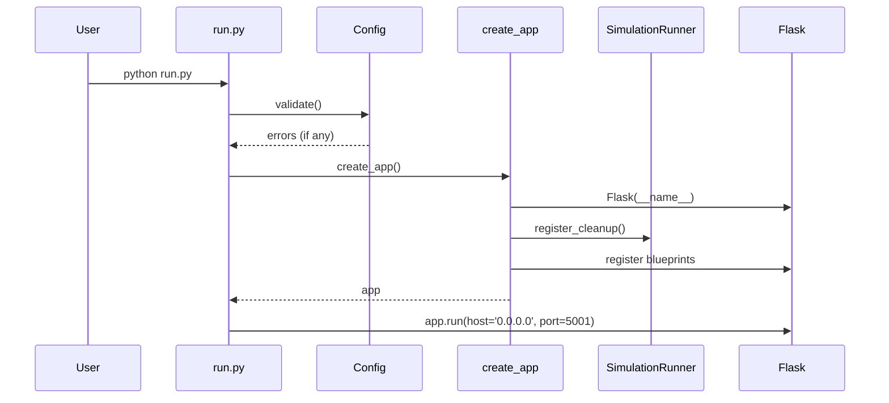

---

## 3. Fase 1 — Graph Building

> **Tujuan**: Mengekstrak entitas, relasi, dan konteks dari seed material lalu membangun Knowledge Graph di Zep Cloud.

### 3.1 Alur Graph Building

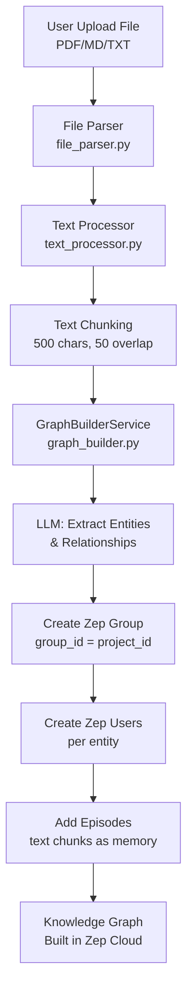

### 3.2 File Parser ([file_parser.py](file:///c:/SharredData/project/mirofish/MiroFish/backend/app/utils/file_parser.py))

Mendukung 3 format:

| Format | Library | Method |
|--------|---------|--------|
| PDF | PyMuPDF (fitz) | Ekstrak teks per halaman |
| Markdown | Built-in | Baca langsung sebagai string |
| TXT | Built-in + chardet | Auto-detect encoding |

**Alur parsing**:
1. Deteksi ekstensi file
2. Untuk PDF: buka dengan `fitz.open()`, iterasi halaman, ekstrak teks
3. Untuk TXT: coba UTF-8 dulu, gagal → deteksi encoding pakai `chardet`/`charset-normalizer`
4. Return raw text string

### 3.3 Text Processor ([text_processor.py](file:///c:/SharredData/project/mirofish/MiroFish/backend/app/services/text_processor.py))

```python
class TextProcessor:
    @staticmethod
    def chunk_text(text: str, chunk_size: int = 500, overlap: int = 50) -> list[str]:
```

Membagi teks menjadi chunk-chunk berukuran tetap dengan overlap untuk menjaga konteks antar-chunk.

### 3.4 GraphBuilderService ([graph_builder.py](file:///c:/SharredData/project/mirofish/MiroFish/backend/app/services/graph_builder.py))

Ini adalah **inti dari Fase 1**. Service ini:

1. **Membuat Zep Group** — satu grup per proyek (`group_id = project_id`)
2. **Mengirim text chunks sebagai "episodes"** ke Zep — Zep secara otomatis melakukan entity extraction & relationship building
3. **Menggunakan LLM untuk memperkaya** — mengirim prompt ke LLM untuk mengekstrak entitas tambahan dan hubungan yang mungkin terlewat oleh Zep

#### Key Methods:

```python
class GraphBuilderService:
    def __init__(self):
        self.zep_client = AsyncZep(api_key=Config.ZEP_API_KEY)
        self.llm_client = LLMClient()

    async def build_graph(self, project_id: str, text: str, 
                          prediction_topic: str) -> dict:
        """Main entry point: build knowledge graph from text"""
        
    async def _create_group(self, project_id: str) -> None:
        """Create Zep group for the project"""
        
    async def _add_episodes(self, group_id: str, chunks: list[str]) -> None:
        """Add text chunks as episodes to Zep"""
        
    async def _extract_entities(self, text: str) -> list[dict]:
        """Use LLM to extract entities from text"""
        
    async def _enrich_graph(self, group_id: str, entities: list) -> None:
        """Enrich graph with LLM-extracted entities"""
```

#### LLM Prompt untuk Entity Extraction:

LLM diminta untuk mengekstrak:
- **Entitas**: Orang, organisasi, lokasi, konsep, event
- **Hubungan**: Relasi antar entitas (misalnya "bekerja_di", "berlokasi_di")
- **Atribut**: Properti tambahan per entitas

Format output yang diminta adalah JSON terstruktur.

### 3.5 API Endpoint: Graph

File [graph.py](file:///c:/SharredData/project/mirofish/MiroFish/backend/app/api/graph.py) menyediakan endpoint:

| Endpoint | Method | Deskripsi |
|----------|--------|-----------|
| `/api/graph/build` | POST | Upload file + build knowledge graph |
| `/api/graph/status/<project_id>` | GET | Cek status pembangunan graf |
| `/api/graph/entities/<project_id>` | GET | Ambil daftar entitas dari graf |
| `/api/graph/relationships/<project_id>` | GET | Ambil relasi dari graf |

**Flow endpoint `/api/graph/build`:**
1. Menerima file upload + `prediction_topic` + `project_name`
2. Simpan file ke `uploads/`
3. Parse file → raw text
4. Buat proyek baru di in-memory store
5. Jalankan `GraphBuilderService.build_graph()` secara async
6. Return `project_id` ke client

---

## 4. Fase 2 — Simulation Setup

> **Tujuan**: Dari knowledge graph yang sudah dibangun, generate konfigurasi simulasi lengkap — termasuk profil agen, ontologi, parameter simulasi, dan konfigurasi platform.

### 4.1 Ontology Generator ([ontology_generator.py](file:///c:/SharredData/project/mirofish/MiroFish/backend/app/services/ontology_generator.py))

Menghasilkan **ontologi domain** dari seed material menggunakan LLM.

```python
class OntologyGenerator:
    async def generate(self, text: str, prediction_topic: str) -> dict:
        """Generate domain ontology from text and prediction topic"""
```

**Apa itu ontologi di sini?**
- Daftar konsep/kategori yang relevan dengan topik prediksi
- Hierarki relasi antar-konsep
- Vocabulary domain-specific yang akan digunakan agen dalam simulasi

**LLM Prompt**: Diberikan teks seed + topik prediksi, LLM diminta menghasilkan:
- Kategori utama diskusi
- Sub-kategori
- Kata kunci penting
- Hubungan antar-konsep

### 4.2 Simulation Config Generator ([simulation_config_generator.py](file:///c:/SharredData/project/mirofish/MiroFish/backend/app/services/simulation_config_generator.py))

Ini adalah "otak" yang merancang seluruh simulasi. File ini ~40KB dan sangat komprehensif.

#### Data Classes:

```python
@dataclass
class AgentActivityConfig:
    """Konfigurasi aktivitas agen"""
    post_frequency: float      # Frekuensi posting
    interaction_rate: float    # Tingkat interaksi
    topic_diversity: float     # Diversitas topik

@dataclass
class TimeSimulationConfig:
    """Konfigurasi waktu simulasi"""
    total_rounds: int          # Jumlah ronde simulasi
    time_per_round: str        # Waktu per ronde (e.g., "1 hour")
    
@dataclass
class EventConfig:
    """Konfigurasi event yang terjadi selama simulasi"""
    round_number: int          # Ronde terjadinya event
    event_type: str            # Tipe event
    description: str           # Deskripsi event
    affected_agents: list      # Agen yang terpengaruh

@dataclass
class PlatformConfig:
    """Konfigurasi platform simulasi"""
    platform_type: str         # 'twitter' atau 'reddit'
    available_actions: list    # Aksi yang tersedia

@dataclass 
class SimulationParameters:
    """Parameter simulasi lengkap"""
    agent_activities: AgentActivityConfig
    time_config: TimeSimulationConfig
    events: list[EventConfig]
    platform: PlatformConfig
    num_agents: int
    prediction_focus: str
```

#### Main Method:

```python
class SimulationConfigGenerator:
    async def generate_config(self, project_id: str, prediction_topic: str,
                              entities: list, text: str, 
                              user_requirements: dict) -> SimulationParameters:
```

**Alur:**
1. Terima entitas dari knowledge graph + topik prediksi + requirement user
2. Kirim ke LLM dengan prompt yang sangat detail
3. LLM merespons dengan JSON konfigurasi simulasi lengkap
4. Parse respons → `SimulationParameters`

**LLM Prompt untuk Config Generation** meminta:
- Berapa jumlah agen yang diperlukan
- Platform mana yang digunakan (Twitter/Reddit)
- Berapa ronde simulasi
- Event apa saja yang harus terjadi
- Bagaimana distribusi aktivitas agen
- Fokus prediksi spesifik

### 4.3 OASIS Profile Generator ([oasis_profile_generator.py](file:///c:/SharredData/project/mirofish/MiroFish/backend/app/services/oasis_profile_generator.py))

File terbesar kedua (~50KB). Bertanggung jawab menghasilkan **profil agen AI yang realistis**.

#### Data Model:

```python
@dataclass
class OasisAgentProfile:
    """Profil lengkap satu agen OASIS"""
    agent_id: str
    name: str
    username: str
    bio: str
    personality: dict        # Big Five personality traits
    background: str          # Latar belakang karakter
    expertise: list[str]     # Area keahlian
    stance: str              # Posisi/sikap terhadap topik
    behavior_pattern: str    # Pola perilaku
    social_connections: list # Koneksi sosial
    initial_posts: list[str] # Posting awal
```

#### Profile Generation Flow:

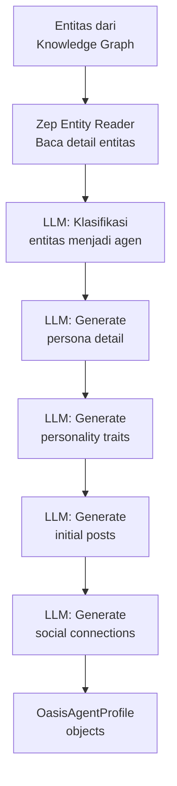

**Detail proses:**

1. **Entity Classification**: LLM mengklasifikasi entitas mana yang bisa menjadi "agen" (orang, organisasi personified, dll)
2. **Persona Generation**: Untuk setiap agen, LLM menghasilkan:
   - Nama & username yang realistis
   - Bio yang sesuai karakter
   - Latar belakang detail
   - Area expertise
3. **Personality Traits (Big Five)**: Setiap agen diberi skor untuk:
   - Openness (Keterbukaan)
   - Conscientiousness (Ketekunan)
   - Extraversion (Ekstroversi)
   - Agreeableness (Keramahan)
   - Neuroticism (Neurotisisme)
4. **Stance Assignment**: LLM menentukan sikap agen terhadap topik prediksi (positif/negatif/netral + intensitas)
5. **Initial Posts**: Generate beberapa posting awal yang konsisten dengan persona
6. **Social Connections**: Tentukan siapa yang terhubung dengan siapa berdasarkan relasi di knowledge graph

### 4.4 Zep Entity Reader ([zep_entity_reader.py](file:///c:/SharredData/project/mirofish/MiroFish/backend/app/services/zep_entity_reader.py))

Membaca entitas dan relasi dari Zep Knowledge Graph.

```python
@dataclass
class EntityNode:
    """Node entitas dari graf"""
    name: str
    entity_type: str
    attributes: dict
    relationships: list[dict]

@dataclass
class FilteredEntities:
    """Hasil filter entitas"""
    agents: list[EntityNode]      # Entitas yang jadi agen
    environment: list[EntityNode]  # Entitas lingkungan
    events: list[EntityNode]       # Entitas event

class ZepEntityReader:
    async def read_entities(self, group_id: str) -> FilteredEntities:
        """Read and classify entities from Zep graph"""
        
    async def get_entity_details(self, group_id: str, entity_name: str) -> EntityNode:
        """Get detailed info about a specific entity"""
```

---

## 5. Fase 3 — Simulation Execution

> **Tujuan**: Menjalankan simulasi multi-agent menggunakan OASIS engine, di mana agen berinteraksi secara bebas di platform sosial virtual.

### 5.1 Simulation Manager ([simulation_manager.py](file:///c:/SharredData/project/mirofish/MiroFish/backend/app/services/simulation_manager.py))

**State machine** untuk lifecycle simulasi.

```python
class SimulationStatus(Enum):
    PENDING = "pending"
    CONFIGURING = "configuring"
    READY = "ready"
    RUNNING = "running"
    PAUSED = "paused"
    COMPLETED = "completed"
    FAILED = "failed"
    CANCELLED = "cancelled"

@dataclass
class SimulationState:
    project_id: str
    status: SimulationStatus
    config: SimulationParameters | None
    current_round: int
    total_rounds: int
    progress: float
    error: str | None
    created_at: datetime
    updated_at: datetime
```

#### Key Methods:

```python
class SimulationManager:
    # In-memory state store (dict)
    _simulations: dict[str, SimulationState] = {}
    
    def create_simulation(self, project_id: str) -> SimulationState
    def update_status(self, project_id: str, status: SimulationStatus)
    def update_progress(self, project_id: str, round_num: int)
    def get_state(self, project_id: str) -> SimulationState | None
    def set_config(self, project_id: str, config: SimulationParameters)
```

> [!IMPORTANT]
> State disimpan **in-memory** (Python dict), bukan di database. Artinya semua state hilang saat server restart. Ini design choice untuk simplicity.

### 5.2 Simulation Runner ([simulation_runner.py](file:///c:/SharredData/project/mirofish/MiroFish/backend/app/services/simulation_runner.py))

File terbesar di backend (~70KB). Ini adalah **mesin eksekusi simulasi** yang mengintegrasikan OASIS.

#### Data Classes:

```python
class RunnerStatus(Enum):
    IDLE = "idle"
    INITIALIZING = "initializing"
    RUNNING = "running"
    PAUSED = "paused"
    COMPLETED = "completed"
    FAILED = "failed"

@dataclass
class AgentAction:
    """Satu aksi agen dalam satu ronde"""
    agent_id: str
    agent_name: str
    action_type: str       # CREATE_POST, LIKE_POST, REPOST, dll
    content: str | None    # Konten posting (jika ada)
    target: str | None     # Target aksi (post/user yang dituju)
    timestamp: datetime
    round_number: int

@dataclass
class RoundSummary:
    """Ringkasan satu ronde simulasi"""
    round_number: int
    actions: list[AgentAction]
    total_posts: int
    total_interactions: int
    key_topics: list[str]
    sentiment_distribution: dict
    timestamp: datetime
```

#### Core Simulation Flow:

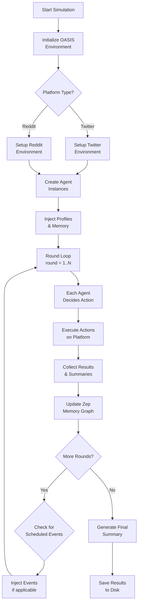

#### Detail Proses per Ronde:

**1. Agent Decision Making:**
Setiap agen di setiap ronde:
- Menerima konteks: timeline terkini, memori mereka, persona mereka
- LLM dipanggil untuk menentukan aksi apa yang akan dilakukan
- Aksi dipilih dari daftar aksi yang tersedia (platform-specific)

**2. Platform Actions (Twitter):**
```python
OASIS_TWITTER_ACTIONS = [
    'CREATE_POST',    # Buat tweet baru
    'LIKE_POST',      # Like tweet
    'REPOST',         # Retweet
    'FOLLOW',         # Follow user
    'DO_NOTHING',     # Tidak melakukan apa-apa
    'QUOTE_POST'      # Quote tweet
]
```

**3. Platform Actions (Reddit):**
```python
OASIS_REDDIT_ACTIONS = [
    'LIKE_POST', 'DISLIKE_POST',
    'CREATE_POST', 'CREATE_COMMENT',
    'LIKE_COMMENT', 'DISLIKE_COMMENT',
    'SEARCH_POSTS', 'SEARCH_USER',
    'TREND', 'REFRESH',
    'DO_NOTHING', 'FOLLOW', 'MUTE'
]
```

**4. Event Injection:**
Di ronde-ronde tertentu (sesuai config), sistem menyuntikkan "event" — misalnya:
- Berita baru muncul
- Kebijakan baru diumumkan
- Insiden terjadi
Ini mengubah dinamika interaksi agen secara real-time.

**5. Memory Update:**
Setelah setiap ronde, aktivitas agen dikirim ke Zep untuk memperbarui knowledge graph temporal. Ini memungkinkan agen "mengingat" apa yang terjadi di ronde sebelumnya.

#### Subprocess Architecture:

```python
class SimulationRunner:
    @staticmethod
    def register_cleanup():
        """Register atexit handler to kill all simulation processes"""
    
    def run_in_subprocess(self, project_id: str, config: SimulationParameters):
        """Launch simulation as a separate process"""
```

> [!NOTE]
> Simulasi dijalankan di **subprocess terpisah** menggunakan `multiprocessing`. Ini mencegah Flask server menjadi tidak responsif selama simulasi berjalan. Komunikasi antara Flask dan subprocess menggunakan IPC (Inter-Process Communication).

### 5.3 Simulation IPC ([simulation_ipc.py](file:///c:/SharredData/project/mirofish/MiroFish/backend/app/services/simulation_ipc.py))

Sistem komunikasi antara Flask server dan simulation subprocess.

```python
class CommandType(Enum):
    START = "start"
    PAUSE = "pause"
    RESUME = "resume"
    STOP = "stop"
    STATUS = "status"
    INJECT_EVENT = "inject_event"

class CommandStatus(Enum):
    PENDING = "pending"
    EXECUTING = "executing"
    COMPLETED = "completed"
    FAILED = "failed"

@dataclass
class IPCCommand:
    command_type: CommandType
    payload: dict | None
    command_id: str

@dataclass
class IPCResponse:
    command_id: str
    status: CommandStatus
    data: dict | None
    error: str | None
```

#### Arsitektur IPC:

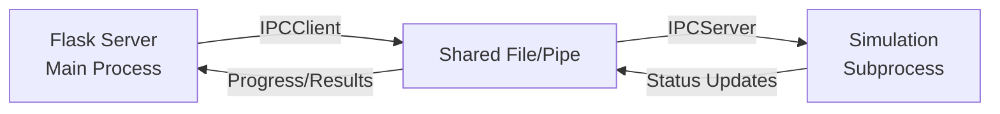

**Mekanisme:**
- `SimulationIPCClient` (di Flask) mengirim command ke subprocess
- `SimulationIPCServer` (di subprocess) menerima command dan menjalankannya
- Status & progress dikomunikasikan balik melalui shared file/memory
- Mendukung: start, pause, resume, stop, inject event

### 5.4 API Endpoints: Simulation

File [simulation.py](file:///c:/SharredData/project/mirofish/MiroFish/backend/app/api/simulation.py) — file terbesar di API layer (~98KB):

| Endpoint | Method | Deskripsi |
|----------|--------|-----------|
| `/api/simulation/configure` | POST | Konfigurasi simulasi untuk proyek |
| `/api/simulation/start/<project_id>` | POST | Mulai simulasi |
| `/api/simulation/pause/<project_id>` | POST | Pause simulasi |
| `/api/simulation/resume/<project_id>` | POST | Resume simulasi |
| `/api/simulation/stop/<project_id>` | POST | Stop simulasi |
| `/api/simulation/status/<project_id>` | GET | Cek status simulasi |
| `/api/simulation/progress/<project_id>` | GET | Ambil progress (SSE) |
| `/api/simulation/rounds/<project_id>` | GET | Ambil data per ronde |
| `/api/simulation/inject-event/<project_id>` | POST | Inject event ke simulasi |
| `/api/simulation/agents/<project_id>` | GET | Daftar agen |
| `/api/simulation/agent/<project_id>/<agent_id>` | GET | Detail agen spesifik |

**SSE (Server-Sent Events) untuk Real-time Progress:**

Endpoint `/api/simulation/progress/<project_id>` menggunakan SSE untuk streaming progress real-time ke frontend:
```python
def event_stream():
    while simulation.status == 'running':
        yield f"data: {json.dumps(progress_data)}\n\n"
        time.sleep(1)
```

---

## 6. Fase 4 — Report Generation

> **Tujuan**: Setelah simulasi selesai, ReportAgent menganalisis seluruh data simulasi dan menghasilkan laporan prediksi komprehensif.

### 6.1 Report Agent ([report_agent.py](file:///c:/SharredData/project/mirofish/MiroFish/backend/app/services/report_agent.py))

Ini adalah file **terbesar dan paling kompleks** dalam proyek (~102KB). ReportAgent adalah LLM agent yang dilengkapi berbagai tools untuk menganalisis hasil simulasi.

#### Arsitektur ReportAgent:

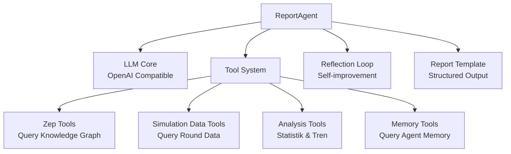

#### Tool Set yang Dimiliki ReportAgent:

ReportAgent memiliki akses ke **tool set kaya** untuk berinteraksi dengan data:

| Tool | Fungsi |
|------|--------|
| `get_simulation_summary` | Ambil ringkasan simulasi keseluruhan |
| `get_round_data` | Ambil data ronde spesifik |
| `get_agent_actions` | Ambil aksi spesifik agen |
| `get_agent_profile` | Ambil profil agen |
| `query_knowledge_graph` | Query Zep knowledge graph |
| `get_entity_relationships` | Ambil relasi antar-entitas |
| `get_sentiment_analysis` | Analisis sentimen per ronde |
| `get_topic_trends` | Tren topik sepanjang simulasi |
| `get_interaction_network` | Jaringan interaksi antar-agen |
| `search_posts` | Cari posting berdasarkan keyword |
| `get_timeline` | Timeline kronologis event |

#### Report Generation Flow:

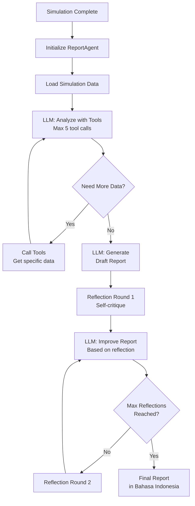

#### Konfigurasi ReportAgent:

```python
# Dari config.py
REPORT_AGENT_MAX_TOOL_CALLS = 5          # Maks panggilan tool per sesi
REPORT_AGENT_MAX_REFLECTION_ROUNDS = 2   # Maks putaran refleksi
REPORT_AGENT_TEMPERATURE = 0.5           # Temperatur LLM
REPORT_OUTPUT_LANGUAGE = 'Bahasa Indonesia'  # Bahasa output
```

#### LLM Prompts (Report Generation):

**System Prompt ReportAgent** berisi instruksi untuk:
1. Bertindak sebagai analis prediktif profesional
2. Menggunakan tools untuk mengumpulkan data dari simulasi
3. Mengidentifikasi tren, pola, dan anomali
4. Membuat prediksi berdasarkan perilaku kolektif agen
5. Menulis laporan dalam bahasa yang ditentukan (default: Bahasa Indonesia)

**Reflection Prompt** meminta LLM untuk:
1. Mengkritisi laporan yang sudah dibuat
2. Mengidentifikasi kelemahan analisis
3. Menambah insight yang terlewat
4. Memperbaiki kesimpulan yang kurang kuat

### 6.2 API Endpoints: Report

File [report.py](file:///c:/SharredData/project/mirofish/MiroFish/backend/app/api/report.py) (~32KB):

| Endpoint | Method | Deskripsi |
|----------|--------|-----------|
| `/api/report/generate/<project_id>` | POST | Generate laporan prediksi |
| `/api/report/status/<project_id>` | GET | Status generasi laporan |
| `/api/report/get/<project_id>` | GET | Ambil laporan yang sudah jadi |
| `/api/report/chat/<project_id>` | POST | Chat dengan ReportAgent |
| `/api/report/chat/agent/<project_id>/<agent_id>` | POST | Chat dengan agen spesifik |
| `/api/report/chat/history/<project_id>` | GET | Riwayat chat |

---

## 7. Fase 5 — Deep Interaction

> **Tujuan**: User dapat berinteraksi langsung dengan dunia simulasi — baik dengan ReportAgent maupun dengan agen individual.

### 7.1 Chat dengan ReportAgent

User bisa bertanya follow-up kepada ReportAgent:
- "Apa faktor utama yang mempengaruhi hasil prediksi?"
- "Jelaskan lebih detail tentang tren X"
- "Bagaimana jika event Y terjadi?"

ReportAgent akan menggunakan tool-toolnya untuk menjawab dengan data dari simulasi.

### 7.2 Chat dengan Agen Individual

User bisa **berbicara langsung** dengan agen simulasi:
- Tanyakan opini mereka tentang topik
- Pahami motivasi mereka
- Eksplorasi perspektif berbeda

**Flow:**
1. Frontend kirim request ke `/api/report/chat/agent/<project_id>/<agent_id>`
2. Backend mengambil profil & memori agen dari Zep
3. LLM dipanggil dengan persona agen sebagai system prompt
4. Response dikembalikan seolah-olah agen yang berbicara

---

## 8. Sistem Memori: Zep Cloud Integration

### 8.1 Mengapa Zep?

Zep Cloud menyediakan:
- **Knowledge Graph otomatis** — dari teks, Zep otomatis mengekstrak entitas & relasi
- **Temporal Memory** — memori yang berubah seiring waktu
- **Episode-based Memory** — memori berdasarkan "episode" (chunk teks)
- **Graph API** — query graf pengetahuan secara programmatik

### 8.2 Zep Tools ([zep_tools.py](file:///c:/SharredData/project/mirofish/MiroFish/backend/app/services/zep_tools.py))

File besar (~67KB) yang berisi **semua operasi Zep**:

```python
class ZepToolSet:
    """Kumpulan lengkap tool untuk berinteraksi dengan Zep Cloud"""
    
    # === Group Management ===
    async def create_group(self, group_id: str, metadata: dict)
    async def get_group(self, group_id: str)
    async def delete_group(self, group_id: str)
    
    # === User/Entity Management ===
    async def create_user(self, user_id: str, metadata: dict)
    async def get_user(self, user_id: str)
    async def add_user_to_group(self, user_id: str, group_id: str)
    
    # === Episode Management ===
    async def add_episode(self, group_id: str, episode_data: dict)
    async def get_episodes(self, group_id: str)
    
    # === Graph Queries ===
    async def search_graph(self, group_id: str, query: str)
    async def get_entity_edges(self, group_id: str, entity_name: str)
    async def get_graph_data(self, group_id: str)
    
    # === Memory Queries ===
    async def search_memory(self, group_id: str, query: str)
    async def get_user_memory(self, user_id: str)
```

### 8.3 Zep Graph Memory Updater ([zep_graph_memory_updater.py](file:///c:/SharredData/project/mirofish/MiroFish/backend/app/services/zep_graph_memory_updater.py))

Memperbarui knowledge graph setelah setiap ronde simulasi:

```python
@dataclass
class AgentActivity:
    """Aktivitas agen yang perlu disimpan ke memori"""
    agent_id: str
    action_type: str
    content: str
    target: str | None
    round_number: int
    timestamp: datetime

class ZepGraphMemoryUpdater:
    async def update_from_round(self, group_id: str, 
                                 round_data: RoundSummary) -> None:
        """Update Zep graph with activities from a simulation round"""
    
    async def batch_update(self, group_id: str, 
                           activities: list[AgentActivity]) -> None:
        """Batch update multiple agent activities"""

class ZepGraphMemoryManager:
    """High-level manager for graph memory operations"""
    async def initialize_agent_memory(self, group_id: str, 
                                       profile: OasisAgentProfile) -> None:
        """Initialize Zep memory for a new agent"""
    
    async def sync_round_memory(self, group_id: str, 
                                 round_summary: RoundSummary) -> None:
        """Sync a round's activities to Zep memory"""
```

**Alur Update Memori:**

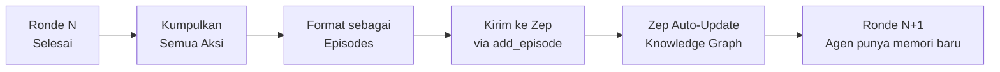

### 8.4 Zep Paging Utility ([zep_paging.py](file:///c:/SharredData/project/mirofish/MiroFish/backend/app/utils/zep_paging.py))

Menangani paginasi saat membaca data besar dari Zep API:

```python
async def fetch_all_pages(fetch_fn, page_size=100, max_pages=50):
    """Generic pagination handler for Zep API calls"""
    all_results = []
    cursor = None
    for _ in range(max_pages):
        response = await fetch_fn(cursor=cursor, limit=page_size)
        all_results.extend(response.results)
        if not response.next_cursor:
            break
        cursor = response.next_cursor
    return all_results
```

---

## 9. Utilitas & Infrastruktur

### 9.1 LLM Client ([llm_client.py](file:///c:/SharredData/project/mirofish/MiroFish/backend/app/utils/llm_client.py))

Wrapper tipis di atas OpenAI SDK:

```python
class LLMClient:
    def __init__(self):
        self.client = OpenAI(
            api_key=Config.LLM_API_KEY,
            base_url=Config.LLM_BASE_URL
        )
        self.model = Config.LLM_MODEL_NAME
    
    def chat(self, messages: list[dict], temperature: float = 0.7,
             max_tokens: int = 4096, response_format=None) -> str:
        """Send chat completion request"""
        
    def chat_with_tools(self, messages: list[dict], tools: list[dict],
                        temperature: float = 0.7) -> dict:
        """Chat with function calling support"""
```

**Key Design:**
- Kompatibel dengan **semua LLM yang support OpenAI SDK** (DeepSeek, Qwen, GPT, dll)
- `base_url` bisa diubah untuk menunjuk ke provider berbeda
- Mendukung function calling untuk ReportAgent tools

### 9.2 Retry Mechanism ([retry.py](file:///c:/SharredData/project/mirofish/MiroFish/backend/app/utils/retry.py))

Sistem retry yang robust (~7.7KB):

```python
class RetryConfig:
    max_retries: int = 3
    initial_delay: float = 1.0
    max_delay: float = 60.0
    backoff_factor: float = 2.0
    retryable_exceptions: tuple = (ConnectionError, TimeoutError)

def retry_with_backoff(config: RetryConfig = None):
    """Decorator for retry with exponential backoff"""
    
async def async_retry_with_backoff(config: RetryConfig = None):
    """Async version of retry decorator"""
```

**Fitur:**
- Exponential backoff (1s → 2s → 4s → 8s → ...)
- Maximum delay cap (60s)
- Configurable retryable exceptions
- Jitter untuk menghindari thundering herd
- Support sync dan async

### 9.3 Logger ([logger.py](file:///c:/SharredData/project/mirofish/MiroFish/backend/app/utils/logger.py))

Sistem logging terpusat:

```python
def setup_logger(name: str, log_file: str = None, 
                 level=logging.DEBUG) -> logging.Logger:
    """Setup logger with console and optional file handler"""
```

- Format: `[timestamp] [level] [logger_name] message`
- Output ke console + file (di `backend/logs/`)
- Support UTF-8 untuk pesan Cina/Indonesia

---

## 10. Frontend — Vue.js Application

### 10.1 Tech Stack Frontend

| Teknologi | Versi | Fungsi |
|-----------|-------|--------|
| Vue.js | 3.x | Framework SPA |
| Vite | Latest | Build tool & dev server |
| Pinia | Latest | State management |
| Vue Router | 4.x | Client-side routing |
| Axios | Latest | HTTP client |

### 10.2 Struktur Komponen

```
frontend/src/
├── App.vue              # Root component dengan router-view
├── main.js              # Entry point, mount Vue app
├── api/
│   └── index.js         # Axios instance + semua API calls
├── components/
│   ├── FileUpload.vue   # Upload seed material
│   ├── GraphPanel.vue   # Visualisasi knowledge graph
│   ├── SimulationPanel.vue  # Control & monitor simulasi
│   ├── ReportPanel.vue  # Tampilkan laporan
│   └── ChatPanel.vue    # Chat interface
├── views/
│   └── HomeView.vue     # Single page view (semua panel)
├── store/
│   └── index.js         # Pinia store (global state)
└── router/
    └── index.js         # Route: / → HomeView
```

### 10.3 API Client Layer ([api/index.js](file:///c:/SharredData/project/mirofish/MiroFish/frontend/src/api/index.js))

```javascript
import axios from 'axios'

const api = axios.create({
    baseURL: 'http://localhost:5001/api',
    timeout: 300000  // 5 menit (simulasi bisa lama)
})

export default {
    // Graph API
    buildGraph(formData) { return api.post('/graph/build', formData) },
    getGraphStatus(projectId) { return api.get(`/graph/status/${projectId}`) },
    getEntities(projectId) { return api.get(`/graph/entities/${projectId}`) },
    
    // Simulation API
    configureSimulation(data) { return api.post('/simulation/configure', data) },
    startSimulation(projectId) { return api.post(`/simulation/start/${projectId}`) },
    getSimulationStatus(projectId) { return api.get(`/simulation/status/${projectId}`) },
    getSimulationProgress(projectId) { /* SSE EventSource */ },
    
    // Report API
    generateReport(projectId) { return api.post(`/report/generate/${projectId}`) },
    getReport(projectId) { return api.get(`/report/get/${projectId}`) },
    chatWithAgent(projectId, message) { return api.post(`/report/chat/${projectId}`, { message }) },
    chatWithSimAgent(projectId, agentId, message) { 
        return api.post(`/report/chat/agent/${projectId}/${agentId}`, { message }) 
    }
}
```

### 10.4 State Management ([store/index.js](file:///c:/SharredData/project/mirofish/MiroFish/frontend/src/store/index.js))

```javascript
export const useMainStore = defineStore('main', {
    state: () => ({
        // Project
        currentProject: null,
        projectId: null,
        
        // Phase tracking
        currentPhase: 'upload',  // upload → graph → simulation → report → chat
        
        // Graph
        graphStatus: null,
        entities: [],
        
        // Simulation
        simulationStatus: null,
        simulationProgress: 0,
        currentRound: 0,
        roundData: [],
        agents: [],
        
        // Report
        reportStatus: null,
        report: null,
        
        // Chat
        chatHistory: [],
        selectedAgent: null
    }),
    
    actions: {
        async uploadAndBuildGraph(file, topic, projectName) { ... },
        async startSimulation() { ... },
        async generateReport() { ... },
        async sendChatMessage(message) { ... },
        async chatWithAgent(agentId, message) { ... }
    }
})
```

### 10.5 UI Flow

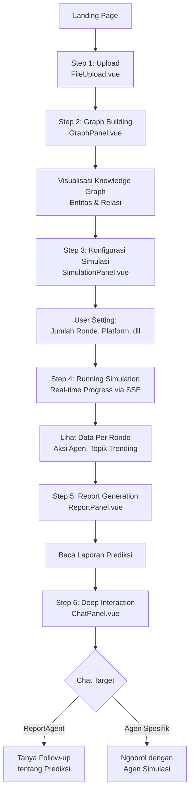

### 10.6 Vite Configuration

```javascript
// vite.config.js
export default defineConfig({
    plugins: [vue()],
    server: {
        port: 3000,
        proxy: {
            '/api': {
                target: 'http://localhost:5001',
                changeOrigin: true
            }
        }
    }
})
```

Dev server di port 3000 dengan proxy ke backend di port 5001.

---

## 11. Model Data

### 11.1 Project Model ([project.py](file:///c:/SharredData/project/mirofish/MiroFish/backend/app/models/project.py))

```python
class ProjectStatus(Enum):
    CREATED = "created"
    GRAPH_BUILDING = "graph_building"
    GRAPH_COMPLETE = "graph_complete"
    CONFIGURING = "configuring"
    SIMULATING = "simulating"
    SIMULATION_COMPLETE = "simulation_complete"
    REPORTING = "reporting"
    COMPLETE = "complete"
    FAILED = "failed"

class Project(BaseModel):
    project_id: str
    project_name: str
    prediction_topic: str
    status: ProjectStatus
    file_path: str | None
    text_content: str | None
    graph_data: dict | None
    simulation_config: dict | None
    simulation_results: dict | None
    report: str | None
    created_at: datetime
    updated_at: datetime
```

Project store (in-memory):
```python
class ProjectStore:
    _projects: dict[str, Project] = {}
    
    @classmethod
    def create(cls, project_name, prediction_topic, file_path) -> Project
    
    @classmethod
    def get(cls, project_id) -> Project | None
    
    @classmethod
    def update(cls, project_id, **kwargs)
    
    @classmethod
    def list_all(cls) -> list[Project]
```

### 11.2 Task Model ([task.py](file:///c:/SharredData/project/mirofish/MiroFish/backend/app/models/task.py))

```python
class TaskStatus(Enum):
    PENDING = "pending"
    RUNNING = "running"
    COMPLETED = "completed"
    FAILED = "failed"

class TaskType(Enum):
    GRAPH_BUILD = "graph_build"
    SIMULATION_CONFIG = "simulation_config"
    SIMULATION_RUN = "simulation_run"
    REPORT_GENERATE = "report_generate"

class Task(BaseModel):
    task_id: str
    project_id: str
    task_type: TaskType
    status: TaskStatus
    progress: float
    result: dict | None
    error: str | None
    created_at: datetime
    updated_at: datetime
```

Task store (in-memory):
```python
class TaskStore:
    _tasks: dict[str, Task] = {}
    
    @classmethod
    def create(cls, project_id, task_type) -> Task
    
    @classmethod
    def get(cls, task_id) -> Task | None
    
    @classmethod
    def update(cls, task_id, **kwargs)
    
    @classmethod
    def get_by_project(cls, project_id) -> list[Task]
```

---

## 12. Alur Data End-to-End

### 12.1 Complete Pipeline

```mermaid
flowchart TD
    subgraph "INPUT"
        A[User Upload<br/>Seed Material] --> B[PDF / MD / TXT]
        C[Prediction Topic<br/>Natural Language] --> D[User Requirements]
    end

    subgraph "FASE 1: GRAPH BUILDING"
        B --> E[File Parser]
        E --> F[Text Chunking<br/>500 chars, 50 overlap]
        F --> G[Zep: Create Group]
        G --> H[Zep: Add Episodes]
        H --> I[Zep: Auto Entity<br/>Extraction]
        I --> J[LLM: Enrich<br/>Entities & Relations]
        J --> K[Knowledge Graph<br/>Complete]
    end

    subgraph "FASE 2: SIMULATION SETUP"
        K --> L[Zep Entity Reader<br/>Extract entities]
        D --> M[LLM: Generate<br/>Ontology]
        L --> N[LLM: Generate<br/>Agent Profiles]
        M --> O[LLM: Generate<br/>Simulation Config]
        N --> P[OASIS Agent<br/>Profiles Ready]
        O --> Q[SimulationParameters<br/>Ready]
    end

    subgraph "FASE 3: SIMULATION"
        P --> R[OASIS Engine<br/>Initialize]
        Q --> R
        R --> S[Round 1..N Loop]
        S --> T[Agent Decision<br/>via LLM]
        T --> U[Execute Actions<br/>on Platform]
        U --> V[Collect Results]
        V --> W[Update Zep<br/>Memory Graph]
        W --> X{Event Scheduled?}
        X -->|Yes| Y[Inject Event]
        Y --> S
        X -->|No| Z{More Rounds?}
        Z -->|Yes| S
        Z -->|No| AA[Simulation<br/>Complete]
    end

    subgraph "FASE 4: REPORT"
        AA --> BB[ReportAgent<br/>Initialize]
        BB --> CC[Tool-assisted<br/>Analysis]
        CC --> DD[Draft Report]
        DD --> EE[Reflection &<br/>Improvement]
        EE --> FF[Final Report<br/>in Target Language]
    end

    subgraph "FASE 5: INTERACTION"
        FF --> GG[User reads<br/>Report]
        GG --> HH{Interact?}
        HH -->|Chat ReportAgent| II[Follow-up Q&A]
        HH -->|Chat Agent| JJ[Talk to<br/>Sim Agent]
    end
```

### 12.2 Data Flow per Fase

| Fase | Input | Proses | Output | Storage |
|------|-------|--------|--------|---------|
| 1 | File + Topic | Parse → Chunk → Zep | Knowledge Graph | Zep Cloud |
| 2 | Graph + Topic | LLM Generate | Config + Profiles | In-memory |
| 3 | Config + Profiles | OASIS Simulation | Round Data | Disk + Zep |
| 4 | Round Data + Graph | LLM Analysis | Report | In-memory |
| 5 | Report + Graph + Data | LLM Chat | Responses | In-memory |

---

## 13. Diagram Arsitektur

### 13.1 System Architecture Overview

```mermaid
graph TB
    subgraph "Frontend (Vue.js + Vite, port 3000)"
        FE[Vue SPA]
        FE --> UP[FileUpload]
        FE --> GP[GraphPanel]
        FE --> SP[SimulationPanel]
        FE --> RP[ReportPanel]
        FE --> CP[ChatPanel]
    end

    subgraph "Backend (Flask, port 5001)"
        API[REST API Layer]
        API --> GA[/api/graph/*]
        API --> SA[/api/simulation/*]
        API --> RA[/api/report/*]
        
        GA --> GBS[GraphBuilderService]
        SA --> SM[SimulationManager]
        SA --> SCG[SimConfigGenerator]
        SA --> SR[SimulationRunner]
        RA --> RAG[ReportAgent]
        
        SR --> IPC[IPC Client]
    end

    subgraph "Subprocess"
        IPC --> IPCS[IPC Server]
        IPCS --> OASIS[OASIS Engine]
        OASIS --> AGT[AI Agents<br/>Thousands]
    end

    subgraph "External Services"
        LLM[LLM API<br/>DeepSeek/Qwen/GPT]
        ZEP[Zep Cloud<br/>Knowledge Graph]
    end

    FE <-->|HTTP/SSE| API
    GBS --> ZEP
    GBS --> LLM
    SCG --> LLM
    SR --> LLM
    RAG --> LLM
    RAG --> ZEP
    OASIS --> LLM
    SR --> ZEP
```

### 13.2 Memory Architecture

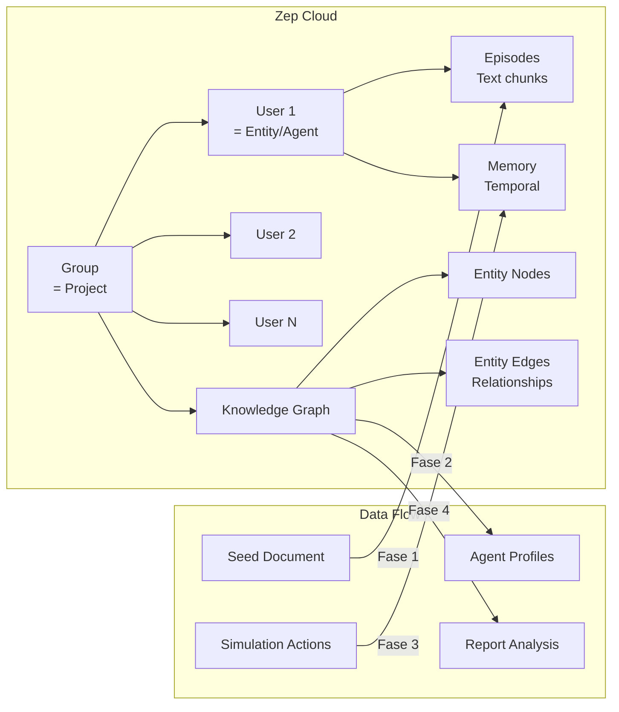

### 13.3 LLM Call Distribution

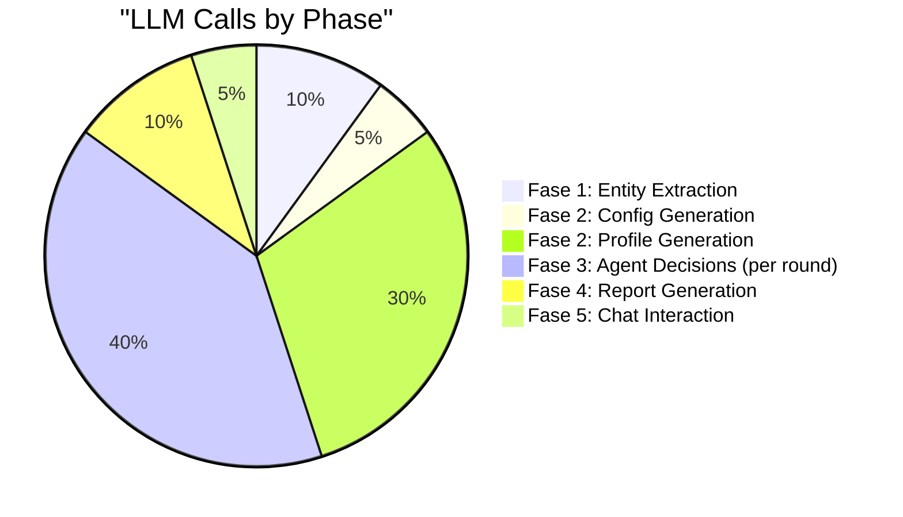

> [!WARNING]
> **Konsumsi API sangat besar!** Fase 3 (simulasi) adalah penyumbang terbesar panggilan LLM karena setiap agen di setiap ronde memanggil LLM untuk menentukan aksinya. Dengan 100 agen × 40 ronde = **4,000 panggilan LLM** minimum. README merekomendasikan mulai dengan < 40 ronde untuk menghemat biaya.

---

## Catatan Arsitektural Penting

### Desain In-Memory

> [!CAUTION]
> Semua state (Project, Task, Simulation) disimpan **di memori Python** (dict biasa), bukan di database. Ini berarti:
> - Server restart = semua data hilang
> - Hanya mendukung single-instance deployment
> - Cocok untuk prototipe/demo, belum production-ready

### OASIS Integration

MiroFish menggunakan **CAMEL-OASIS** (`camel-oasis==0.2.5`) sebagai engine simulasi sosial. OASIS menyediakan:
- Platform simulasi mirip Twitter & Reddit
- Framework untuk multi-agent interaction
- Action space yang well-defined
- Timeline & feed management

### Subprocess Architecture

Simulasi dijalankan di **proses terpisah** dari Flask untuk:
- Menghindari blocking event loop Flask
- Memungkinkan simulasi panjang tanpa timeout
- Cleanup otomatis via `atexit` handler
- Kontrol via IPC (pause, resume, stop, inject event)

### Scalability Considerations

| Aspek | Status Saat Ini | Untuk Production |
|-------|-----------------|-----------------|
| Storage | In-memory dict | Database (PostgreSQL/Redis) |
| Task Queue | Synchronous/subprocess | Celery/RQ |
| Process | Single process + subprocess | Distributed workers |
| Caching | Tidak ada | Redis cache layer |
| Auth | Tidak ada | JWT/OAuth2 |

---

> **Dibuat oleh**: Deep Analysis pada codebase MiroFish
> **Versi Codebase**: 0.1.0
> **Tanggal Analisis**: 20 Juni 2026
